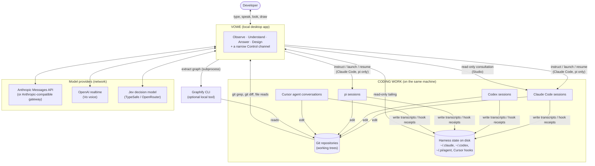
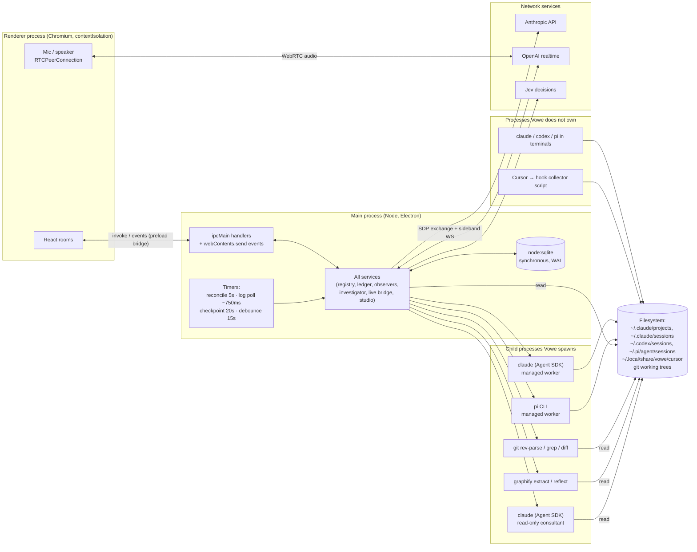
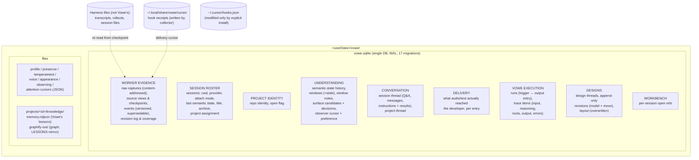

# Vowe as built — Pass 1: System Map

> **The question this pass answers:** *What is the machine we have already built?*
>
> This is an as-built investigation of the repository at commit `8029620`
> (2026-09-27). It describes what runs, not what is intended. Where the code and
> the existing documents disagree, the code wins, and the disagreement is noted.

## How to read this document

Every substantive statement is tagged with one of these labels, either inline or
at the start of its paragraph:

| Tag | Meaning |
|---|---|
| **[current]** | Executable behavior. I traced it through a call site that runs in the shipped desktop app. |
| **[partial]** | The code exists and runs, but only under a condition (a key, an installed tool, a UI action), or it is wired only halfway. |
| **[future]** | Documented direction (mostly `docs/north-star.md`). **Not built.** It appears here only to mark the edge of what exists. |
| **[inference]** | My reading of the architecture. It is not a statement the code makes about itself. |

The organization follows the runtime, not the repository layout. Packages,
classes, tables and IPC channels appear only as **evidence**. Paths are
repository-relative, and `file:line` points at the entry point.

---

## 0. The answer in one paragraph

Vowe is a **local, single-user observer and companion that runs beside coding
agents it does not own**. One Electron main process holds the whole backend. In
that process, a set of **harness integrations** read what Claude Code, Codex,
Pi and Cursor write to disk. An **evidence ledger** converts those records into
durable, provider-neutral, versioned events and keeps the original bytes. A
**session registry** keeps the live roster of sessions and assigns each one to
a git repository (a *project*). Two independent **understanding pipelines** read
the event stream:

- A cheap *status* pipeline says what each worker is doing.
- A windowed *Session Observer* writes a durable narrative. It also proposes
  things worth telling the developer, and a **communication policy** decides
  whether to say them.

A single **grounded investigator** answers questions. It has three read-only
tools over the same evidence, interpretation and repository, and it serves both
typed questions and questions delegated from **Vo**, the voice interface, which
runs on an external realtime model. A **repository-knowledge** subsystem adds a
structural code graph (Graphify) and a small, gated **project memory**.
**Studio** is a separate design workspace. It has its own model agent and its
own persistence, and it consults Claude Code *read-only* as a repository
expert. The only path that affects a worker is a narrow **control channel**
reached from its own button, which can send text into (or launch) a session
Vowe is able to drive. Almost every model call is recorded in a durable
**execution record**. Everything durable lives in one SQLite file plus a few
JSON and NDJSON files under Electron's `userData`.

---

## 1. What is alive when Vowe is open

Suppose Vowe is running and two coding agents are working. Here is what is
executing at that moment.

| Machinery | Where it runs | Always, or conditional | Evidence |
|---|---|---|---|
| Electron **main process**: every service below | one Node process | always | `apps/desktop/src/main/index.ts:232` `createServices` |
| Electron **renderer**: React UI, microphone, speaker, WebRTC peer | Chromium process | always | `apps/desktop/src/renderer/AppShell.tsx` |
| **Registry reconcile timer**: every adapter's `discoverSessions()` every 5 s | main | always | `packages/core/src/registry/session-registry.ts:219` |
| **Evidence source pollers**: tail JSONL logs about every 750 ms; list Cursor receipt files | main (fs polling, no fs watcher) | per observed session | `packages/adapter-kit/src/evidence-source.ts:90` |
| **Evidence admission**: one serialized SQLite writer | main | always | `session-registry.ts:549` → `sqlite-event-store.ts:319` |
| **Fast activity lane**: a deterministic label on every event | main | always | `interpretation-runner.ts` → `worker-activity.ts:90` |
| **Status interpretation**: debounced, 15 s quiet or 25 events | main plus Anthropic call | model call only with a key; otherwise heuristic | `interpretation-runner.ts`, `llm-interpreter.ts` |
| **Session Observer runners**: one serialized loop per followed session, plus a 20 s checkpoint timer | main plus Anthropic calls | only for sessions that have been *started* (see §5.6) | `observation-service.ts:105`, `observer-runner.ts:115` |
| **Communication decisions**: per candidate the observer raises | main plus Jev or Anthropic | when the observer raises one | `communication-policy.ts:84` |
| **Graphify index build or refresh** | `graphify` child process | only if installed and a repository search asked for it | `knowledge-graphify/src/graphify-cli.ts` |
| **Worker processes Vowe owns**: Claude Code through the Agent SDK, `pi` CLI | child processes | only for sessions Vowe launched or resumed | `adapter-claude-code/src/control.ts:91`, `adapter-pi/src/control.ts` |
| **Worker processes Vowe does not own**: terminals running `claude`, `codex`, `pi`, Cursor | outside Vowe | the normal case | observed through files only |
| **Cursor hook collector**: a short-lived Node script per hook | spawned by *Cursor* | only after an explicit install | `adapter-cursor/src/collector.ts`, `install.ts` |
| **Vo live session**: audio over WebRTC from the renderer; a sideband WebSocket from main | OpenAI realtime | only during a call, with `OPENAI_API_KEY` | `live-openai/src/openai-live-transport.ts:112,135` |
| **Studio design turn**: Anthropic tool loop, possibly with read-only Claude Code consultations | main plus Anthropic plus a `claude` child | only during a Studio turn, with a key | `studio-service.ts:204`, `consultant.ts:109` |

**[current]** Nothing in Vowe watches the filesystem with OS notifications. The
repository is not watched at all. The comment at
`apps/desktop/src/main/index.ts:586` says so directly: a `file_changed`
*event reported by a worker* is what marks repository knowledge stale.

---

## 2. Diagram A — whole-system context



What the picture says:

- **[current]** Vowe's primary relationship to coding work is *reading the
  harnesses' own files*. It is not a proxy or a wrapper. The workers do not know
  Vowe exists, except in two cases: sessions Vowe launched or resumed, and
  Cursor after its hooks are installed.
- **[current]** Vowe reads the repository directly with `git grep`, `git diff`
  and file reads, and optionally through Graphify. It never writes to the
  repository. Graphify output goes under Vowe's own data directory
  (`<userData>/vowe/projects/<id>/knowledge/graphify-out`), not the checkout.
- **[current]** Claude Code appears **twice** in Vowe's world, in two roles:
  1. as an observed and sometimes controlled **worker**;
  2. as a sandboxed **read-only consultant** for Studio.

  The second role is invisible to the first. It runs with
  `persistSession: false`, so it leaves no transcript for discovery to find
  (`adapter-claude-code/src/consultant.ts`, `options()`).
- **[current]** Up to four external model services can be involved. All of them
  are optional, and each one degrades independently (§5.14).

---

## 3. Diagram B — major subsystems and what flows between them

The subsystems below come from the runtime object graph built in
`createServices` (`apps/desktop/src/main/index.ts:232–666`). The key test is
who holds a reference to what. That test defines authority, and authority is
this codebase's main architectural idea.

```mermaid
flowchart TB
  subgraph SURF["Product surfaces (renderer)"]
    SB["Sidebar / project & session roster"]
    PH["Project Home"]
    SR["Session Room<br/>(conversation + composer + workbench)"]
    ST["Studio canvas + rail"]
    VO["Vo panel (mic/speaker)"]
    YV["Your Vowe (presence, temperament, voice)"]
  end

  SHELL["Desktop shell<br/>main-process IPC + preload bridge"]

  subgraph WB["Worker boundary"]
    HI["Harness integration<br/>(discovery + evidence acquisition)"]
    CTRL["Control channel<br/>(instruct / launch / interrupt)"]
  end

  subgraph EV["Evidence & roster"]
    LED["Evidence ledger<br/>(capture → admission → events)"]
    REG["Session registry<br/>(roster, project assignment,<br/>event fan-out, semantic-state join)"]
    PRJ["Project resolution<br/>(cwd → git repository)"]
  end

  subgraph UND["Session understanding"]
    STAT["Status interpretation<br/>(fast label + debounced state)"]
    OBS["Session Observer<br/>(windows → notes → candidates)"]
    POL["Communication policy"]
  end

  subgraph ANS["Answering"]
    NAV["Context navigation<br/>(3 read tools over everything)"]
    INV["Grounded investigator<br/>(session & project Ask)"]
    LIVE["Live voice bridge (Vo)"]
  end

  subgraph PROJ["Project level"]
    BRIEF["Project projection<br/>(brief, attention — derived)"]
    KNOW["Repository knowledge<br/>(Graphify graph + project memory)"]
  end

  STUDIO["Studio<br/>(design model + design agent<br/>+ read-only consultant)"]

  RUNS["Execution record<br/>(Vowe runs & traces)"]
  STORE[("Local store<br/>SQLite + JSON/NDJSON")]
  PREF["Developer preferences<br/>(temperament, voice, pauses,<br/>profile, presence, cursors)"]

  HI -->|"EvidenceBatch: raw records +<br/>proposed normalized candidates + coverage"| LED
  HI -->|"discovered sessions:<br/>cwd, attach mode, capabilities, liveness"| REG
  LED -->|"admitted events (seq), revisions,<br/>invalidations"| REG
  REG -->|"session cwd"| PRJ
  PRJ -->|"projectId, worktree, branch"| REG
  REG -->|"event stream"| STAT
  REG -->|"event stream + invalidations"| OBS
  STAT -->|"currentActivity, phase, progress"| REG
  OBS -->|"understanding, durable updates"| REG
  OBS -->|"surface candidates"| POL
  POL -->|"decision: ignore / quiet / queue / speak"| LIVE
  OBS -->|"notes (quiet context)"| LIVE
  NAV -->|"search/open/diff results + refs"| OBS
  NAV --> INV
  KNOW -->|"graph hits, lessons"| NAV
  INV -->|"answers + receipts + refs"| STORE
  INV -->|"session answers"| KNOW
  LIVE -->|"delegated questions"| INV
  BRIEF -->|"project context"| LIVE
  REG --> BRIEF
  KNOW -->|"index status"| BRIEF
  REG -->|"file_changed → mark stale"| KNOW
  SHELL -->|"Send to agent / launch"| CTRL
  CTRL --> REG
  STUDIO -->|"consult question"| CC2["Claude Code<br/>(read-only)"]
  SURF <--> SHELL
  SHELL <--> REG & INV & LIVE & STUDIO & BRIEF & OBS & NAV
  STAT & OBS & POL & INV & LIVE & STUDIO -.->|"every model call"| RUNS
  RUNS --> STORE
  LED & REG & OBS & STUDIO & LIVE --> STORE
  PREF -.->|"temperament guidance"| POL & INV & LIVE & STUDIO & OBS
```



Note what **does not** connect. **[current]** These missing edges are the design:

- The investigator, observer, voice bridge and Studio hold **no registry and no
  adapter**, so none of them can reach a worker. The comments at
  `index.ts:180–191` and `index.ts:491–498` state this, and the constructor
  arguments confirm it.
- Studio does not reach project memory, the project brief, the live bridge, or
  any session. It receives the store, an attachment opener (`navigator`, typed
  as `Pick<…,'openContext'>`), the design agent and the consultant
  (`index.ts:500–513`).
- The renderer never gets `ContextNavigator`. It gets display projections through
  `ArtifactResolver` (`index.ts:993–997`).

---

## 4. Diagram C — runtime and process view



These process distinctions matter architecturally:

1. **[current] One backend process.** Every service, the database, and every
   model loop share the Electron main process. SQLite access is synchronous
   (`node:sqlite`). Evidence admission therefore yields to the event loop
   between segments (`session-registry.ts:549`, `yieldToIo`), and acquisition is
   throttled to two in-flight segments with a foreground/background share
   (`ACQUISITION_TURNS`, `BACKGROUND_SHARE`). There is no worker thread and no
   separate daemon. When Vowe is closed, nothing observes.
2. **[current] Voice is split across two processes.** The renderer negotiates
   the audio peer connection directly with OpenAI. Main only brokers the SDP
   exchange (the API key must not reach the browser) and then attaches a
   *second* server-side sideband socket to the same live session. Main never
   carries audio (`openai-live-transport.ts:50–66`, `index.ts:1152–1162`).
3. **[current] Claude Code as a child process.** The Agent SDK spawns a
   platform-native `claude` binary. The installed
   `@anthropic-ai/claude-agent-sdk-darwin-arm64` ships one, and `sdk.mjs` uses
   `child_process`. Vowe spawns it for two unrelated purposes:
   - a *managed worker*, whose control is streaming input (`control.ts`);
   - a *consultant*, restricted to Read, Grep and Glob, with no persistence and
     a budget and time cap (`consultant.ts`).
4. **[current] Workers Vowe does not own are observed through files only.**
   That is the default attach mode (`external-live` or `external-idle`).

---

## 5. Subsystems

The order roughly follows information from the worker toward the developer,
then covers the project-level, design and cross-cutting subsystems.

### 5.1 Harness integration: discovery and evidence acquisition

**Responsibility.** To learn which coding sessions exist on this machine, where
they run, whether they are live, and what they have recorded, and to hand that
record to Vowe in a provider-neutral envelope. This is the only subsystem that
knows file layouts, record schemas and CLI behavior for Claude Code, Codex, pi
and Cursor.

**Inputs.**
- Harness state on disk:
  - Claude Code: `~/.claude/projects/<dir>/<id>.jsonl` transcripts, plus
    `~/.claude/sessions/<pid>.json` records of live processes
    (`adapter-claude-code/src/paths.ts`, `live-sessions.ts`).
  - Codex: `~/.codex/sessions/rollout-*.jsonl`.
  - pi: `~/.pi/agent/sessions/<encoded-cwd>/*.jsonl`.
  - Cursor: receipt files the hook collector writes under
    `~/.local/share/vowe/cursor`, plus Cursor's own transcript
    (`adapter-cursor/src/adapter.ts:37`).
- For sessions Vowe manages, the adapter's in-memory control state.

**Outputs.** Two different kinds of output, over two different interfaces:
1. **Discovered sessions** (`AgentSession`): provider id, `cwd`, attach mode
   (`managed`, `external-live` or `external-idle`), liveness status, a task and
   label taken from the developer's opening words, and **per-session
   capabilities** (`observe`, `sendInstruction`, `interrupt`, `resume`,
   `launch`, `reasoning`) (`types/adapter.ts`,
   `adapter-claude-code/src/adapter.ts` `capabilitiesFor`).
2. **Evidence batches** (`EvidenceBatch`, `core/src/evidence/types.ts`):
   - raw records with their original bytes and physical locations;
   - *proposed* normalized candidates (`AdapterEvent`s in a small shared
     vocabulary: `agent_message`, `tool_started`, `command_finished`,
     `file_changed`, `permission_requested`, `session_waiting`, …);
   - scoped **coverage** (`partial`, `complete` or `unavailable`, with a reason);
   - a resumable **checkpoint**;
   - a declared **continuity contract** (`append-log`, `delivery-cursor` or
     `mutable-snapshot`).

**State.** In memory only: transcript metadata caches, incremental reader
offsets, normalizer carry-state, and the live-process map. Resumption state is
**not** owned here. Checkpoints come back from the ledger
(`session-registry.ts:441`: `resumeAfter(checkpoint, …)`).

**Intelligence.** None. Normalization is deterministic parsing and
classification. Unrecognized records become `unknown` rather than being dropped.
The adapter does assert some interpretation policy. For example, Claude Code
marks `command_finished` and `test_finished` from canonical tool-result records
as `execution: 'executed'` (`adapter-claude-code/src/adapter.ts`
`evidenceSources`). This is a reviewed claim the adapter makes, not a model
judgment.

**Connections.** Feeds the evidence ledger (through the registry's admission
queue) and the registry's roster. Depends on nothing else in Vowe.

**Authority.** Observe only. (The same adapter objects *also* implement control.
That is a separate interface surface; see §5.4.)

**Implementation evidence.**
- `packages/core/src/types/adapter.ts`: the `AgentAdapter` contract.
- `packages/adapter-kit/src/evidence-source.ts:90`: `jsonlEvidenceSource`, the
  shared append-log reader.
- `packages/adapter-{claude-code,codex,pi,cursor}/src/adapter.ts`.

**Findings.**
- **[current]** All four adapters implement `evidenceSources()`. The older
  `subscribeToEvents` → `SessionRegistry.ingest` path is still in the interface
  and the registry, but no registered adapter reaches it at runtime. Claude Code
  still implements it.
- **[current]** Capability is uneven by design:

  | Provider | Observe | Instruct | Launch | Interrupt |
  |---|---|---|---|---|
  | Claude Code | yes | yes when managed, or idle with a transcript | yes | managed sessions only |
  | pi | yes | yes when the CLI is present and a session file exists | yes, when the CLI is present | managed sessions only |
  | Codex | yes | no | no | no |
  | Cursor | yes | no | no | no |

  Codex and Cursor are observe-only
  (`adapter-codex/src/adapter.ts` capabilities `false`;
  `adapter-cursor/src/adapter.ts:313` throws).
- **[partial]** Cursor observation exists only after someone runs the explicit
  hook installer (`adapter-cursor/src/install.ts`). That installer rewrites
  `~/.cursor/hooks.json`. Nothing in the desktop app calls it.

### 5.2 Evidence ledger: from raw activity to provider-neutral events

**Responsibility.** To turn what adapters report into an immutable,
auditable, provider-neutral event history. It survives restarts, handles
re-reads, corrections, and rewritten sources, and never loses the original
bytes.

**Inputs.** `EvidenceBatch`es from sources, one at a time per session, through
the registry's serialized writer.

**Outputs.**
- `NormalizedEvent`s, each with a Vowe `id`, a monotonic per-session `seq`
  (admission order, *not* execution order), `raw`, `rawRef`, and optional
  `evidence` and `supportStatus: 'superseded'`.
- An `EvidenceChange`: the revision, the seq range added, and optionally
  `invalidatedFromSeq`.
- Per-source status and coverage, and freshness watermarks
  (`evidenceRevision` vs `derivedThroughRevision`).

**State.** Durable, in SQLite (§6):
- `evidence_blobs`: content-addressed raw bodies and candidates;
- `evidence_journal`, `evidence_capture_ranges`, `evidence_view`,
  `evidence_catalog`: observation positions, current view, identities seen;
- `evidence_supports` and `evidence_heads`: current belief per fact key;
- `evidence_changes`: the revision log;
- the `events` projection, with `active` and `logical_key`.

Each raw capture commits *before* admission reads it back. Unadmitted captures
are retried at startup (`docs/execution-evidence.md`; the code is in
`packages/core/src/evidence/ledger.ts:126`).

**Intelligence.** Deterministic. Reconciliation runs in SQL over temp tables,
with an array reference implementation (`reconcile.ts`) under differential
test. Identity is layered: blob, then physical observation, then source record,
then event. **Equal text never merges** two sources.

**Connections.**
- Called by the registry (`SqliteEventStore.ingestEvidence`,
  `sqlite-event-store.ts:319`).
- Consumed by everything that reads events: the status and observer pipelines,
  context navigation, the brief, and the renderer's inspectors.
- When evidence is **corrected**, the ledger reaches *downstream*:
  - it marks windows stale;
  - it rewinds the observer cursor;
  - the registry clears `semanticState`
    (`session-registry.ts:549`: `invalidatedFromSeq → semanticState: null`);
  - project memories whose citations lost support drop out of current retrieval
    (`evidence/support.ts:5` `hasCurrentSupport`, handed to `ProjectMemoryStore`
    at `index.ts:323`).

**Authority.** None over workers. It is the arbiter of *what Vowe believes
happened*.

**Findings.**
- **[current]** This is the most rigorous boundary in the system. It is where
  "provider-specific ↔ provider-neutral" actually becomes clean: nothing
  downstream of the ledger names a provider, except for presentation glyphs in
  the renderer.
- **[current] Documentation drift.** `docs/architecture.md` ("Windows store
  ranges, never material: the raw trace stays where the provider wrote it") is
  stale. Since migrations 011–015, Vowe keeps its own immutable copy of raw
  evidence. `RawEventRef`'s comment now reads: "Historical reads use immutable
  Vowe evidence."
- **[current]** Coverage is *scoped*, and it underclaims on purpose. A session
  never claims to be "complete". It claims a named surface was fully read.

### 5.3 Session registry and project resolution: the live roster

**Responsibility.** The authoritative in-memory view of *which sessions exist
now* and *which project each belongs to*. It is the fan-out point for events.
It is also the one object that holds adapters, which is why only it can
instruct a worker.

**Inputs.**
- Discovered sessions from every adapter, every 5 s (`reconcile`,
  `session-registry.ts:219`).
- Admitted evidence changes.
- Semantic-state writes from the two understanding pipelines.
- Title and archive notices from IPC handlers.

**Outputs.**
- Events `session:added`, `session:updated`, `session:removed`, `event` (each
  admitted event, paged out of SQLite), and `evidence:changed`.
- `list()` and `get()` with **freshness derived on read**: `catching-up`,
  `behind` or `current` (`withFreshness`).

**State.**
- In memory: the session map, subscriptions, the acquisition queue, and the
  sources still catching up.
- Durable: `sessions` rows (including `semantic_state_json`,
  `generated_title`, `archived_at` and `project_id`) and `semantic_states`
  history.
- **[current]** At startup, stored sessions are rehydrated with
  `status: 'unknown'`. "Nothing is live until an adapter says so"
  (`session-registry.ts` `start`). Sessions that disappear are not deleted.
  They drop to unknown liveness and lose instruct and interrupt.

**Project resolution** (`projects/project-service.ts:71`,
`repository-identity.ts:78`). **[current]** A project is *derived*, never
declared. When a session is new or its `cwd` changes, `git rev-parse` resolves
the repository identity. Worktrees and branches are recorded per session, and
the project row stores identity only. Membership lives on the session rows. A
developer can also open a folder as a project (`index.ts:973`). A folder outside
git falls back to its own path.

**Intelligence.** None.

**Connections.** Sits between the worker boundary and everything else. It is
also **the join between the two understanding pipelines**: it owns
`applyActivitySignal`, `applySemanticState` and `applyObserverState`
(`session-registry.ts:590,627,665`), which all write different fields of the
same `SemanticState`.

**Authority.** It holds the control path (§5.4). It is the only understanding
consumer that could affect a worker, and none of the understanding code holds
it.

**Finding (boundary blur).** **[current]** Three writers share `SemanticState`
by a field-ownership *convention*:

| Writer | Fields it owns |
|---|---|
| fast lane | `currentActivity`, `phase`, and `provenance.eventIds` |
| interpreter | activity and progress, but it yields when the fast lane saw newer events |
| observer | `currentUnderstanding` and `meaningfulUpdates` |

The rule is enforced by merge code in the registry, not by types. The fast-lane
write is also not persisted directly. It reaches the database only when a later
write carries it (`applyActivitySignal` doc comment). **[inference]** This is
the place a future "project understanding" will be tempted to write too. It is
the least typed seam in the understanding layer.

### 5.4 Control channel: the only thing that affects a worker

**Responsibility.** To deliver developer text to a real coding worker, or to
launch, resume or interrupt one, when and only when the provider and the
session's current attach mode allow it.

**Inputs.** From the renderer, two explicit IPC calls:
- `vowe:agent:send-instruction` (`index.ts:1068`), from the Session Room
  composer with destination set to "worker" (`SessionRoom.tsx:288`,
  `state/composer.ts:58`);
- `launch` from the New Session sheet (`index.ts:1074`).

**Outputs.**
- Text delivered to the worker by one of three routes:
  - Claude Code **managed**: streaming input into a live Agent SDK query;
  - Claude Code **idle**: an Agent SDK *resume*, which spawns a process to take
    the turn;
  - **pi**: spawning `pi` with the session id.
- An `InstructionResult` (`delivered`, `via`, `note`).
- Two conversation entries: `user_instruction` before delivery and
  `instruction_result` after (`session-registry.ts:264`).

**State.** Adapter control maps of managed sessions and their processes. These
are in memory, so after a restart no session is `managed`.

**Intelligence.** None. **[current]** No model sits between the developer's
words and the worker.

**Connections.** Registry → adapter (`requireAdapter`). Capabilities are
**re-checked at call time** from a fresh `getSession`, because attach mode can
change at any moment.

**Authority.** **Affects workers.** This is the only subsystem that does.
**Launch** also exists: registry `launchSession`, `session-registry.ts:324`.
It names the new session right away (`titles.ensure`).

**Findings.**
- **[current]** The separation is *structural at the backend*: different IPC
  channel, different service, and nothing else holds the registry's control
  methods.
- **[current]** It is *adjacent at the UI*: one composer with a destination
  toggle (`state/composer.ts`), not two unrelated places.
- **[current]** It is *shared in persistence*. Instruction entries go to the
  same `conversation_entries` table as questions and answers, told apart only by
  `role` (`types/conversation.ts`: `reachedWorker(role)`).

  **[inference]** This is a deliberate choice: one chronological thread per
  session. It does mean "the conversation" is not purely human↔Vowe.
- **[current]** Vo's system prompt denies it any worker-control capability
  (`live/vo-prompt.ts`), and the live bridge holds no registry. Voice therefore
  **cannot** instruct a worker, even when asked.
- **[partial]** `interrupt` exists in the registry and in the Claude Code and pi
  adapters, but no IPC handler exposes it. It is unreachable from the UI.

### 5.5 Status interpretation: "what is it doing right now?"

**Responsibility.** To always have a short, current answer to "what is this
worker doing?", including for sessions nobody is actively observing.

**Inputs.** Every admitted event (registry `event`) and evidence invalidations.

**Outputs.**
- **Fast lane** (every event, synchronous, no model): a `WorkerActivity` label
  and phase derived from the last 32 events (`product/worker-activity.ts:90`).
  It is published to the registry in memory.
- **Slow lane** (debounced: 15 s of quiet or 25 events): a `SemanticState` with
  task, phase, `currentActivity`, `recentProgress` and `provenance.eventIds`,
  from the last 60 events. It is persisted.

**State.** Only debounce timers. Its outputs live on the session.

**Intelligence.**
- With an Anthropic key, `LlmSemanticInterpreter` computes the heuristic
  result first. It then asks the model (`summarizeSession`) to improve it, and
  falls back to the heuristic on failure (`interpretation/llm-interpreter.ts`).
- Without a key, it is purely deterministic (`HeuristicInterpreter`).
- If evidence changed during the model call, the result is discarded and
  rescheduled (`interpretation-runner.ts` `run`).

**Connections.** Registry → interpreter → registry. It does **not** read
observer output, and the observer does not read it.

**Authority.** Interprets.

**Findings.**
- **[current]** It runs for **every discovered session with events**, not only
  for followed ones. Pausing a project stops the model lane but keeps the fast
  lane (`setPaused`).
- **[current]** `docs/architecture.md` calls this "the snapshot" and correctly
  keeps it separate from observation. AGENTS.md warns about exactly this:
  "follow both callers before assuming one updates the other's state".

### 5.6 Session Observer: windows, notes and candidates

**Responsibility.** To follow long-running work continuously, with continuity.
It turns the trace into bounded **windows**, writes a durable **note** per
window that has read the previous notes, keeps a rolling
**current understanding**, and **proposes** moments worth telling the
developer.

**Inputs.**
- The event stream, used as a nudge (`notifyTrace`).
- Stored events read by seq. Only `agent_message`, `user_instruction` and
  `session_started` form the transcript. `agent_reasoning` is excluded on
  purpose, for provider parity (`observer-runner.ts` `TRANSCRIPT_KINDS`).
- Previous notes, and older notes chosen by the decision router.
- Read tools from context navigation.
- Evidence coverage, and the session's `task` and `cwd` (through a
  `getSession` function, not the registry itself).

**Outputs.**
- `TraceWindow`s: ranges plus pinned event ids.
- `WindowNote`s: summary, current activity, refs.
- `ObserverUnderstanding`: current understanding plus an optional
  `MeaningfulUpdate`. It goes to the registry through
  `ObservationService.onUnderstanding` (`observation-service.ts` around line
  128).
- `SurfaceUpdate` candidates: message, `whyNow`, urgency, refs. The model raises
  them through the `surface_update` tool.

**State.** Durable:
- `windows`, `window_notes`, `surface_updates`;
- `observation_state`: the cursor, `processedThroughSeq`, and the per-session
  communication preference.

The cursor is persisted after every note, so a restart resumes at the next
window.

**Intelligence.** Model-driven. Each canonical window is one Anthropic
tool-runner loop (`llm/anthropic-llm-client.ts:220` `observeWindow`):

- A window closes after about 40 events, about 6k tokens, 2 min of trace, or
  3 min of silence.
- Whether the window gets read tools at all is a **Jev `noul` decision**, with a
  heuristic fallback (`observer-runner.ts:691` `shouldExplore`).
- A cheaper 20 s **checkpoint** pass refreshes understanding from the open tail.
  It has no read tools, but it keeps `surface_update`.

Without a model, `nullObserver` records every window with a fixed
"not interpreted" summary (`index.ts:679`).

**Connections.**
- Reads through context navigation.
- Writes understanding into the registry.
- Emits notes and candidates to the live bridge (quiet context) and to the
  communication policy.

**Authority.** Interprets and proposes. It holds no adapter or registry. The
runner explicitly gets `getSession` as a function "so the runner holds no
registry" (`observer-runner.ts`).

**Findings (important).**
- **[current] Observation is started by the UI, as a side effect of rendering.**
  The only runtime call to `startObserving` is a `useEffect` in the Project
  Room's *Current work* list (`renderer/project/ProjectRoom.tsx:167`). It runs
  for every session in `brief.active`, and there is **no cleanup**: nothing
  calls `stopObserving` from the renderer. So:
  - a session gets a Session Observer (and continuous model spend) once its
    project home has been rendered while the session was "current work", and it
    keeps it until quit or pause;
  - after a restart, no observer runs until that room renders again;
  - opening a Session Room does **not** start observation;
  - starting a voice call does **not** start observation.

  The service's doc comment ("a session is followed because someone asked for
  it to be") describes intent that the call site implements only implicitly.
  This is the most significant "who decides what Vowe watches?" finding.
- **[current]** Correction propagates cleanly. When evidence is invalidated, a
  followed session's runner is stopped and restarted from the rewound cursor
  (`observation-service.ts` `ensureListening`).

### 5.7 Communication policy: whether to interrupt a human

**Responsibility.** To decide what happens to each candidate the observer
raises. There are four options:

| Action | Meaning |
|---|---|
| `ignore` | Record it and move on. |
| `quiet_context` | Give it to Vo silently. |
| `queue` | Hold it until the developer next speaks. |
| `speak_now` | Say it now. |

The decision uses the developer's plain-language preference and temperament.

**Inputs.**
- A `SurfaceUpdate`.
- The effective preference: the per-session preference, else the global
  temperament's personal instruction (`effectivePreference`).
- The temperament's interruption appetite.

**Outputs.** A `CommunicationDecision` (action, reason, source), persisted on
the candidate (`recordCommunicationDecision`) and emitted as `surface`
(`observation-service.ts:278`).

**State.** None of its own. Decisions live in `surface_updates`.

**Intelligence.** It tries each strategy in order until one answers:
1. the **Jev router** `choose`;
2. the Anthropic client, reusing `answerQuestion` as a decision prompt;
3. `defaultDecision`, which is deterministic and keyed on urgency.

A "speak floor" from temperament is applied afterwards
(`communication-policy.ts:84`).

**Connections.** Observer → policy → live bridge.

**Authority.** It decides communication. It has no authority over workers.

**Finding (dead end without voice).** **[current]** The *only* consumer of a
decision is `LiveBridge.deliverSurface` (`live-bridge.ts:386`). It delivers only
when a voice call is attached **to that exact session**
(`sidebandFor(sessionId)` compares against `scope.sessionId`). So:

- with no voice call, candidates are decided, possibly with a paid model call,
  then stored, and never shown. The renderer does not read `surfaceUpdates`
  (grep over `apps/desktop/src/renderer`).
- during a **project**-scoped voice call, `speak_now` and `queue` never fire.
  Only notes refresh the project context.

The "Needs You" signal the UI does show comes from a separate, deterministic
projection (`product/attention.ts:67`) over `permission_requested` and
`session_waiting` events with `awaitingHuman`, not from this policy.
**[inference]** Today, "observation → interruption" is a voice-only feature,
while "attention" is a UI feature. They are two unconnected answers to the same
product question.

### 5.8 Context navigation: the read boundary

**Responsibility.** One read-only view over everything Vowe can see, shared
unchanged by the observer and the investigator. It exposes exactly three
capabilities: `search_context`, `open_context` and `get_diff`, plus `readSource`
for the workbench.

**Inputs.**
- The store (events, windows, notes, sessions).
- Session `cwd` and project resolution (functions from the registry).
- Project knowledge (graph and memory).
- The live working tree, through `git grep`, `git diff` and `readFile`
  (`context/git-diff.ts`).

**Outputs.** Search hits and opened material, each carrying a **`ContextRef`**:

| Ref | What it addresses |
|---|---|
| `window` | an interpreted window |
| `trace` | a range of events |
| `event`, `transcript` | a single event, or a point in the worker/user exchange |
| `repo` | a file and line in the working tree |
| `diff` | a session's or a project's current diff |
| `symbol` | a node in a project's code graph |
| `lesson` | a record in project memory |

Refs are **addresses, not copies** (`context/refs.ts`, deliberately
import-free so the renderer can use it).

**Scoping** (`context-navigator.ts:169,193`):
- *Session* scope searches `windows`, `trace` and `transcript` by default, and
  can add `repo`.
- *Project* scope is restricted to `repo` and `observations`
  (`PROJECT_SOURCES`, line 124). It never sees raw trace directly. It reaches a
  session by following a citation.

**State.** None durable.

**Intelligence.** Deterministic: lexical search and graph lookup.

**Connections.** Used by the observer, the investigator, the attachment opener
(Studio) and `ArtifactResolver` (the workbench).

**Authority.** Read-only. It holds no registry and no adapter.

**Finding (repository reality vs recorded evidence).** **[current]** `repo:` and
`diff:` refs are resolved **live** on every open. A citation made an hour ago
opens today's file or diff. Trace refs open immutable captured evidence. So the
same answer can mix *historical* evidence with *current* repository state
without marking the difference. AGENTS.md states this: "a reopened artifact is
not a historical snapshot".

### 5.9 Grounded investigator: session Ask and project Ask

**Responsibility.** The single question-answering engine. A typed question in
the Session Room, a typed question in the Project Home, and a question Vo
delegates by voice all reach **one `DelegatedQuestionRunner` instance**
(`index.ts:459`).

**Inputs.**
- The question and optional attached refs, opened up front
  (`delegation/attachments.ts`).
- For a session: the session state, recent conversation, and live transcript
  turns when asked by voice.
- For a project: a *roster* of the project's current sessions with their
  understanding, attention and latest development (`projectRoster`), plus
  recent project conversation.
- Temperament guidance.
- The three read tools.

**Outputs.**
- A `companion_answer` entry carrying: `fullAnswer` (the text), refs,
  `provenance.eventIds`, and an **`InvestigationReceipt`** (the "Checked 3
  things · 4s" account). It is written to the session or the project
  conversation table.
- A `spokenAnswer`, returned to voice only. The typed IPC handler strips it
  (`index.ts:836–851`).
- Transient `investigationProgress` events, forwarded to the window and never
  stored (`index.ts:469`).

**State.** None of its own beyond conversation rows and the run record.

**Intelligence.** Model-driven: an Anthropic `toolRunner` loop with the three
read tools (`anthropic-llm-client.ts:271`). Without a key, it falls back to
reporting the observed state (`nullObserver.investigate`).

**Connections.**
- `CompanionService` (typed) and `LiveBridge` (voice) call it.
- It reads through context navigation.
- After answering, **session** answers go to repository knowledge through
  `onAnswer` → `knowledge.consider` (`index.ts:475`).

**Authority.** Answers questions. It cannot affect a worker; there is nothing in
its object graph to do it with.

**Findings.**
- **[current]** "Typed session Ask and delegated voice questions share
  `DelegatedQuestionRunner`" is true at the instance level, as AGENTS.md
  requires.
- **[current] Project answers never reach project memory.** `onAnswer` fires
  only in `answer()` (`delegated-question-runner.ts:394`), not in
  `answerProject()` (line 414 onward). Memory is therefore learned only from
  *session-scoped* questions, even though project questions are the ones most
  likely to produce repository-level knowledge. **[inference]** This is
  probably unintended.
- **[current]** A typed project answer is also pushed into an active project
  voice call as quiet context (`index.ts:866` → `live.projectAsked`). That is
  the one place typed and spoken conversation cross-feed.

### 5.10 Repository knowledge and project memory

**Responsibility.** Durable understanding of *the repository*, as distinct from
*the work* done in it. It has two halves with different epistemic status:

1. a **structural graph** built by Graphify from the AST: "orientation, not
   truth";
2. **project memory**: a few answers Vowe decided were durable facts about the
   codebase.

**Inputs.**
- Search requests from context navigation.
- `file_changed` events, which mark the index stale
  (`index.ts:588` → `noteSourceChange`).
- Session answers offered for admission (`consider`).
- The HEAD commit, compared at hydrate time to detect staleness
  (`graphify-provider.ts:119,221`).

**Outputs.**
- `ProjectKnowledgeHit`s. Memory hits come first, then structural ones.
- `symbol:` and `lesson:` refs.
- Index state (`unindexed`, `indexing`, `ready`, `stale`, `error`), pushed to
  the renderer as `projectKnowledgeChanged`.

**State.** Durable, under `<userData>/vowe/projects/<id>/`:
- `knowledge/graphify-out/graph.json`, the Graphify index state, and
  `reflections/LESSONS.md` (a mirror);
- `knowledge/memory.ndjson`, append-only, and Vowe's record
  (`project-memory-store.ts`).

**Intelligence.**
- Graph extraction is deterministic (`--code-only`), unless
  `VOWE_GRAPHIFY_BACKEND` enables Graphify's own semantic backend. In that case
  *Graphify* calls a model provider, outside Vowe's run record.
- Memory admission is a **Jev `noul` decision** with a threshold of 0.7. It is
  gated first by "is this grounded in `repo:` or `symbol:` refs?". It **fails
  closed**: with no router, nothing is remembered
  (`knowledge/memory-admission.ts`).

**Connections.** Feeds context navigation and the project brief's index status.
It is fed by the investigator (session answers) and by the event stream.

**Authority.** Read and remember. It never writes the checkout.

**Findings.**
- **[current]** Indexing is triggered **only by asking**. The first repository
  search in a project starts the build (`project-knowledge-service.ts:95`).
  Opening a room does not (`index.ts:752`).
- **[current]** Staleness depends on worker-reported `file_changed` events and
  on HEAD at hydrate time. **[inference]** Edits made by a human in an editor,
  or by an unobserved tool, are not noticed until HEAD moves or an observed
  worker edits something.
- **[current]** `recordCorrection` (developer-asserted memory, which skips
  admission) exists but has **no caller**. The only live path into memory is
  gated admission of session answers, which requires a Jev key.
- **[current] Documentation drift.** `JevDecisionRouter`'s comment and
  `.env.example` say the router is used for "three things and no others". There
  is a fourth: memory admission (`index.ts:330`).

### 5.11 Project projection: the project-level read model

**Responsibility.** To say what one repository's work adds up to: headline,
active and recent sessions, "Needs You" attention, latest signal, and knowledge
status. It serves the Project Home and Vo's project context.

**Inputs.**
- Sessions for the project, their stored events, and their semantic and
  observer state.
- Knowledge index state.

**Outputs.** A `ProjectBrief` (`product/project-brief.ts:116,136`), assembled
on every read.

**State.** **None.** "Derived on every read, never stored" (`index.ts:124`,
`index.ts:758`). Durable *project-level* state exists elsewhere:
- project identity and the `open` flag (`projects`);
- the project conversation (`project_conversation_entries` and deliveries);
- project memory and index (files);
- designs (Studio).

**Intelligence.** None. "Deliberately not a project agent: nothing below calls
a model" (`index.ts:337–340`).

**Connections.** Read by the renderer (`getProjectBrief`) and the live bridge
(`refreshProjectContext`). Its roster logic is reused by the investigator's
`projectRoster`.

**Authority.** Presents.

**Findings.**
- **[current]** "Session ↔ project" is asymmetric. A session is a first-class
  runtime object with its own understanding pipelines. A project is a git
  identity plus deterministic aggregation over its sessions, plus a
  conversation thread and a memory. **There is no project-level
  understanding** that accumulates independently of sessions.
- **[future]** The freshness watermark shape is described as "the watermark a
  later consumer (Project Understanding) can reuse"
  (`docs/execution-evidence.md`). That consumer does not exist.

### 5.12 Live voice bridge (Vo)

**Responsibility.** To let the developer *talk* with Vowe about the work. Vo is
the conversational relationship. Vowe's backend stays the intelligence: Vo
delegates real questions back to the investigator and receives observer output
as background.

**Inputs.**
- *From the provider*, through the sideband: user and assistant transcript
  deltas, `delegation.created`, and session lifecycle events.
- *From Vowe*:
  - observer notes (quiet context);
  - communication decisions;
  - the project brief (project calls);
  - typed project Q&A;
  - playback reports from the renderer (`livePlayback`, validated in main,
    `index.ts:1172`).

**Outputs.**
- Context pushed to Vo: `appendThinking` (quiet) and `appendCommentary`
  (speak now).
- Delegation results: the investigator's `spokenAnswer`.
- Transcript deltas to the window (transient).
- **Durable conversation entries and delivery records** through
  `LiveConversationRecorder` (`live/live-conversation-recorder.ts:89`).
  - Entries are deduplicated by `ConversationOrigin`.
  - A spoken answer that was cut off stays one full entry, plus a delivery
    record of how far the audio got.

**State.**
- In memory: one attachment (a single call at a time), the transcript buffer,
  and queued surfaces.
- Durable: conversation and delivery rows, and `live_turn` and `live_response`
  runs.

**Intelligence.** Two models:
- the **OpenAI realtime model**, which decides how to talk and when to delegate;
- the **investigator**, for delegated questions.

No reasoning is persisted for the voice model, which exposes none.

**Connections.** Observation service (listens), investigator (delegates),
project brief, store, run record. The transport is behind `LiveTransport`
(`core/live/live-transport.ts`). Without `OPENAI_API_KEY`, it is
`UnavailableLiveTransport` (`index.ts:427`).

**Authority.** Converses and answers. It cannot instruct a worker, both
structurally and by prompt.

**Findings.**
- **[current]** A session voice call and a project voice call differ
  substantially:
  - A session call gets proactive surfacing and observer notes for that
    session.
  - A project call is refreshed from the *deterministic* brief on session
    changes (`index.ts:578`) and on notes for its sessions, but never gets
    `speak_now`.
- **[current] Voice creates a third thread topology.** Spoken turns are written
  to the session or project conversation table, the *same* tables as typed
  turns. Modality lives on the delivery, not the entry. This is the cleanest
  realization of "entry vs delivery" in the code (AGENTS.md "Distinguish a
  conversation entry, a delivery attempt…").

### 5.13 Studio: the design workspace

**Responsibility.** "Studio is Vowe's representation of the change the
developer is trying to make true" (`docs/north-star.md`). **[current]** In code,
it is a per-project set of **designs**. Each design is a structured model
(parts, links and responsibilities, with kinds, technology and groups). It is
edited by conversation with a design agent and by direct canvas manipulation.
Each element can carry a `today` stamp: what the repository has now, grounded
by a consultation and stamped with the `RepositoryBasis` (worktree, HEAD,
dirty).

**Inputs.**
- Developer messages, with optional focus on elements, attached refs, and a
  start mode (`code` or `idea`).
- Canvas ops, a closed set: `design`, `part`, `link`, `duty`, `remove`,
  `revert`. They are parsed by `parseOp` in main (`index.ts:908`).
- Layout changes.
- Temperament.

**Outputs.**
- `DesignEntry`s (the thread; replies carry consult receipts).
- Append-only `DesignRevision`s, each holding a model snapshot and a `move`.
- `layout_json` (view state).
- Streamed `studioProgress` (transient).
- `designChanged` notifications.

**State.** Durable: `designs`, `design_entries`, `design_revisions`
(migrations 016–017). There is no separate table for consultations; they live
in the receipt and the `studio` run trace.

**Intelligence.** It has the most agency of any subsystem, and all of it is
bounded:
- `AnthropicSystemDesignAgent.turn` is a streamed tool loop with one tool,
  `consult_repository` (`anthropic-system-design-agent.ts:84`). The design
  change streams out as a `<design_move>` block of JSON ops.
- `consider` is a small follow-up call with no tools, made after a semantic
  canvas move.
- Consultations are capped at 2 per turn (`studio-service.ts:531`). Each is a
  full Claude Code agent run, restricted to Read, Grep and Glob, capped at
  $0.75, 24 turns and 180 s, with citations verified against the real path.
- `StudioService` validates the agent's claims. It drops `today: true` when
  nothing in the design has been grounded.

**Connections.**
- Store, run record, the attachment opener (a `navigator` reduced to
  `openContext`), the design agent, and `ClaudeCodeConsultant`.
- **Not**: the registry, sessions, the project brief, project memory, voice, or
  the investigator. `docs/studio.md` says a test asserts that no Studio source
  imports those; I did not run it in this pass.

**Authority.** It designs, and it consults the repository read-only. It does
not affect workers.

**Findings.**
- **[current] Studio is an island.** It is the only subsystem whose "project"
  input is only a `repoRoot`. It knows nothing about the sessions working in
  that repository or what Vowe observed of them, and nothing flows back out:
  "Project Ask never reads these tables. Nothing is admitted to project memory.
  Nothing reaches voice." (`docs/studio.md`, consistent with the wiring).
  "Human intent" (designs) and "current work" (sessions) have no connection in
  the running system.
- **[current]** Studio grounds against the repository through **a coding
  harness** rather than through Vowe's own context navigation. That gives Vowe
  two independent repository-reading mechanisms:

  | Mechanism | Used by | How it reads |
  |---|---|---|
  | Context navigation | observer, investigator | cheap `git grep`/graph/diff, inside Vowe |
  | Consultation | Studio | an expensive agentic run in a `claude` child |

  **[inference]** This split is the seam North Star "1D" intends to revisit.
- **[partial]** Studio exists only with an Anthropic key
  (`studio: null` otherwise, `index.ts:500`). The consultant additionally
  depends on the developer's Claude Code sign-in (or an inherited
  `ANTHROPIC_API_KEY`).
- **[future]** Design → Build handoff, reconciliation of `today` with landed
  work, and divergence detection are all described (`docs/studio.md`,
  `docs/north-star.md` Phase 2). None of them is built.

### 5.14 Model intelligence: distributed, not a subsystem

**[current]** There is no "AI layer". Model use is spread across subsystems
behind narrow ports defined in core. Vendor SDKs appear only in their
integration packages:
- `@anthropic-ai/sdk` in `packages/llm`;
- `openai` in `packages/live-openai`;
- `fetch` to Jev in `packages/decision-jev`;
- `@anthropic-ai/claude-agent-sdk` in `packages/adapter-claude-code`.

| Call site | Port | Implementation / model | Recorded as a Vowe run? | Without a key |
|---|---|---|---|---|
| Status interpretation | `LlmClient.summarizeSession` | Anthropic (`VOWE_LLM_MODEL`, default Sonnet at low effort) | yes, `interpretation` | heuristic |
| Observer windows and checkpoints | `ObservationLlm.observeWindow` | Anthropic tool runner | yes, `observation` | fixed "not interpreted" note |
| Explore / relevant-notes decisions | `DecisionRouter.noul/choose` | Jev | yes, `decision` | heuristic |
| Communication decision | router → `LlmClient.answerQuestion` | Jev, then Anthropic | yes, `communication_decision` | urgency default |
| Investigation | `ObservationLlm.investigate` | Anthropic tool runner | yes, `investigation` | observed-state report |
| Memory admission | `DecisionRouter.noul` | Jev | **no run** (no trace passed, `memory-admission.ts`) | never remember |
| Session titles | `AnthropicTitleModel` | Haiku (`VOWE_TITLE_MODEL`) | **no** (no recorder wired, `index.ts:413`) | deterministic title |
| Vo | `LiveTransport` | OpenAI `gpt-live-1` | yes, `live_turn` / `live_response` | voice unavailable |
| Studio turn and consider | `SystemDesignAgent` | Anthropic (`VOWE_STUDIO_MODEL`) | yes, `studio` | Studio unavailable |
| Studio consultation | `RepositoryConsultant` | Claude Code (its own model and auth) | only as `tool_call`/`tool_result` + `costUsd` inside the studio run | reported unavailable |
| Graphify semantic backend | (external) | configured by Graphify | **no** | `--code-only` |

**Finding.** **[current]** `index.ts:126` describes `VoweRunRecorder` as "every
model call Vowe makes on its own behalf, recorded". That is true for the main
reasoning loops. It is **not** true for title generation, memory admission, or
Graphify's optional backend. The consultant's inner model calls are visible
only as one opaque tool result.

### 5.15 Execution record: Vowe's own history

**Responsibility.** To record what Vowe's *own* models did, so that "which
question caused this execution?" and "which execution produced this answer?"
are joins rather than guesses.

**Inputs.** `begin()` from every recorded caller (`run-recorder.ts:103`), with
trace items for model input, reasoning or reasoning summary, output, tool calls
and results, and errors.

**Outputs.**
- Durable `vowe_runs` and `vowe_trace_items`, linked by `triggerEntryId` and
  `outputEntryId`.
- A live `activity` signal (the kinds running now), which drives the presence
  animation (`index.ts:560`, `usePresenceSignals.ts`).
- Settled investigation chronologies, rebuilt by joining run, trace and receipt
  (`index.ts:1054`).

**Intelligence.** None.

**Authority.** Records.

**Finding.** **[current]** Four distinct historical lanes share one database,
and the code keeps them distinct:

| Lane | What it records |
|---|---|
| **conversation** | what was said |
| **delivery** | what was actually received |
| **Vowe execution** | runs and traces |
| **worker evidence** | what the coding agent did |

This is one of the cleaner boundaries in the system (`docs/architecture.md`
"Four lanes", confirmed by the schema and the recorder).

### 5.16 Local store and developer preferences

**Store.** `SqliteEventStore` (`sqlite-event-store.ts:91`) is a single
`node:sqlite` database. It uses WAL with `synchronous = FULL`, and 17 frozen,
ordered migrations. It implements both `EventStore` and `DesignStore`, so every
subsystem shares one store object, and **authority is enforced by what each
subsystem is handed, not by the store**. Conversation writes notify *after*
`COMMIT` (`onConversationChanged`), which is what lets the UI trust that a
notified entry is readable.

**Preferences** are small JSON files under `<userData>/vowe/`:

| File | Contents |
|---|---|
| `profile.json` | who the developer is |
| `presence.json` | how Vowe looks |
| `temperament.json` | how Vowe behaves: interruption appetite, personal instruction |
| `voice.json` | voice choice |
| `appearance.json` | theme; read before the window paints |
| `attention.json` | per-session "seen through seq" cursors for the return checkpoint |
| `observing.json` | paused projects |

**[current]** Temperament is the one preference that reaches intelligence. It
is read synchronously at each decision and injected into:
- the investigator guidance;
- the Vo system prompt;
- communication policy;
- observer decisions (through `ObservationService.temperament`);
- Studio turns.

**Pausing a project** stops every model-backed lane for its sessions
(interpretation, observer, titles). Evidence is still ingested, and explicit
questions still run (`index.ts:152–161`, `index.ts:594–608`).

### 5.17 Desktop shell and product surfaces

**Responsibility.** To present all of the above and to carry requests across
the process boundary. The main process owns services, credentials and IPC. The
preload script exposes a typed `window.vowe` API (`shared/ipc.ts`,
`preload/index.ts`). The renderer is browser-safe. It imports only types from
`@vowe/core`, plus four import-free subpaths: `refs`, `studio-model`,
`presence` and `projections` (`packages/core/package.json` `exports`).

**The rooms** (`renderer/state/navigation.ts` `Route`):

| Room | What it holds |
|---|---|
| Sidebar | projects and their sessions |
| **Project Home** | brief, current work, project conversation and Ask, project Vo |
| **Studio** | designs, canvas, rail |
| **Session Room** | conversation (Ask / instruct), return checkpoint, workbench of opened refs, session Vo |
| **Your Vowe** | presence, temperament, voice |

A **Workbench** shows resolved `ContextRef`s. Its tab set persists per session
(`workbench_state`), and contents are re-resolved on open.

**Intelligence.** Renderer logic is deterministic: projections, motion, layout.

**Findings.**
- **[current]** The renderer is not a passive view. It **triggers** backend
  behavior with product consequences:
  - rendering *Current work* starts Session Observers (§5.6);
  - opening a Session Room triggers naming by a model (`sessionOpened` →
    `titles.ensure`, `index.ts:1111`);
  - playback reports shape delivery records.
- **[current]** Streamed state is transient and is never written:
  investigation progress, Studio progress, and live transcripts. Durable state
  arrives only through `*Changed` notifications followed by re-reads.

---

## 6. Diagram D — what survives a restart



What **does not** survive a restart:

- **[current]** Which sessions are *managed*. Control channels and managed
  processes are in memory, so after a restart Claude Code sessions are at best
  `external-idle` (resumable).
- **[current]** Which sessions were being *observed*. The runners are gone. The
  cursors survive, but nothing restarts a runner until the Project Room renders
  Current Work again (§5.6).
- **[current]** Live liveness: every session starts `unknown`.
- **[current]** Pending debounce timers, fast activity labels not yet carried
  by a persisted write, queued voice surfaces, and any voice call.
- **[current]** Streamed progress and transcripts, which were never meant to
  survive.

**[current] Transient vs durable, stated precisely.** A conversation *entry*
commits when a turn closes. A *delivery* is a separate record. An
*investigation receipt* is embedded in the answer entry. A *run* commits its
start at `begin()` and its outcome at `complete()`, `failed()` or `cancel()`.
They are four facts that commit at four different times. The code keeps them
apart, as AGENTS.md requires.

---

## 7. The boundaries, examined

### 7.1 Coding worker ↔ Vowe

**[current] Mostly clean, and physically enforced.** Vowe learns about workers
only through their own files, plus the Cursor collector's receipts. It affects
them only through `SessionRegistry.sendInstruction`/`launchSession` → adapter,
for Claude Code and pi. The boundary blurs in two places:

1. Vowe can *own* a worker (managed sessions) and then observes the same
   session through its transcript like any other.
2. Claude Code also appears as an *instrument* (the consultant). Its read-only
   isolation is configured and tested (`docs/studio.md` lists a live probe),
   but it is a different trust posture from observation.

### 7.2 Provider-specific ↔ provider-neutral

**[current] Clean at the evidence ledger.** Adapters hand over raw records and
*proposed* candidates. The ledger admits them without knowing any provider.
Core names no provider and imports no vendor SDK. The remaining provider
knowledge downstream is presentation only (`ProviderGlyph`, `providerName` in
the renderer) and wiring (`index.ts:280–283`). One subtle leak is by design:
adapters assert interpretation policy (`execution: 'executed'`) inside the
candidates.

### 7.3 Observation ↔ control

**[current] Clean in the object graph.** Observers, the investigator, voice and
Studio hold no registry or adapter. Control is its own IPC channel and its own
UI destination. **Blurred in persistence:** instructions and their results
share the session conversation table with questions and answers.

### 7.4 Raw evidence ↔ interpretation

**[current] Clean and traceable.** Every interpretation carries refs or
`provenance.eventIds` back to events, and events carry raw captures. Corrections
propagate *forward*: stale windows, a rewound cursor, cleared state, memory
excluded. The weak joint is that there are **two unconnected interpretation
pipelines** (§5.5 and §5.6), merged into one `SemanticState` only by convention
in the registry.

### 7.5 Session ↔ project

**[current] Asymmetric.** Sessions are primary runtime objects. Projects are
derived from git, and project-level "understanding" is a deterministic
projection recomputed on every read. Project-scoped questions are deliberately
denied raw trace and reach sessions only through citations. Project voice calls
receive no proactive surfacing. Project Ask does not feed memory, and
session Ask does. **[future]** Project Understanding is named in the docs and
absent from the code.

### 7.6 Repository reality ↔ inferred understanding

**[current] Three different postures coexist:**

| Posture | Where it applies |
|---|---|
| **Live reality** | `repo:` and `diff:` refs, re-resolved on every open |
| **Stamped inference** | Studio `today`, with its `RepositoryBasis` (worktree, HEAD, dirty) |
| **Evidence-cited inference** | project memory, invalidated only when its *evidence* citations lose support; not when the file it describes changes |

The graph is explicitly "orientation, not truth", and its staleness is
worker-event-driven.

### 7.7 Human conversation ↔ worker instruction

**[current] Separated by capability, not by modality or place.** Voice can
never instruct. Typing can do either, chosen by the composer's destination. The
two share one thread.

### 7.8 Human intent ↔ current implementation

**[current] Represented only inside Studio**, as the design model versus each
element's `today`. Nothing connects a design to the sessions that might
implement it, or to what those sessions later change. **[future]** Build and
reconciliation are Phase 2.

### 7.9 Transient ↔ durable

**[current] Deliberate and mostly consistent.** Streams are forwarded and
never stored. The durable record is written when a turn or window closes, and
change notifications fire after commit. Exceptions: the fast activity label
(persisted only when a later write carries it), and the per-process lifetime of
observation runners and managed sessions.

---

## 8. Boundary table

Each row is a seam in the running system and the information that crosses it.

```text
Harness files (worker-owned)
      ↓  transcript / rollout / session lines; Cursor hook receipts
Harness integration
      ↓  EvidenceBatch: raw bytes + locations, proposed candidates, coverage, checkpoint
Evidence ledger
      ↓  admitted NormalizedEvents (seq, raw, rawRef), revisions, invalidatedFromSeq
Session registry
      ↓  per-event stream; evidence:changed; session roster + capabilities + freshness
Status interpretation                       Session Observer
      ↑↓ activity label, phase,                ↑↓ current understanding, durable updates
         progress (→ SemanticState)               (→ SemanticState)  [joined in registry]

Harness integration
      ↓  discovered session: cwd, attach mode, liveness, capabilities
Session registry
      ↓  cwd                     ↑ projectId, worktree, branch
Project resolution (git)

Session Observer
      ↓  SurfaceUpdate: message, whyNow, urgency, refs
Communication policy
      ↓  decision: ignore | quiet_context | queue | speak_now (+ reason)
Live voice bridge
      ↓  appendThinking / appendCommentary text
Vo (OpenAI realtime)

Session Observer
      ↓  WindowNote summary + current activity (quiet context)
Live voice bridge

Vo (OpenAI realtime)
      ↓  delegation.created (+ latest user turn)
Live voice bridge
      ↓  question, scope, question-entry id
Grounded investigator
      ↓  spokenAnswer → Vo; fullAnswer + refs + receipt → conversation store

Renderer (typed Ask)
      ↓  question + attached refs (via IPC → CompanionService)
Grounded investigator
      ↓  search_context / open_context / get_diff requests
Context navigation
      ↓  hits + opened material, each with a ContextRef address
Grounded investigator / Session Observer

Context navigation
      ↓  query (repo scope)          ↑ graph hits, lessons (symbol:/lesson: refs)
Repository knowledge

Grounded investigator (session answers only)
      ↓  question, answer, refs
Repository knowledge (memory admission via Jev)
      ↓  appended lesson (memory.ndjson)

Session registry
      ↓  file_changed event → projectId
Repository knowledge (mark stale → debounced Graphify refresh)

Session registry + stored events + observer state + index state
      ↓  (read on demand)
Project projection
      ↓  ProjectBrief
Renderer (Project Home) / Live voice bridge (project context)

Renderer (composer: destination = worker)
      ↓  session id + instruction text (dedicated IPC)
Control channel (registry → adapter)
      ↓  streaming input | SDK resume | pi spawn
Coding worker                               ↓ user_instruction / instruction_result entries → store

Renderer (Studio)
      ↓  message, focus, attachments, canvas ops, layout
Studio service
      ↓  DesignTurn (design state, history, basis)   ↑ reply + design_move ops
System design agent (Anthropic)
      ↓  consult_repository: question + why
Repository consultant (Claude Code, read-only)
      ↓  ConsultationFinding: answer, confidence, verified repo refs, inspected paths, cost
Studio service → design revision (+ today stamped with RepositoryBasis)

Every model caller (except titles, memory admission, Graphify backend)
      ↓  run start, model input, reasoning, tool calls/results, output, outcome
Execution record → store; activity kinds → renderer presence

Developer preferences (temperament)
      ↓  guidance text, interruption appetite, personal instruction
Communication policy, investigator, Vo prompt, observer decisions, Studio

Main process
      ↓  display projections only (never the read toolset, never credentials)
Renderer
```

### The most load-bearing boundaries

In my judgment, these carry the most weight:

1. **Registry-only control (observation ↔ control).** The whole trust story
   ("asking Vowe cannot reach your agent") depends on the object graph in
   `createServices`: only `SessionRegistry` holds adapters, and it is reachable
   for control only from `vowe:agent:send-instruction` and `launch`. Any new
   subsystem handed the registry quietly breaks this.
2. **The evidence ledger (provider-specific ↔ provider-neutral, raw ↔
   admitted).** Everything downstream depends on its guarantees: immutable
   captures, stable identity, scoped coverage, and forward invalidation. It is
   also where the four providers become one system.
3. **`ContextRef` as the universal address.** Notes, candidates, answers,
   memory, workbench tabs and Studio citations all speak refs. The mix of live
   refs (`repo`, `diff`) and immutable refs (`event`, `trace`) is the system's
   de facto definition of "evidence".
4. **One investigator, three read tools (context navigation).** Text and voice
   share one instance. The observer and the investigator share one navigator.
   Any capability added to `ContextNavigator` becomes available to both at once.
5. **The registry's `SemanticState` join.** The two understanding pipelines meet
   here and nowhere else, by field-ownership convention. It is the weakest-typed
   seam in the understanding layer, and the most likely to be overloaded by
   future project-level understanding.
6. **The Session Observer's cursor and window continuity.** Restartability,
   cost bounds and correction handling all hang on
   `observation_state` plus pinned windows. What *starts* a runner, however, is
   decided by the renderer (§5.6).
7. **Communication policy → live bridge.** This is the only path from "the
   observer noticed something" to "the developer is told". Today it ends at a
   session-scoped voice call.
8. **Entry vs delivery vs receipt vs run.** Four independently committed facts
   in four tables. This lets Vowe be honest about what was said, heard,
   checked and executed.
9. **Studio's isolation plus the read-only consultant.** It keeps design
   intent out of project truth and keeps a harness-as-instrument from becoming
   a worker. It is also exactly the wall that Design → Build will have to cross.
10. **Main ↔ renderer.** Credentials, the navigator and all I/O stay in main.
    The renderer imports only import-free subpaths. The renderer still triggers
    real backend policy (observation start, naming).

---

## 9. Verification notes

**Verified by reading call sites in this pass:**
- the service wiring in `apps/desktop/src/main/index.ts`, in full;
- the registry's discovery, admission, control and semantic joins;
- the interpretation runner and the LLM interpreter;
- the observation service and the observer runner's structure;
- the communication policy's strategy order and default;
- the live bridge's delivery and delegation paths;
- the investigator's session and project paths, including where `onAnswer`
  fires;
- context navigation scoping;
- knowledge search, refresh and admission;
- Studio's wiring and consultant options;
- every adapter's capability matrix;
- the Cursor installer and collector;
- the SQLite migration list;
- the renderer call sites for `startObserving`, `sessionOpened`,
  `sendInstruction` and the absence of any `surfaceUpdates` consumer;
- that the Agent SDK uses `child_process` with a native `claude` binary.

**Not verified at runtime.** No app launch, test run or model call was made in
this pass. Timings (debounce, polling, window thresholds) are the code's
defaults and were not measured. Studio's import-isolation test and the
consultant's live probe are cited from `docs/studio.md`, not re-run. The
Graphify hydrate and staleness behavior was read at the method level, not traced
end to end.

**Open questions that need runtime evidence:**
- How much model spend does implicit observation start (§5.6) cause for a
  project with many "current work" sessions?
- Are undelivered `speak_now` decisions common in practice?
- Does the fast activity label ever regress after a restart, before the next
  persisted write?
