# Vowe as built — Pass 2: Intelligence, Evidence, and Agent Design

> **The question this pass answers:** *How does Vowe turn raw software-engineering
> activity into information that another intelligent system can reason over?*
>
> This is an as-built investigation of the repository at commit `8029620`
> (2026-09-27). It builds on [`00-system-map.md`](00-system-map.md), but each
> claim made here was checked again against the code, not carried over. It is a
> diagnosis only. It proposes no architecture.

---

## How to read this document

The tags from Pass 1 still apply, and this pass adds two:

| Tag | Meaning |
|---|---|
| **[current]** | Executable behavior. I traced it through a call site that runs in the shipped desktop app. |
| **[partial]** | It runs only under a condition (a key, an installed tool, a model's choice), or it is wired only halfway. |
| **[future]** | Stated intent. **Not built.** It appears only to mark an edge. |
| **[inference]** | My reading of the architecture. It is not something the code states about itself. |
| **[defect]** | The code contradicts its own stated contract or comment. I found it by reading, not by running it. |
| **[stale]** | A comment or document describes behavior that the code no longer has. |

References take the form `path:line` and point at the function or the exact
statement. Paths are relative to the repository root. The package prefixes used
most often are:

| Prefix | Package |
|---|---|
| `adapter-claude-code/` | `packages/adapter-claude-code/src/` |
| `core/` | `packages/core/src/` |
| `llm/` | `packages/llm/src/` |
| `main/index.ts` | `apps/desktop/src/main/index.ts` |

### Vocabulary: five things that must not be collapsed

The brief asks that "agent", "LLM call", "observer", "summarizer" and "coding
harness" be kept apart. This document uses these words strictly:

| Word | Meaning in this document | Examples in Vowe |
|---|---|---|
| **Coding harness** | An external program that runs a coding agent. Vowe does not own it. | Claude Code, as the worker Vowe observes; Claude Code again, as Studio's consultant (`adapter-claude-code/consultant.ts:93`). |
| **Worker** | One session of a coding harness doing engineering work. | A `~/.claude/projects/*/*.jsonl` transcript. |
| **Model call** | One request to a model that returns one structured or prose result, with no tools. | `summarizeSession`, `consider`, `title`, every Jev decision. |
| **Tool loop** | A model call that repeatedly acts through tools until it stops. Only these deserve the word "agent". | Observer window with exploration, the investigator, the Studio design agent, and the consultant (which is a harness running its own loop). |
| **Runner / pipeline** | Deterministic Vowe code that decides *when* a model is called and *what it is handed*. | `InterpretationRunner`, `ObserverRunner`, `DelegatedQuestionRunner`, `StudioService`, `LiveBridge`. |

Two roles that sound alike are also different:

- **Summarizer.** The status interpreter (`core/interpretation/*`) is
  **stateless**. It reads a sliding window again on every pass.
- **Observer.** The Session Observer (`core/observation/observer-runner.ts`) is
  **stateful**. It reads each event once, in windows, and carries an
  understanding forward.

### Correction to Pass 1

- **[current]** Temperament does **not** reach the observer model. Pass 1's
  Diagram B (`00-system-map.md:235`) drew an edge "temperament guidance → OBS".
  In fact:
  - The observer prompt receives only the session's own
    `communicationPreference` (`core/observation/observer-prompt.ts:48`).
  - Temperament enters observation only after the model has run, when the
    policy decides (`core/observation/observation-service.ts:288`, which calls
    `effectivePreference(temperament, sessionPreference)`).

  The observer therefore writes the same candidate whatever the developer's
  temperament. Temperament changes only what happens to that candidate.

---

## 0. The answer, compressed

Vowe turns activity into information in **two deterministic steps, followed by
three independent model readings that never consult each other**.

1. **Capture, deterministic.** Every line of the harness's own transcript is
   kept verbatim and content-addressed, with its byte location
   (`adapter-kit/evidence-source.ts`, `core/evidence/ledger.ts`).
2. **Normalization, deterministic and lossy.** Each line becomes zero or more
   provider-neutral `NormalizedEvent`s. Each event has:
   - a template one-line `summary`;
   - a compacted `detail`;
   - a copy of the whole raw record.

   Thinking is dropped, tool output is truncated to 600 characters, edit
   contents are dropped, and some record types are ignored
   (`adapter-claude-code/normalize.ts`).
3. **Three model readings of those events**, each with its own view:
   - **The status interpreter.** It sees *only one-line summaries* of the last
     60 events and restates them as phase and activity. The result is
     persisted, but no other model reads it.
   - **The Session Observer.** It sees windows of summaries plus a 400-character
     detail excerpt, and optionally explores with read tools. It writes a
     per-window **note** and a single running **understanding** string. This is
     the only durable interpretation that other models consume.
   - **The investigator (Ask).** It is handed observer notes and recent
     conversation, then **re-derives from the events** with lexical search and
     drill-down tools, down to the verbatim raw record.

Everything above the events is a **chain of summaries of summaries**. It is
anchored by `ContextRef` addresses that resolve all the way down to the
captured raw record:

- **[current]** Those addresses are well formed.
- **[defect]** They are not *selective*: the refs attached to a note or an
  answer are *everything the model touched*, not what supports the claim
  (§5).

Project understanding is **not a model output at all**. It is a deterministic
roster assembled at read time from each session's observer understanding
(`core/product/project-brief.ts`).

Studio is a **separate intelligence**. It sees none of this. It grounds itself
by consulting a fresh, read-only Claude Code run against the live repository
(`core/studio/studio-service.ts`).

The only durable understanding that crosses from one session to another is:

- the observer notes of other sessions in the same project, which the project
  roster and `observations` search can reach;
- the rare investigator answer that passes a two-gate memory admission and
  becomes a "lesson".

**Nothing Vowe understands ever reaches a worker.** The only thing that crosses
into a worker is text the developer typed into the explicit instruction control
(§7, §8).

---

## 1. The raw trace: one Claude Code line, through every representation

The harness is **Claude Code**, observed through its on-disk transcript.

### 1.1 Pipeline diagram

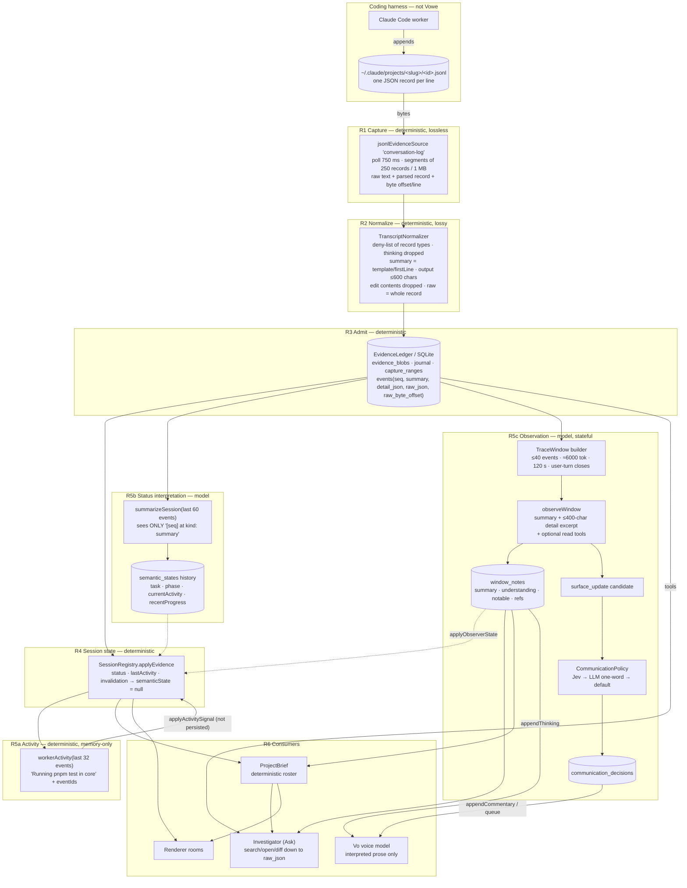

### 1.2 The representations

| # | Representation | Where it is built | Deterministic? | Persisted? |
|---|---|---|---|---|
| R0 | Claude Code JSONL record | The harness | — | The harness's own file |
| R1 | `EvidenceRecord`: raw bytes, parsed JSON, location, candidate events | `adapter-kit/evidence-source.ts:73` (segmenting), `adapter-claude-code/adapter.ts:140` (source id) | yes | yes: `evidence_blobs` (content-addressed), journal, capture ranges, checkpoint |
| R2 | `NormalizedEvent` candidate: `kind`, `summary`, `detail`, `raw`, `rawRef` | `adapter-claude-code/normalize.ts:91` | yes | through R3 |
| R3 | Admitted event: `seq`, `supportStatus`, `evidence{basis, execution}`, `raw_json` | `core/evidence/ledger.ts:1259` (`settle`), `:1370` (insert) | yes | yes: `events` |
| R4 | `AgentSession`: status, `lastActivityAt`, `semanticState` | `core/registry/session-registry.ts:549` | yes | the session row, plus the semantic history |
| R5a | `WorkerActivity`: label and `eventIds` | `core/product/worker-activity.ts:90` | yes | **no**, memory only (`session-registry.ts:627`) |
| R5b | `SemanticState` from the interpreter | `core/interpretation/llm-interpreter.ts:37-61` | **model** (falling back to the heuristic) | yes (`session-registry.ts:610`) |
| R5c-i | `TraceWindow` | `core/observation/window-builder.ts` (policy in `trace-window.ts`) | yes | yes: the `appendWindow` row |
| R5c-ii | `WindowNote`: `summary`, `understanding`, `notableChange`, refs | `observer-runner.ts:364-445` | **model** | yes (`observer-runner.ts:444`) |
| R5c-iii | `SurfaceUpdate` candidate, then `CommunicationDecision` | `observer-runner.ts` (the `surface_update` tool), `communication-policy.ts:84` | model, then Jev, LLM or heuristic | yes: `communication_decisions` |
| R5c-iv | `SemanticState.currentUnderstanding` and `meaningfulUpdates` | `session-registry.ts:665-696` | derived from model output | yes |
| R6a | Project roster line | `delegated-question-runner.ts:525-545`, `project-brief.ts:249` | yes | **no**, built at read time |
| R6b | Investigation answer: `fullAnswer`, `spokenAnswer`, refs, receipt | `llm/anthropic-llm-client.ts:271-341` | **model** | yes: a conversation entry plus a run/trace |
| R6c | Project memory lesson | `core/knowledge/project-knowledge-service.ts:215` | **model** (the Jev gate) | yes: `memory.ndjson` |
| R6d | Vo's spoken context | `core/live/live-bridge.ts:373-414, 538` | passthrough of interpreted prose | only the conversation and delivery records |

### 1.3 Each transition, in detail

#### T0 → R1: the harness file becomes captured evidence

| Question | Answer |
|---|---|
| In | Bytes appended to a `.jsonl` file that the harness owns. Discovery covers `~/.claude/projects/*/*.jsonl` over a two-day window, plus live `~/.claude/sessions` records. |
| Out | `EvidenceRecord` values, each with `raw` (the parsed object), the exact line `text`, `location{byteOffset, line}`, and candidate events. Segments are cut at 250 records or 1 MB (`evidence-source.ts:73`). |
| Discarded | **Nothing that was written.** Malformed lines are kept as raw text with no events (`evidence-source.ts:123-188`). An incomplete trailing line is deferred until it is complete. |
| Ordering | File order is kept (`line`, `byteOffset`). The record key is the provider's `uuid` (`adapter.ts:148`). |
| Provenance | A checkpoint records device, inode, size, mtime, offset, a sha256 of the head, and a 64 KB boundary anchor (`evidence-source.ts:59-70`). A rewritten file triggers a whole-snapshot re-read, not an append. |
| Model? | No. |
| Persisted? | Yes: content-addressed blobs, journal, capture ranges, and heads (`ledger.ts`). Coverage is always declared `partial`: "Retained transcript captured; provider history and omitted evidence may be incomplete". |
| Can the next stage get back? | Yes. The capture *is* the evidence. |

What the harness never writes is also lost here. Examples are provider-side
context that the harness compacted before writing, and subagent transcripts
stored elsewhere.

- **[inference]** Vowe cannot know about these. Its honest `partial` coverage
  label is the only acknowledgement.

#### R1 → R2: normalization (the first and largest semantic compression)

| Question | Answer |
|---|---|
| In | One parsed record. |
| Out | Zero or more `NormalizedEvent` candidates (`normalize.ts:91`, `withOrdinals`). |
| Discarded entirely | These record types produce no event (`IGNORED_RECORD_TYPES`, `normalize.ts:28`, checked at `:97`): • `attachment`, `last-prompt`, `mode`, `permission-mode`, `atis-latch`, `bridge-session`, `cost-state`, `queue-operation`; • `file-history-snapshot/delta`, `ai-title`, `agent-name`, `summary`. Also dropped: • `isMeta` user records (`:214`); • `turn_duration` system records (`:273`); • **assistant `thinking` blocks**, which are "intentionally not events" (`:134`). |
| Compressed | • **`summary`** is a deterministic template or the first line: `firstLine(text)` for assistant text (`:126`), `Task: firstLine` for the first user message (`:222`), "Ran: …", "Edited X", "Read file", "Searched for", "Delegated to a subagent" (`:161-180`). • **Tool input** passes through `compactInput` (`:367`). Only the Bash command (≤400) and description, or `file_path`, survive. **The contents of Edit and Write are not in `detail`.** • **Tool output** is truncated to 600 characters (`:264`), with `failed = is_error` (`:246`). • **System records** become `unknown`, with content truncated to 200. |
| Kept | • `detail.text` holds the **full** assistant text and the full user text, after `stripNoise` removes `<system-reminder>` and command wrappers (`:351`). • **`raw` is the entire original record, and `rawRef{source, byteOffset, line}`** (`:304`) points into the file. |
| Classification | `tool_use` becomes a `kind`: • Bash becomes `command_started`, or `test_started` if it matches `TEST_COMMAND`. • Edit, Write, NotebookEdit and MultiEdit become `file_changed` (`:44`). • AskUserQuestion and ExitPlanMode become `session_waiting` with `awaitingHuman` (`:45`). • Read, Grep, Glob, Task and Agent become `tool_started`. `tool_result` is paired through a pending map to produce the matching `*_finished`. |
| Ordering | `withOrdinals` numbers the events one line produces. The line order stays in `rawRef`. |
| Model? | No. This is the most consequential *judgement* in the pipeline, and it is made by string templates. |
| Persisted? | Yes, through R3. `raw` travels with the event. |
| Can the next stage get back? | **Yes, but only at event granularity.** Because `raw` is the whole record, an Edit's contents and the full tool output *are* recoverable from the event. What is not recoverable from any event is a record type on the deny list or a thinking block. Those survive only in the R1 blobs, which nothing reads at runtime (§5). |

Two consequences recur throughout this document:

- **[current]** The `summary` field is documented as "Deterministic one-line…
  No LLM" (`core/types/events.ts`). It is exactly what the two cheapest model
  readers are allowed to see (§4).
- **[current]** Subagent work (`Task` and `Agent`) appears as a single
  `tool_started` "Delegated to a subagent" plus its result, truncated to 600
  characters. What the subagent did internally is outside this transcript.

#### R2 → R3: admission into the ledger

| Question | Answer |
|---|---|
| In | An `EvidenceBatch` of candidates, each with a `factKey` (by default `[sourceId, recordId, slot]`), a `basis` (`reported` or `established`) and an `execution`. `command_finished` and `test_finished` are marked `executed` (`adapter.ts`, the `interpret` hook). |
| Out | Admitted `events` rows with a `seq`, plus `event_support` rows. |
| Discarded | Nothing is deleted. A changed fact **supersedes** (`active = 0`) and invalidates from a `seq` (`ledger.ts:1143`). Sources that disagree yield an `operation_reported` event, "Sources disagree about this operation" (`:1298`). |
| Ordering | **`seq` is the order of admission, not of chronology** (`types/events.ts`). `at` carries the provider timestamp. After a rewrite or re-read, a later `seq` can describe an earlier moment. |
| Provenance | `events.raw_json` holds the verbatim record text (`:1370`), along with `raw_source`, `raw_byte_offset` and `raw_line`. **[current]** A full provenance API exists: `ledger.provenance(sessionId, eventId)` (`ledger.ts:845`) and `store.evidenceProvenance`. It returns the batches, captures and supports behind an event. **It has no runtime caller**; only tests call it. |
| Model? | No. |
| Persisted? | Yes. The capture commits first and admission in a separate commit (`ingest`). |
| Can the next stage get back? | To `raw_json`, yes. To the *capture* (blob, journal, the other sources that supported it), **only through an API that nothing calls**. |

#### R3 → R4: the registry's session state

`SessionRegistry.applyEvidence` (`session-registry.ts:549`) updates status and
activity time. It emits events in pages. When a change carries
`invalidatedFromSeq`, it **sets `semanticState = null`** (`:557`) and emits
`evidence:changed`. The observation service then stops and restarts that
session's runner (`observation-service.ts:268`).

- **[current]** An evidence correction therefore wipes the session's
  *interpreted* state. That includes the observer's `currentUnderstanding` and
  its five `meaningfulUpdates`, not only the interpreter's.
- **[inference]** The notes already written are not deleted. They stay
  readable through `hasCurrentSupport` / `stale` (`core/evidence/support.ts:12`),
  and `openWindow` flags them "Historical window: support was invalidated"
  (`context-navigator.ts:564`). Until the observer processes its next window,
  the live understanding simply starts over from nothing.

#### R4 → R5a: fast activity (deterministic)

`InterpretationRunner` runs `workerActivity(events)` over the last 32 events on
every event (`interpretation-runner.ts:62, 91`). It then calls
`registry.applyActivitySignal` (`:93`), which is **memory-only**
(`session-registry.ts:627`).

- The label is "specific or silent" (`worker-activity.ts:10-30`). It names a
  real command, file or test target, parsed from `detail` (`describeCommand`,
  `testTarget`, `editLabel`).
- It carries `eventIds` as provenance.

This is the most faithful "what is it doing *right now*" representation Vowe
has. It is never persisted and never shown to any model except through
`sessionActivity(session)` in the project roster line
(`observer-state.ts:84`).

#### R4 → R5b: status interpretation (model; see §2, actor A1)

The runner is debounced: 15 s of quiet, or a burst of 25 events
(`interpretation-runner.ts:59-61`). It passes the last **60** events to
`LlmInterpreter.interpret`:

1. The heuristic runs first (`llm-interpreter.ts:37`).
2. The model then receives `events.map(toObservedEvent)` (`:53`).
   `toObservedEvent` (`core/llm/llm-client.ts:76`) keeps **only
   `id, seq, at, kind, summary, evidence`**. Detail, output, text and paths are
   all gone.
3. If the evidence revision changed during the call, the result is discarded
   and rescheduled (`interpretation-runner.ts:158-164`).
4. Otherwise the result is persisted through `applySemanticState`, which keeps
   the fast lane's activity when its events are newer and always preserves the
   observer's fields (`session-registry.ts:590-610`).

#### R3 → R5c: windowed observation (model; see §2, actors A2 and A3)

1. **Window.** Built deterministically from event timestamps under
   `DEFAULT_WINDOW_POLICY`: 40 events, about 6000 approximate tokens, 120 s
   elapsed or a 180 s idle gap, and a user turn closes the window
   (`trace-window.ts`).
2. **Prompt.** `renderObserverPrompt` (`observer-prompt.ts:48`). Each event line
   is `[seq] at kind: summary (ref)`, plus `observerDetail`
   (`observer-prompt.ts:121`), which keeps the keys command, output, text,
   `file_path`, failed, input, execution, and so on, truncated to **400
   characters**.
3. **Output.** The `record_observation` tool (`llm/observation-tools.ts:36`)
   produces a `summary`, an `understanding` of about 60 words, a
   `currentActivity` and a rare `notableChange`. An optional `surface_update`
   (`:131`) produces a candidate.
4. **Refs.** The window's own trace ref, **plus every ref the tool loop
   touched**, plus the model's refs (`observer-runner.ts:364-445`).
5. **Persistence.** `appendWindowNote` (`:444`), then the cursor advances
   (`:445`), then `onNote`, then `publishUnderstanding`, which calls
   `registry.applyObserverState`.

#### R5 → R6: the consumers

These are covered in §2 and §4. The key fact about ordering and provenance is:

- **[current]** Every derived representation carries `ContextRef` strings. They
  resolve with `ContextNavigator.openContext` (`context-navigator.ts:503`) down
  to `openEvent` at `depth='raw'`, which returns
  `JSON.stringify(event.raw)` (`:853`).
- **[stale]** The doc comments at `context-navigator.ts:50-55` and `:843-851`
  say `raw` "reaches past Vowe entirely and re-reads the provider's own record
  from its own file". **It does not.** It returns Vowe's captured copy from
  `events.raw_json`. The result is equivalent while the file is unchanged. It
  differs if the harness rewrote the file, which is the case the ledger's
  supersession exists for.

---

## 2. Inventory of intelligent actors, by cognitive responsibility

The organizing question is *"What cognitive job have we given this model?"*.
The actors below are grouped by that job, not by package.

Four configured model endpoints stand behind all of them:

| Endpoint | Configuration |
|---|---|
| **The shared Anthropic client** `llm` | `AnthropicLlmClient.fromEnvironment()`, `main/index.ts:248`. Default `claude-sonnet-5` (`llm/anthropic-llm-client.ts:102`), effort `low` (`:104`), 12 tool iterations (`:103`), adaptive thinking. **One instance** serves the interpreter, the observer, the investigator and the policy's LLM fallback. |
| **The Studio agent** | A separate `AnthropicSystemDesignAgent`. Default `claude-sonnet-5`, effort `medium`, 8 iterations, overridable through `VOWE_STUDIO_MODEL` (`llm/anthropic-system-design-agent.ts:61-77`). |
| **Jev** | A structured-decision model over HTTP (`decision-jev/jev-decision-router.ts:16-24`). It never writes prose. |
| **Two external model/harness runtimes** | OpenAI Live `gpt-live-1` for Vo (`live-openai/openai-live-transport.ts:27`), and Claude Code through the Agent SDK for Studio consultations. Titles use Haiku (`llm/anthropic-title-model.ts:14`). |

### 2.1 One line each: the cognitive job

| # | Actor | The cognitive job, stated plainly | Kind |
|---|---|---|---|
| A1 | Status interpreter | "Restate the last 60 one-line event summaries as a phase, a 12-word activity and up to six progress bullets." | model call, stateless |
| A2 | Session Observer (window) | "Read this new portion of the trace. Say what changed in your running understanding of the worker. Propose anything worth a human's attention." | tool loop (explores only when gated in), stateful through the store |
| A3 | Session Observer (checkpoint) | "The window is still open. Give a provisional reading of the tail so far." | model call with one tool, no read tools |
| A4 | Exploration gate | "Is this window ambiguous enough to justify spending tools?" | Jev `noul` over kinds and summaries |
| A5 | Continuity selector | "Which one older note is relevant to this window?" | Jev `choose` |
| A6 | Communication judge | "Should this candidate be spoken now, queued, kept quiet or ignored, given what the developer said they want?" | Jev `choose`, then an LLM one-word classifier, then a heuristic |
| A7 | Session investigator | "Answer this developer's question about one worker by going and looking. Give a spoken sentence and a written answer with citations." | tool loop |
| A8 | Project investigator | "Answer this question about a repository and the agents in it, starting from a roster of what Vowe understood about each session." | tool loop |
| A9 | Memory admission judge | "Would this grounded answer still help an engineer in a future, unrelated session?" | Jev `noul` ≥ 0.7 |
| A10 | Vo | "Hold a spoken conversation. Know only what background updates tell you. Delegate when you would have to guess." | realtime voice model with one client-side delegation hook |
| A11 | Studio design agent | "Be a system-design partner. Keep a small design model coherent, tell proposal from fact, and check the repository only when implementation truth decides something." | tool loop (one tool) |
| A12 | Studio glance (`consider`) | "The developer moved something on the canvas. Almost always say nothing. Otherwise write one note under 20 words." | model call |
| A13 | Repository consultant | "Answer one bounded, read-only question about the actual code, with the files it rests on." | an **external coding harness** (Claude Code) running its own loop |
| A14 | Title model | "Name this piece of work in a few words." | model call |

Two further things act on meaning without a model:

- **D1, the normalizer.** It decides what an event *is* and how it reads in one
  line (§1.3).
- **D2, `workerActivity` / `workerMilestones` / `attentionFor`.** These decide
  what the worker is doing, which moments were milestones, and whether a human
  is needed (`core/product/worker-activity.ts:90`, `observer-state.ts:62`,
  `attention.ts:67`).

They are not "intelligent", but three model actors (A1, A2 and A8) take them
as ground truth.

### 2.2 Actor cards

Every card answers the same ten questions. "Durable?" means the output survives
a restart.

#### A1 — Status interpreter (`LlmInterpreter` → `AnthropicLlmClient.summarizeSession`)

| | |
|---|---|
| **Purpose** | A cheap, periodic "what is it doing / what has it done" for the session header. `SUMMARIZE_SYSTEM`, `llm/prompts.ts:6`. |
| **Input context** | Session id, cwd, the current task, and the *previous* phase, activity and progress. Then the last 60 events as `[seq] at kind: summary`, plus an evidence JSON (`prompts.ts:30-55`). **No `detail`, output, message text or paths beyond the summary** (`core/llm/llm-client.ts:76`). |
| **Available tools** | None. `messages.parse` with a zod schema, effort `low`, 4k tokens (`anthropic-llm-client.ts:150-178`). |
| **Persistent state available** | Only what the runner hands it: its own previous output. |
| **Output** | `SemanticUpdate{task, phase, currentActivity, recentProgress}`, merged over the heuristic (`llm-interpreter.ts:61`). |
| **Output consumer** | `registry.applySemanticState`, then the session status UI. **No model consumes it.** The investigator prompt carries no `SemanticState` (§4.2), and Vo is not primed with it (§4.6). |
| **Durable?** | Yes: the semantic-state history (`session-registry.ts:610`). It is cleared on evidence invalidation (`:557`). |
| **Evidence/provenance** | `provenance{eventIds, throughSeq}` names the window it read, not which event supports which bullet. |
| **Authority** | Display only. It cannot overwrite the observer's fields (`session-registry.ts:590-610`). |
| **Model** | The shared `llm` (`claude-sonnet-5`, low). The heuristic fallback runs when the key is absent. |

Its prompt asks for "findings and outcomes, not a transcript of tool calls"
(`prompts.ts:15`), but gives it only tool-call one-liners, with no command
output or message text.

- **[inference]** It can therefore only restate activity or guess at outcomes.
  The same prompt forbids it to guess.

#### A2 — Session Observer, window mode (`ObserverRunner.processWindow` → `observeWindow`)

| | |
|---|---|
| **Purpose** | Keep an incremental understanding of one worker, one window at a time. `OBSERVER_SYSTEM` asks "what changed in my understanding?" (`observer-prompt.ts:19-44`). |
| **Input context** | `renderObserverPrompt` (`observer-prompt.ts:48`) contains: • the task and cwd; • the session's `communicationPreference`; • the current `understanding` string; • up to 4 recent note summaries plus their notables (`observer-runner.ts:184, 393`); • at most one relevant older note, chosen by A5 (`:394`); • up to 8 recent developer and worker message summaries (`:185`); • a coverage notice; • the window's events as summary lines plus a 400-character detail excerpt. |
| **Available tools** | `record_observation` and `surface_update` always (`llm/observation-tools.ts:36, 131`). When A4 says to explore, also `search_context`, `open_context` and `get_diff` at session scope (`:166-219`). The session scope **also permits `sources: ['observations', 'repo']`**, which reaches other sessions' notes and project memory (`context-navigator.ts:197-247`). |
| **Persistent state available** | Its own notes (through the prompt). With tools: this session's windows, trace and transcript, the repository, other sessions' observations, and lessons. |
| **Output** | A `WindowNote{summary, understanding, currentActivity, notableChange?, refs}` and optionally a `SurfaceUpdate{message, whyNow, urgency, refs}`. |
| **Output consumer** | • The store. • `registry.applyObserverState`, which produces `currentUnderstanding` and `meaningfulUpdates`. • The investigator (the last 6 notes). • `searchWindows` and `searchObservations`. • The project roster (A8). • Vo (`appendThinking`). • A6 (the candidate). |
| **Durable?** | Yes: `window_notes`, and the understanding through the semantic-state history. |
| **Evidence/provenance** | The note's refs are the window's trace ref, **∪ every ref touched in the tool loop**, ∪ the model's refs (`observer-runner.ts:364-445`). |
| **Authority** | It proposes attention and does not decide it. It writes the only durable interpretation other actors read. |
| **Model** | The shared `llm`. Without a key it is `nullObserver`: no notes and no understanding (`main/index.ts:441, 679`). |

#### A3 — Session Observer, checkpoint mode (`observeTail`)

| | |
|---|---|
| **Purpose** | Keep the live understanding current while a long window is still open. It runs every 20 s (`observer-runner.ts:187, 546`). |
| **Input context** | The same prompt as A2, over the open tail. |
| **Available tools** | `record_observation` and `surface_update`. **No read tools.** |
| **Persistent state available** | As A2, through the prompt only. |
| **Output** | The understanding and a possible durable update and candidate. **No note is written.** |
| **Output consumer** | `applyObserverState`. |
| **Durable?** | Partly. The durable update's id is `checkpoint:<sid>:<endSeq>` (`:642`), and it lives **only** in `SemanticState.meaningfulUpdates`, which is capped at 5 (`session-registry.ts:689`). It rolls off and has no note to search. |
| **Evidence/provenance** | Metadata `{checkpoint: true, throughSeq}` (`:591`). |
| **Authority** | The same as A2. |
| **Model** | The shared `llm`. |

#### A4 / A5 — Exploration gate and continuity selector (Jev)

| | A4 exploration gate | A5 older-note selector |
|---|---|---|
| **Purpose** | Decide whether A2 gets read tools for this window. | Pick at most one relevant older note. |
| **Input context** | The window's event kinds and summaries (`observer-runner.ts:700`). | The window, plus the last 6 older notes' summaries, truncated to 240 (`:754`). |
| **Tools** | — | — |
| **State** | none | none |
| **Output** | `noul` ≥ 0.5 means explore. Without Jev, the `looksUncertain` heuristic decides. | A key. |
| **Consumer** | A2's tool set. | A2's prompt. |
| **Durable?** | Only as a run record. | Only as a run record. |
| **Provenance** | — | — |
| **Authority** | It controls how deeply A2 may look. | It controls what A2 remembers. |
| **Model** | Jev, or the heuristic. | Jev, or the recency fallback. |

**[stale]** The `JevDecisionRouter` comment says it is used for "three things
and no others" (`jev-decision-router.ts:53-58`). It has **four** call sites:

- `observer-runner.ts:700` (A4);
- `observer-runner.ts:754` (A5);
- `communication-policy.ts:124` (A6);
- `memory-admission.ts:75` (A9).

Pass 1 noted this too.

#### A6 — Communication judge (`CommunicationPolicy.evaluate`)

| | |
|---|---|
| **Purpose** | Decide what happens to a candidate: `speak_now`, `queue`, `quiet_context` or `ignore`. |
| **Input context** | • **Jev** (`communication-policy.ts:124`): the candidate message, `whyNow`, urgency, and interruption appetite, with the developer's preference as instructions. • **LLM fallback** (`:182-230`): the same facts rendered as a question to `answerQuestion`, with `task`, `cwd` and `semanticState` all null and `events: []`. • **Neither path sees the session's understanding or the evidence.** |
| **Tools** | none |
| **Persistent state** | none |
| **Output** | A `CommunicationDecision{action, reason, source}`, then `withSpeakFloor`, which can only downgrade (`:248`). |
| **Consumer** | `ObservationService`, then `LiveBridge.deliverSurface` (`live-bridge.ts:386-414`) and the renderer. |
| **Durable?** | Yes: `recordCommunicationDecision` (`observation-service.ts:294`). |
| **Provenance** | The candidate's refs. |
| **Authority** | **It can make Vo speak unprompted.** |
| **Model** | Jev, then the shared `llm` through `answerQuestion` (`ANSWER_SYSTEM`, a *session Q&A prompt* reused as a one-word classifier; `prompts.ts:19`), then `defaultDecision` (`:271`). |

**[current]** `answerQuestion` has no caller other than this one. The Q&A
prompt it was built for is otherwise dead. So is `renderQuestionPrompt`
(`prompts.ts:58`), which *would* have rendered the interpreted state.

#### A7 — Session investigator (`DelegatedQuestionRunner.answer` → `investigate`)

| | |
|---|---|
| **Purpose** | Answer a question about one worker with grounded evidence (`INVESTIGATE_SYSTEM`, `llm/observer-prompts.ts:13`). It serves typed session Ask and Vo's session delegation alike (`live-bridge.ts:509-521`). |
| **Input context** | `renderInvestigationPrompt` (`observer-prompts.ts:57-100`) contains: • the task, cwd and session id; • temperament guidance (`delegated-question-runner.ts:281`); • attachments, opened before the model runs (`:274`); • the **last 6 window notes, rendered as summary plus notable only**, under the heading "What the observer currently understands" (`observer-prompts.ts:93-97`); • the last 12 durable conversation turns, with delivery status (`delegated-question-runner.ts:288-291`), or a live transcript override. |
| **Available tools** | `search_context`, `open_context` and `get_diff` (session scope; `observations` and `repo` are allowed), plus `record_answer`, then `tool_choice: none` for the prose (`anthropic-llm-client.ts:271-341`). |
| **Persistent state available** | Through tools: this session's events down to raw, window notes, other sessions' observations, repository files, the Graphify graph, lessons, and the current diff. |
| **Output** | `spokenAnswer` (from `record_answer`, or else the first sentence), `fullAnswer` (the final text), and refs. |
| **Output consumer** | • A `companion_answer` conversation entry (`delegated-question-runner.ts:347-365`). • The renderer. • Vo (`spokenAnswer` only, `live-bridge.ts:538`). • `onAnswer`, which calls memory admission (A9, `main/index.ts:475`). |
| **Durable?** | Yes: the entry, the receipt, and the run with its model trace. |
| **Evidence/provenance** | `refs = model refs ∪ recorder.refs()` (`:347`). **Every search hit counts as a ref** (`investigation-recorder.ts:60-70`). `provenance.eventIds` is the subset of those refs that are event or transcript refs (`:356`). |
| **Authority** | Read-only. It has no adapter (`main/index.ts:833-835`). |
| **Model** | The shared `llm`. Effort is raised from `low` to `medium` for session scope (`anthropic-llm-client.ts:289`). |

Three things about A7's context are easy to miss:

- **[current]** It is not given the session's `currentUnderstanding`. That is
  the observer's own distilled state and the one field written to be read
  standalone.
- **[current]** It is not given the interpreter's `SemanticState` either.
- **[current]** The prompt labels a list of window *summaries* as "what the
  observer currently understands". The actual understanding string is absent.

#### A8 — Project investigator (`DelegatedQuestionRunner.answerProject`)

| | |
|---|---|
| **Purpose** | Answer about a repository and its agents (`INVESTIGATE_PROJECT_SYSTEM`, `observer-prompts.ts:34-40`). It serves typed project Ask and Vo's project delegation (`live-bridge.ts:509`). |
| **Input context** | • Project name and repository root. • A **roster** (`delegated-question-runner.ts:525-545`) of at most 12 lines: every *current* session, plus up to 3 recent ones. Each line carries status, `currentActivity` (the fast lane), `currentUnderstanding` truncated to 360 characters, attention, `latestDevelopment` truncated to 220, and up to 3 evidence refs. • The last 12 project conversation entries (2400 characters each, plus up to 4 refs). • Attachments. |
| **Available tools** | The same three read tools at project scope. Search is restricted to `repo` and `observations` (`context-navigator.ts:124, 197-201`). **`open_context` has no scope check**, so a roster or observation ref leads straight into a session's trace or raw events (`context-navigator.ts:503-545`). |
| **Persistent state available** | The same as A7, reached across sessions. |
| **Output** | The same shape as A7. |
| **Output consumer** | A project conversation entry, the renderer, a project Vo call (`main/index.ts:865`, `live.projectAsked`). |
| **Durable?** | Yes, the entry. **It never reaches memory**: `answerProject` has no `onAnswer` call. |
| **Evidence/provenance** | As A7. |
| **Authority** | Read-only. |
| **Model** | The shared `llm`, effort `low` (`anthropic-llm-client.ts:289`). |

**[current] Cost.** `projectRoster` loads *every* event (with raw omitted) of
*every* session in the project on each project question, before sorting
(`delegated-question-runner.ts:528`).

#### A9 — Memory admission judge (`ConservativeMemoryAdmission`)

| | |
|---|---|
| **Purpose** | Decide whether a session answer becomes a project "lesson" (`core/knowledge/memory-admission.ts:53-97`). |
| **Input context** | The question, the full answer, and up to 20 ref *kinds* (`:81-87`). |
| **Tools / state** | None. |
| **Output** | A boolean. Two gates: (1) at least one `repo:` or `symbol:` ref (`:105-111`); (2) Jev `noul` ≥ 0.7. With no Jev, it answers **no**. |
| **Consumer** | `ProjectMemoryStore.remember`, which appends to `memory.ndjson` (`project-memory-store.ts:71, 269`). |
| **Durable?** | The lesson is. |
| **Provenance** | The lesson keeps the answer's refs, as strings. |
| **Authority** | **It is the only gate between one conversation and every future search in the project.** |
| **Model** | Jev. |

**[defect]** Gate 1 is described as "structural rather than linguistic": an
answer must be *grounded in the repository*. But the refs it tests include every
search *hit* the investigator saw (`investigation-recorder.ts:60-70`), and
`searchRepo` hits are `repo:`, `symbol:` or `lesson:` refs.

- An answer about "what is the worker running?" passes gate 1 if the
  investigator merely *searched* the repository on the way.
- A second consequence: an answer that cites an existing lesson passes because
  `searchRepo` returned `symbol:` or `repo:` hits alongside it.

Gate 2 carries the whole decision in practice.

#### A10 — Vo, the voice model (OpenAI Live through `LiveBridge`)

| | |
|---|---|
| **Purpose** | A spoken companion (`core/live/vo-prompt.ts`). "You have no worker-control capability" (`:23`). "Those updates are what you know" (`:35`). |
| **Input context** | • The system prompt. • **Project call:** the project voice context (`projectVoiceContext(brief)`), an orientation line (`live-bridge.ts:298-300`), and 12 hydrated turns. • **Session call:** only "Vowe is following this session live" plus the communication preference, then 12 hydrated turns (`:564-580`). • After that, notes as `appendThinking` (`:373-383`), candidates as `appendCommentary` (`:413`), and delegated answers' `spokenAnswer` (`:538`). Each piece passes through `toLiveText`, which caps it at about 500 tokens. |
| **Available tools** | Client-side delegation only (`openai-live-transport.ts:123`). The provider says that a delegation happened, not what was asked. The bridge reconstructs the question from its own transcript buffer (`live-bridge.ts:454-466, 483-489`). |
| **Persistent state available** | None of its own. `LiveConversationRecorder` persists the turns and deliveries (`live-conversation-recorder.ts:469`). |
| **Output** | Speech. |
| **Output consumer** | The human. The transcript goes into durable conversation entries, which later feed A7 and A8 as history. |
| **Durable?** | Only as recorded conversation. |
| **Evidence/provenance** | None. It speaks interpreted prose, never refs. |
| **Authority** | It can talk. It cannot instruct a worker. |
| **Model** | `gpt-live-1` (`openai-live-transport.ts:27`). |

**[current]** A **session** call starts without the session's understanding.
Until the next note arrives, or until Vo delegates, it knows nothing about the
worker beyond the hydrated conversation. A project call starts with the brief.

#### A11 — Studio design agent (`AnthropicSystemDesignAgent.turn`)

| | |
|---|---|
| **Purpose** | A system-design partner (`STUDIO_SYSTEM`, `llm/studio-prompts.ts:12`). It is "stateless between turns on purpose" (`core/studio/system-design-agent.ts:23-27`). |
| **Input context** | `DesignTurn` (`system-design-agent.ts:73-102`), assembled in `studio-service.ts:257-270`: • the message; • the current `DesignModel` and revision; • the last 12 moves; • focus; • the last 12 conversation turns, with canvas moves and notes rendered inline (`:646-660`); • **every earlier repository finding in this design** (`findingsIn`, `:588-599`); • attachments; • temperament guidance. |
| **Available tools** | `consult_repository` only (`anthropic-system-design-agent.ts:213-226`). At most 2 per turn (`studio-service.ts:160, 531-536`). None on an idea-first first turn (`anthropic-system-design-agent.ts:110`). |
| **Persistent state available** | Only this design's rows. `DesignStore` is narrow on purpose (`core/studio/types.ts:106-141`). **No sessions, notes, project brief, memory or Graphify.** |
| **Output** | A reply, plus an optional move (ops and summary) parsed from a delimited text block (`design-text.ts`). |
| **Output consumer** | `StudioService`. It grounds the move (`groundModel`, `:669`; `unclaimed`, `:461`), then `commitDesignTurn` writes the reply and the revision together. |
| **Durable?** | Yes: design entries, revisions and layout. |
| **Evidence/provenance** | Parts may cite only refs this design has checked (`groundModel`). `today` is stamped with a `RepositoryBasis` (checkout) (`core/studio/model.ts:97, 329-424`). |
| **Authority** | It changes the design. **It cannot touch workers, files, project memory or Project Ask** (`studio/types.ts:11-14`). |
| **Model** | `claude-sonnet-5`, medium (or `VOWE_STUDIO_MODEL`). |

**[current] How strict the "today" grounding is.** "Grounded" is decided **per
design, not per claim** (`studio-service.ts:334-338`). Once any finding exists
anywhere in the design's history, or any attachment was opened, *every*
`today: true` in later moves is kept. That holds even for a part that no
consultation ever mentioned. The citation filter (`groundModel`) constrains
*refs*, not the `today` flag.

#### A12 — Studio glance (`consider`)

| | |
|---|---|
| **Purpose** | Say nothing about a canvas move unless it breaks something (`CONSIDER_SYSTEM`, `studio-prompts.ts:273-280`). |
| **Input** | The model before and after, the move, and the conversation. |
| **Tools / state** | None. 400 tokens (`anthropic-system-design-agent.ts:184-196`). |
| **Output** | A `{on, text}` note, or null. |
| **Consumer / durable** | A `companion_note` design entry anchored to the move (`studio-service.ts:474-510`). |
| **Provenance / authority** | None. It annotates only. |
| **Model** | As A11. |

#### A13 — Repository consultant (`ClaudeCodeConsultant`, which is a coding harness)

| | |
|---|---|
| **Purpose** | A bounded, read-only question about the actual code (`core/studio/consultation.ts:3-26`). |
| **Input context** | One question plus why it matters. The repository is its whole world. **It gets no Vowe context at all**: no sessions, notes, lessons or design (`consultant.ts:222`). |
| **Available tools** | `Read`, `Grep`, `Glob` only (`consultant.ts:22`). An explicit deny list covers the rest (`:25-27`). `settingSources: []`, `mcpServers: {}`, `persistSession: false` (`:196-203`). Limits: 24 turns, $0.75, 180 s (`:103-105`). |
| **Persistent state available** | None. No CLAUDE auto-memory. The repository's own `CLAUDE.md` is readable as a file. |
| **Output** | `{answer ≤ ~250 words, confidence, references}`. References are verified to exist inside the root and ordered opened-first (`verifiedRefs`, `:182`), along with `inspected` paths. |
| **Output consumer** | A11, as tool output (`renderFinding`, `anthropic-system-design-agent.ts:229-241`), and the turn's receipt. |
| **Durable?** | Yes, as a `consult` check inside the design entry's receipt, which is later re-read by `findingsIn`. |
| **Evidence/provenance** | Verified `repo:` refs, plus a `RepositoryBasis` for the checkout that was read. |
| **Authority** | None. It cannot write, execute or leave a session behind. It is never registered as a worker. |
| **Model** | Claude Code's default model (overridable through `model`), via `@anthropic-ai/claude-agent-sdk`. |

#### A14 — Title model (`AnthropicTitleModel` through `SessionTitleService`)

| | |
|---|---|
| **Purpose** | Name a session once, when it is launched or first opened (`session-title-service.ts:37-50`, `main/index.ts:1100-1114`). |
| **Input / tools / state** | The task string only, no tools, no state. |
| **Output / consumer** | `generated_title`, which becomes the display label everywhere, including the roster lines A8 reads. |
| **Durable?** | Yes. It never re-runs once set. |
| **Provenance / authority** | None. It is a label only. |
| **Model** | `claude-haiku-4-5-20251001`. |

---

## 3. Agent architecture diagrams

### 3.1 Who talks to whom: direct calls versus persisted state

A **solid** edge is a direct, in-process call or model input. A **dashed** edge
means the two actors communicate **only through something persisted**.

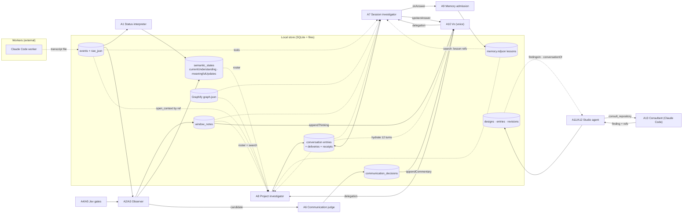

What the diagram shows:

- **Direct conversation** happens only in four places:
  - between Vo and the investigator, through delegation and the spoken answer;
  - between the Studio agent and the consultant;
  - from the observer to the policy (one-way);
  - from the Jev gates to the observer (one-way).
- **Every other relationship is mediated by the store.** The investigator
  learns what the observer understood by reading `window_notes`, not by asking
  it. Project Ask learns what each session is about through a deterministic
  roster, not from any model.
- **A1 is a dead end for intelligence.** Its output reaches `semantic_states`
  and the UI. No model edge leaves it.
- **Studio is an island.** Its only edges are to its own store and to a
  consultant that shares nothing with the rest of Vowe.

### 3.2 Evidence altitude: who reads raw evidence and who reads summaries

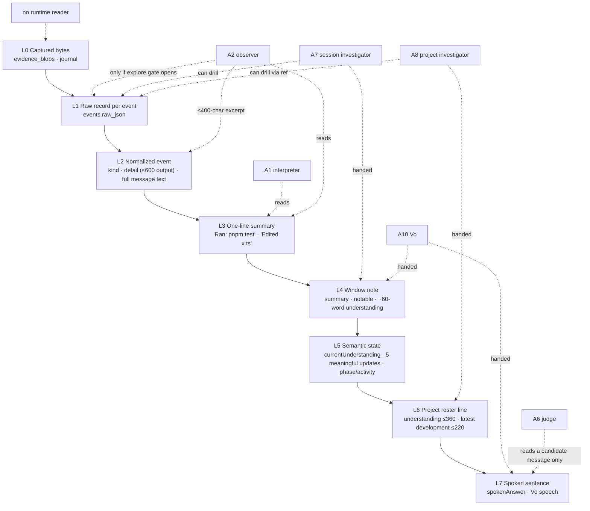

**[current]** Nothing reads L0 at runtime. The deepest any actor reaches is L1,
Vowe's copy of the record.

### 3.3 Capability matrix

| Actor | Shares conversation with | Isolated from | Has tools | Can drill down | Can affect workers |
|---|---|---|---|---|---|
| A1 interpreter | — | everything except its own last output | no | no | no |
| A2 observer | — (its own notes are its memory) | the developer's conversation with Vowe | yes, when gated | yes, to L1 | no |
| A6 judge | — | the session understanding and the evidence | no | no | no |
| A7 session investigator | Vo and typed Ask: the same durable session conversation | `currentUnderstanding` and `SemanticState` (not handed, only searchable) | yes | yes, to L1 | no |
| A8 project investigator | Vo and typed project Ask: the project conversation | session conversations | yes | yes, to L1, via refs | no |
| A10 Vo | the session or project conversation it is scoped to | evidence (it has refs to nothing) | delegation only | only by delegating | **no** |
| A11 Studio | its own design thread | all observation, all sessions, memory, graph | the consultant | through the consultant only | no |
| A13 consultant | nothing | everything Vowe knows | read, grep, glob | the live repository only | no |
| **Control channel** (not an actor) | — | — | — | — | **yes**: `registry.sendInstruction`, the developer's verbatim text |

---

## 4. Context assembly for each reasoning path

In every path, **a deterministic runner assembles the model's opening context
with fixed-size windows**. Relevance beyond recency is decided in only four
places:

- the Jev older-note selector (A5);
- the exploration gate (A4);
- the model's own tool calls, in A2 (when gated), A7, A8 and A11/A13;
- lexical term-count scoring inside `search_context` (`context-navigator.ts:320-394`).

No path uses embeddings or a learned ranker.

### 4.1 Comparison matrix

| Path | History | Summaries handed in | Raw evidence handed in | Project data | Repository knowledge | Who decides relevance | Assembly |
|---|---|---|---|---|---|---|---|
| **Status interpreter** (A1) | Its own previous output (phase, activity, progress) | Last 60 event summaries | none | none | none | recency (a fixed 60) | deterministic |
| **Observer window** (A2) | Current understanding; 4 recent notes; ≤1 older note; 8 message summaries | The window's event summaries | ≤400-character detail excerpt per event | none | only through tools | recency, **Jev choose** (older note), **Jev noul** (tools) | deterministic + model-gated + tool-driven |
| **Observer checkpoint** (A3) | as A2 | the open tail | ≤400-character excerpt | none | none | recency | deterministic |
| **Session Ask** (A7), typed or voice | 12 durable conversation turns with delivery status | Last 6 note summaries and notables | attachments (opened ahead of time) | none | only through tools | recency; then the **model** decides what to search and open | deterministic, then tool-driven |
| **Project Ask** (A8), typed or voice | 12 project conversation entries (2400 characters each) | Roster: ≤12 sessions × (understanding ≤360, latest development ≤220, activity, attention) | attachments | the roster *is* the project data | only through tools (Graphify first, then git grep, then lessons) | status + recency (current first, then 3 recent); then the **model** | deterministic, then tool-driven |
| **Studio turn** (A11) | 12 design turns, 12 moves, **every** earlier finding | none from observation | attachments | the project name only | the **consultant** (A13), at most 2 per turn | the **model** decides when to consult; findings are all included | deterministic, then tool-driven (through a harness) |
| **Vo, project call** (A10) | 12 project turns | the project voice context from the brief | none | the brief | none | none; whatever the brief selected | deterministic |
| **Vo, session call** (A10) | 12 session turns | **none at start**; then notes as they arrive | none | none | none | none; arrival order | deterministic (event-driven) |
| **Communication judge** (A6) | none | the candidate `message` and `whyNow` | none | none | none | — | deterministic |
| **Memory admission** (A9) | none | question and answer | ref kinds | none | none | — | deterministic |
| **Project home / brief** (no model) | — | each session's understanding and updates, with a milestones fallback | none | all sessions | the index state | `selectProjectSignal`: the latest surface update, else the latest notable (`project-signal.ts`) | deterministic |

### 4.2 Session Ask, step by step (`delegated-question-runner.ts:266-398`)

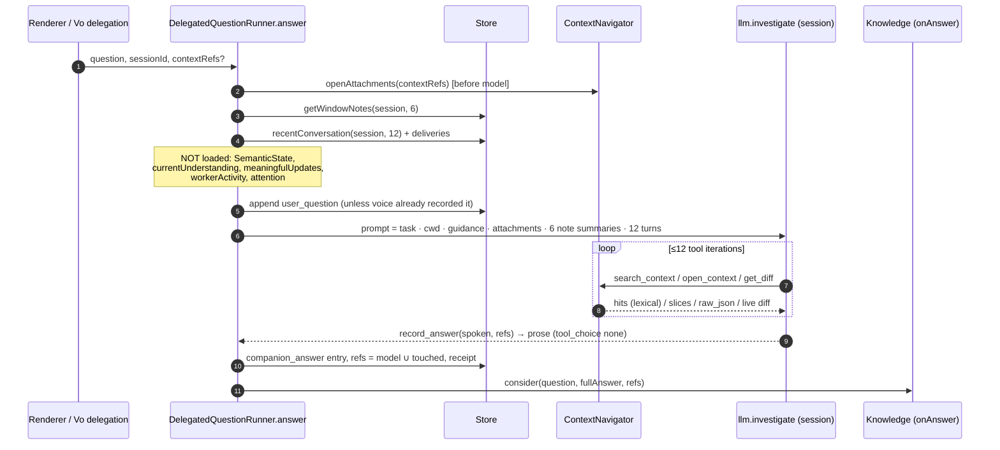

### 4.3 Project Ask, step by step (`delegated-question-runner.ts:414-523`)

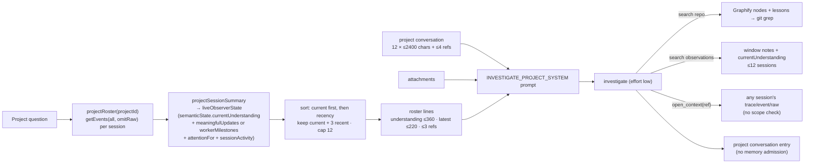

**[current]** The project path is two-stage. A **deterministic selection of
model outputs** (the roster) is followed by **model-driven retrieval**. The
roster's `currentUnderstanding` is the observer's last ~60-word paragraph. For
a session with no observer model, the line has no understanding at all, and
only deterministic milestones remain (`observer-state.ts:60-69`).

### 4.4 Studio turn (`studio-service.ts:230-372`)

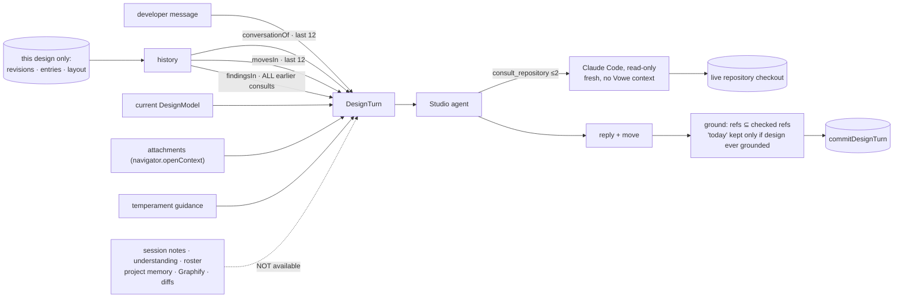

**[current]** Studio grounds itself **only in the present repository, as a
harness reads it**. It cannot know:

- that a worker is mid-change on the part being designed;
- what was decided in yesterday's session;
- what Vowe already learned in project memory.

The one exception is refs the developer attached by hand, which
`openAttachments` resolves through the navigator, so an attached `window:` or
`trace:` ref *is* readable.

### 4.5 Observer window (`observer-runner.ts:364-445`)

The continuity budget is fixed:

- one understanding paragraph;
- 4 recent notes;
- ≤1 older note, chosen from the 6 before those;
- 8 message summaries.

Relevance beyond recency is Jev's `choose` over note summaries truncated to 240
characters. Without Jev, the fallback is recency.

- **[inference]** On a long session, what the observer "remembers" at window
  *n* is the understanding paragraph (itself a rewrite of earlier rewrites) plus
  a handful of note summaries. Anything older is reachable only if the
  exploration gate opens *and* the model thinks to search `windows`.

### 4.6 Vo at call start (`live-bridge.ts:290-305, 564-610`)

| Scope | Primed with | Missing at start |
|---|---|---|
| Project | the brief's voice context, an orientation instruction, 12 turns | raw evidence (it must delegate) |
| Session | "following live / catching up", the preference, 12 turns | **the session's `currentUnderstanding`, activity and recent updates.** They arrive only as later notes and candidates. |

---

## 5. Provenance, traced backward

The expected chain is:

> user-facing statement → model output → input context → derived
> representation → normalized evidence → provider event

Below, the chain is walked for three statements.

- ✅ marks a link that is **addressable at runtime**.
- ⚠️ marks a link that exists but is **not selective or not exact**.
- ❌ marks a link that is **broken or absent**.

### 5.1 "The agent is implementing X" (session status, Vo, or the project roster)

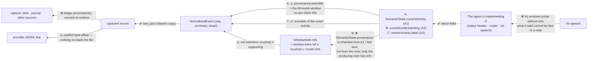

| Link | Status | Evidence |
|---|---|---|
| Vo's words → the note or candidate it paraphrased | ❌ | `appendThinking` and `appendCommentary` send text only (`live-bridge.ts:383, 413`). The recorder keeps the Vo utterance, not which background update it rested on. |
| `currentUnderstanding` → evidence | ❌ **[defect]** | See the note below this table. |
| Note → events | ⚠️ | The refs are the whole window plus every ref touched (`observer-runner.ts:364-445`). A note that says "tests fail in `x`" cites the whole window, not the failing `command_finished`. |
| Interpreter bullet → events | ⚠️ | Only `{eventIds, throughSeq}` for the 60-event span. |
| Fast activity → events | ✅ | Exact `eventIds` (`worker-activity.ts`, `editRefs`). But it is memory-only. |
| Event → raw record | ✅ | `open_context(depth='raw')` returns `events.raw_json` (`context-navigator.ts:853`). |
| Raw record → capture and source agreement | ❌ | `ledger.provenance` (`ledger.ts:845`) has no runtime caller. |
| Raw record → provider file | ⚠️ | `rawRef` is kept, but nothing re-reads the file. The comment says it does (**[stale]**, `:50-55`, `:843-851`). |

**[defect] The understanding cites whichever lane last wrote provenance.** The
understanding is a bare string on `SemanticState`.

- **Who writes `provenance`.** `applyObserverState` never sets it; it spreads
  `...previous` (`session-registry.ts:686-691`). So `SemanticState.provenance`
  is whatever the interpreter wrote last (its 60-event window,
  `llm-interpreter.ts:73`), or what the fast activity lane wrote last (its few
  activity events, `session-registry.ts:644`). The fast lane's value is
  memory-only, but it gets persisted as a side effect of the next observer
  write.
- **What the navigator cites.** For the "· now" hit, it builds its trace ref
  from `state.provenance.eventIds`
  (`context-navigator.ts`, `currentUnderstanding()`).
- **Result.** A search hit on the observer's understanding cites a range the
  observer did not read.
- **After an evidence invalidation.** The provenance is empty
  (`session-registry.ts:718`), so the hit is dropped altogether.

### 5.2 "This project currently does Y" (Project Ask)

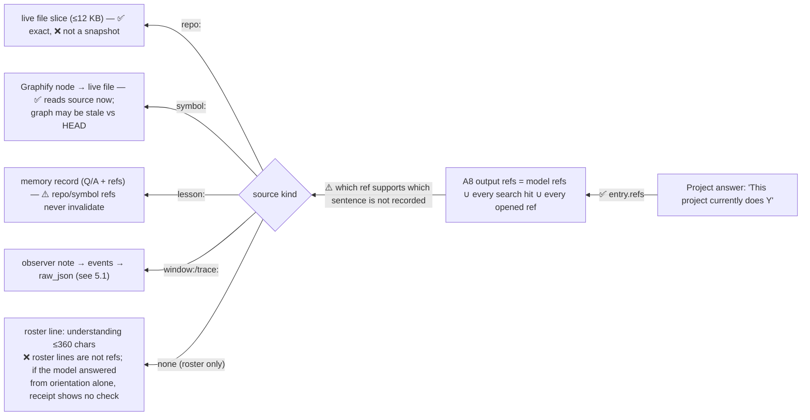

- **[current]** The prompt tells the model to answer broad questions "directly
  from" the roster, "without searching" (`observer-prompts.ts:40`).
  - Such an answer's only grounding is roster text that was put into the
    prompt, not retrieved.
  - The roster lines carry at most 3 refs, taken from `latestDevelopment`.
  - The `currentUnderstanding` sentence the answer paraphrases has **no ref in
    the roster** (`delegated-question-runner.ts:540-544`).

  The answer is therefore two model hops away from the evidence: the observer's
  paragraph, then the investigator's paraphrase. Nothing links it back.
- **[current] How lesson support works.**
  - A lesson is marked `invalidated` only when a trace, event or window ref
    loses support, or a cited lesson is superseded
    (`project-memory-store.ts:250-262`, `core/evidence/support.ts:5-26`).
  - For `repo:` and `symbol:` refs, `hasCurrentSupport` returns `true`
    unconditionally (`support.ts:26`).
  - **So a lesson grounded in code never goes stale when that code changes.**
- **[current] Repository refs are addresses.** `repo:` refs are live-file
  addresses, not snapshots. `openRepo` reads the file as it is now
  (`context-navigator.ts`, `openRepo`). This matches AGENTS.md's "a reopened
  artifact is not a historical snapshot". It means an old answer's citation can
  point at text that no longer says what the answer claimed.

### 5.3 "This Studio component exists in the code today"

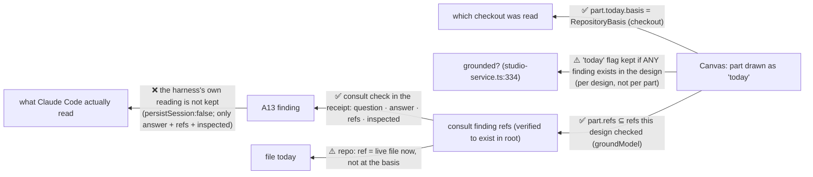

- ✅ **Strong:**
  - Citations cannot be invented. `groundModel` drops any ref that is not a
    file this design checked (`studio-service.ts:669-694`).
  - Each "today" carries the checkout it was established against
    (`model.ts:329-424`).
- ⚠️ **Weak:**
  - The **`today` flag** is gated on "this design has ever been grounded", not
    on "this part was confirmed" (`studio-service.ts:334-338`).
  - A later turn may mark a new, unchecked part as `today: true`, and it is
    kept. It gets the latest basis (`checked`) if a consultation happened this
    turn. Otherwise, per `applyOne`, it gets none, or it inherits the part's
    previous basis (`model.ts:372-379`).
- ❌ **Broken:** the consultant's own reasoning and tool trail are discarded by
  design. Only the answer, `confidence`, verified refs and the `inspected`
  paths survive.

### 5.4 Summary

| Statement type | Weakest link | Strongest link |
|---|---|---|
| "The agent is doing X" | Vo speech → source; understanding → a specific event | Fast activity → exact events (but memory-only) |
| "The project does Y" | Roster-orientation answers with no retrieval; `repo:` lessons that never invalidate | `repo:` and `symbol:` refs open the current source |
| "This exists today" | Design-level (not part-level) `today` gate | Refs constrained to checked files; checkout basis |
| Any answer | Refs = everything touched, not what supports the claim | Every ref resolves down to `raw_json` |

---

## 6. Information loss at every compression boundary

### 6.1 The loss map

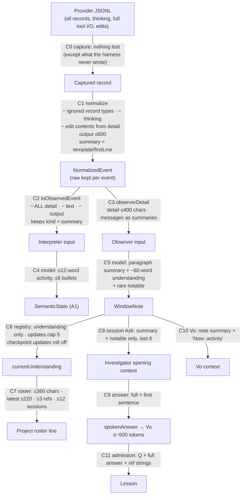

### 6.2 The boundaries, one by one

| # | Boundary | What cannot be recovered afterwards | Why the compression exists | Is the raw evidence reachable elsewhere? |
|---|---|---|---|---|
| C0 | Harness → capture | Anything the harness did not write (compacted context, other files) | not a choice | **No.** Outside Vowe. |
| C1 | Record → event | • **Thinking** (by policy, `normalize.ts:134`) • the ignored record types (`:28`) • in `detail`: edit contents, output beyond 600, and the input fields other than command/description/`file_path` | a provider-neutral event model; a stable one-line `summary` for the UI; small events | **Yes, per event**, through `raw_json` (`open_context depth=raw`). Only the investigator and an exploring observer can reach it, and only by opening that exact event. Ignored record types and thinking survive only in the capture blobs, which **nothing reads**. |
| C2 | Event → interpreter input | Everything except the kind and the one-line summary | the cost of a periodic, 60-event, low-effort call | Yes, in the store, but A1 has no tools. |
| C3 | Event → observer input | Detail beyond 400 characters; full message text (messages are shown as summaries) | the window token budget (about 6000) | Yes, through tools, **only when the exploration gate opens** |
| C4 | → `SemanticState` | Which event supports which bullet | display compactness | The events are in the store; the link is not |
| C5 | Window → note | Everything the model judged "not a change"; ordering within the window | the observer's charter: "what changed in my understanding" | Yes. The note cites the window's full trace range. |
| C6 | Note → registry | Earlier understanding paragraphs (only the latest is live); durable updates beyond 5; **checkpoint updates entirely once they roll off** | one current state per session | Notes: yes, searchable. Checkpoint updates: **no**, because they have no note. Earlier understandings: in the `semantic_states` history, which **no reader reads** at runtime (`getSemanticHistory`, `sqlite-event-store.ts:470`). |
| C6′ | Evidence invalidation | The live `semanticState` is nulled (`session-registry.ts:557`) | correctness over continuity | The old notes remain (marked stale). The understanding restarts from nothing. |
| C7 | Understanding → roster | Everything after 360 characters; sessions past 12; non-current sessions past 3 | the project prompt budget | Through `search_context(observations)` and by opening refs |
| C8 | Notes → session Ask | `currentUnderstanding`; the interpreter state; notes older than 6 | the prompt budget, and **[inference]** an oversight: the heading claims "understanding" | Through tools (`windows` search) |
| C9 | Answer → spoken | Everything after the first sentence (or `record_answer.spokenAnswer`) | a voice turn | Yes. The full answer is the durable entry. |
| C10 | Note → Vo | Refs; any detail | the voice provider's ~500-token append limit (`vo-prompt.ts`, `LIVE_APPEND_TOKEN_LIMIT`) | Only by Vo delegating |
| C11 | Answer → lesson | Why it was admitted (the score is not stored in the record); the session context | durable, cheap retrieval | The refs remain. `repo:` refs point at *today's* file. |
| — | Consultation → finding | The harness's exploration, reasoning and non-cited reads | `persistSession: false`; the finding contract | **No.** Discarded by design. |

### 6.3 The trade being made

| Axis | Where Vowe chose fidelity | Where Vowe chose usability, context, cost or latency |
|---|---|---|
| **Storage** | Capture is lossless and content-addressed. The raw record travels with every event. | — |
| **Periodic reading** (A1, A2) | — | Summaries only (A1). A 400-character excerpt (A2). Tools only behind a gate. The runs are frequent (debounced at 15 s; checkpoints every 20 s), so every token is multiplied. |
| **Question-time reading** (A7, A8, A11) | Tools reach back to raw (A7, A8) or to the live repository (A13). | The opening context is small and fixed. Depth is paid only when the model chooses it. |
| **Continuity** | Notes are durable and searchable. | The live memory is one paragraph plus 4 notes, and 5 updates in the registry. |
| **Voice** | The full answer is persisted. | Vo gets one sentence and prose without refs. |

**[inference]** The intended pattern is **"cheap summaries up front, pay for
depth on demand"**, and at storage level it is implemented faithfully. It fails
at the *hand-offs*:

- the cheapest reader (A1) gets the thinnest input, and its output is read by
  no model;
- the best-distilled state (`currentUnderstanding`) is handed to the project
  investigator but not to the session investigator or to session Vo;
- the provenance API that would make depth cheap to reach (`ledger.provenance`)
  is unused.

---

## 7. Observation versus control

### 7.1 The two paths

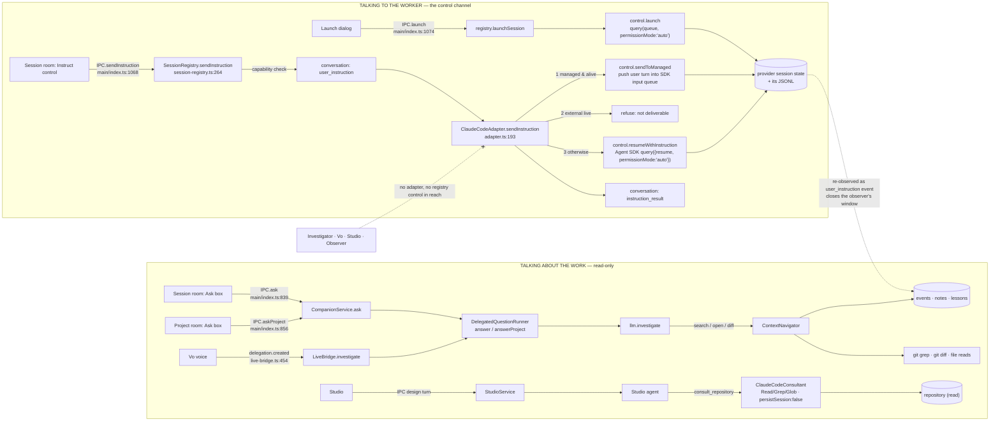

### 7.2 What is confirmed

- **[current] The investigator has no path to control.** The ask handlers go
  to `CompanionService` and `DelegatedQuestionRunner`, which hold the store,
  the navigator and the LLM, and no adapter (`main/index.ts:833-835`,
  `:459-487`). The navigator's tools are search, open and diff.
- **[current] Vo has no path to control.** Its only tool is client
  delegation, whose results come back from the investigator. The prompt tells
  it to direct the user to the instruction control (`vo-prompt.ts:23`).
- **[current] Studio has no path to control.** `StudioService` holds a
  `DesignStore`, an `openContext` function and a `RepositoryConsultant`
  (`studio-service.ts:123-135`). The consultant is never registered as a
  worker, and `persistSession: false` means discovery never finds it
  (`consultant.ts:88-90, 203`).
- **[current] Instructions enter provider state in exactly three places:**
  - `sendToManaged` pushes a user turn into a live SDK input queue
    (`adapter-claude-code/control.ts`, `sendToManaged`);
  - `resumeWithInstruction` starts a new SDK `query` with `resume` and
    `permissionMode: 'auto'` (`control.ts:188-207`);
  - `launch` starts a new session with the prompt (`control.ts:119-165`).

  The text is the developer's verbatim input. **No Vowe model composes,
  rewrites or augments it.**
- **[current] Instructions are kept out of the Vowe conversation.** Vowe
  records `user_instruction` and `instruction_result` conversation entries
  (`session-registry.ts:284-304`). `conversationTurns` filters both out
  (`conversation-context.ts`), so neither Vo nor the investigator sees an
  instruction *as conversation*. They see it only as **worker evidence**, once
  the harness writes the new user turn to its transcript and the normalizer
  emits `user_instruction`. That in turn closes the observer's window
  (`trace-window.ts`, "closes on a user turn").

### 7.3 Can a question contaminate the target session?

- **[current] Observation-side tools are read-only.** They are the lexical
  store search, file reads, `git grep` and `git diff`
  (`context-navigator.ts`). Graphify builds write to Vowe's own data
  directory, never inside the repository (`graphify-provider.ts`, class
  comment; `graphify-cli.ts:159-168`, which overrides `--out`). A question
  therefore does not write to the worker's transcript, its provider state or
  the repository.
- **[current] A consultation runs in a separate harness process** with no
  persisted session. It reads the same working tree the worker may be editing,
  and it can observe a half-applied change. The reverse does not happen: it
  cannot write.
- **[inference] One indirect coupling remains: cost and rate.** Consultations
  and Vowe's own model calls use the developer's credentials. The consultant
  uses Claude Code's own authentication. That is shared budget, not shared
  state.
- **Open question (runtime): what `resume` writes.**
  `resumeWithInstruction` uses the Agent SDK's `resume` without an explicit
  `forkSession`. Two things are unverified here and need a live probe:
  - whether this appends to the same transcript file or writes a new one;
  - how the observed session's identity follows it.

  Either way, it is a **new headless worker run with `permissionMode: 'auto'`**
  started on the developer's instruction. That is control, not observation.

---

## 8. Persistence and intelligence: what does Vowe's intelligence remember today?

### 8.1 Inventory

| What | Raw or semantic | Stored, recomputed, or context-only | Scope | Read back by intelligence? |
|---|---|---|---|---|
| Captured transcript (`evidence_blobs`, journal) | raw | stored | session | **no** (nothing at runtime) |
| `events` + `raw_json` | raw + deterministic summary | stored | session | A1 (summaries), A2 (summaries + excerpt, raw via tools), A7/A8 (tools) |
| Trace windows | deterministic structure | stored | session | A2 (sequencing), navigator |
| **Window notes** | **semantic** | stored | session | A2 (4 + 1), A7 (6), A7/A8 search, brief (notables) |
| `SemanticState`, latest | semantic | stored | session | A8 through the roster; the UI. **Not** A7 or Vo. |
| `SemanticState`, history | semantic | stored | session | **no** (`getSemanticHistory` has no runtime caller) |
| Checkpoint durable updates | semantic | stored only inside `meaningfulUpdates` (cap 5) | session | A8 through the roster's latest development; then gone |
| Fast activity | deterministic | **memory only** | session | A8 roster line (`sessionActivity`) |
| Attention, milestones, project brief, roster | deterministic | **recomputed on read** | session / project | A8, Vo (project) |
| Surface updates + communication decisions | semantic + decision | stored | session | the brief's `latestSignal`; UI. No model re-reads a past decision. |
| Session conversation + deliveries + receipts | semantic (Vowe's answers) | stored | session | A7 (12 turns), session Vo (12 turns) |
| Project conversation | semantic | stored | project | A8 (12), project Vo (12) |
| Run traces: model input, tool calls, results, output | raw record of Vowe's own reasoning | stored | per run | **no model**; UI only (`main/index.ts:1054-1065`) |
| **Lessons** (`memory.ndjson`) | semantic | stored | **project** | A7/A8/A2 through `repo` search |
| Graphify graph | structural | stored (rebuilt) | project | A7/A8/A2 through `repo` search and `symbol` open |
| Designs: entries, revisions, findings, layout | semantic | stored | **design** | A11/A12 only |
| Titles | semantic label | stored once | session | everywhere, as a label |
| Temperament, profile, voice, preferences | developer settings | stored | global | A6, A7/A8/A11 (guidance), Vo |
| Tool results during a model loop; Vo's realtime context; the consultant's exploration | — | **model-context-only**, recorded in the run trace except the consultant's | — | **no** |

### 8.2 Diagram

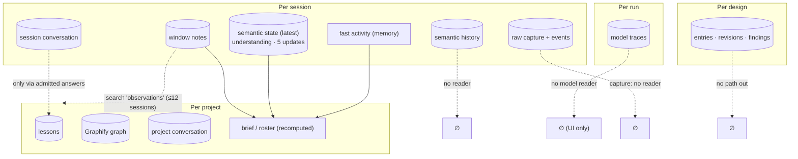

### 8.3 If a second coding session begins tomorrow, what understanding from today's session can reach it?

Call today's session **S1** and tomorrow's session **S2**, both in the same
project **P**. S1 was observed with a model configured.

**What reaches the S2 worker (Claude Code itself): nothing. [current]**

- Vowe writes nothing into the repository or into `~/.claude`.
- The consultant does not persist.
- Graphify's output and the lesson mirror live in Vowe's data directory
  (`graphify-memory-mirror.ts:15-26`, `project-memory-store.ts:268`).
- The only text that crosses into a worker is what the developer types into
  the instruction control (§7). If the developer copies an answer into an
  instruction, that is the developer's act, not a Vowe mechanism.

**What reaches Vowe's own reasoning about S2:**

| Reasoner looking at S2 | What from S1 can reach it | Condition |
|---|---|---|
| S2's observer (A2) | Nothing by default: continuity is per session (`observer-runner.ts:393-394`). With exploration, a `search_context` over `observations` can return S1's notes and understanding, and a search over `repo` can return lessons. | **[partial]** Only if Jev (or the heuristic) opens the gate **and** the model chooses those sources. |
| S2's interpreter (A1) | Nothing. | — |
| Session Ask on S2 (A7) | The prompt holds S2's notes and conversation only. Through tools: S1's notes (`observations`) and lessons (`repo`). | **[partial]** The model must choose to search them. |
| Session Vo on S2 | Nothing from S1. It hydrates S2's conversation only. | — |
| Project Ask (A8) / project Vo | S1's `currentUnderstanding` (≤360) and latest development (≤220), **if S1 is still current or among the 3 most recent non-current sessions**. Today's project conversation (12 entries). S1's notes through `observations` search. | **[current]** |
| Studio | Nothing, unless the developer attaches an S1 ref by hand. | **[current]** |
| Lessons | Only S1 **Session Ask** answers (typed or voice) that passed both gates: a repo/symbol ref (the weak gate, §2 A9), and Jev ≥ 0.7. **With no Jev key, nothing is admitted.** Project Ask answers never are. Observer notes never are. Design findings never are. | **[partial]** |

**The honest answer.** From today's *coding* session, what can reach tomorrow
is:

- a ≤360-character paragraph in a project roster, for as long as S1 stays
  among the recent sessions;
- S1's window notes, if some model thinks to search for them;
- zero or more lessons, which are admitted only from questions the developer
  happened to ask.

**Nothing that Vowe understood reaches the worker that will do tomorrow's
work.**

---

## 9. Repository intelligence

### 9.1 The sources

| Source | What it knows | How it is built | Persistent or JIT | Who can read it | Freshness |
|---|---|---|---|---|---|
| **Graphify graph** (`knowledge-graphify/*`) | Symbols, files, and relations (calls, imports, contains) | `graphify extract --code-only` by default: local AST, no model. A semantic backend is optional (`graphify-cli.ts:86-90, 166-168`). The build starts lazily on the first search (`project-knowledge-service.ts:91-95`). | persistent, per project, in Vowe's data directory | A2 (exploring), A7, A8, through `searchRepo` → `symbol:` and `openSymbol` (`context-navigator.ts:422-460`) | Marked stale on observed `file_changed` (`project-knowledge-service.ts:276`); refreshed after a quiet period or a burst; HEAD is checked at hydrate |
| **Retrieval over the graph** | — | Lexical label, kind, summary and source scoring, plus a one-hop expansion from the top 3 seeds (`lexical-retrieval.ts`) | JIT | the same | — |
| **Project memory lessons** | Q/A pairs that someone once found useful, with refs | Admitted session answers (A9); `recordCorrection` has **no caller** | persistent NDJSON, per project | the same, as `lesson:` hits | Invalidated only by trace, event or window refs; **`repo:`/`symbol:` refs never go stale** (`support.ts:26`) |
| **`git grep`** | Literal text in the working tree | `git grep`, after knowledge hits (`context-navigator.ts:417-460`) | JIT | the same | live |
| **Direct file reads** | Exact bytes | `openRepo` (≤12 KB slice) and `openSymbol`, which reads the live file | JIT | the same | live, and **not a snapshot** |
| **`git diff`** | Uncommitted change against HEAD, *excluding untracked files* | `getGitDiff` | JIT | the same | live |
| **Harness consultation** | An answer to one question, with verified files | Claude Code, read-only (A13) | JIT; the finding persists **inside the design only** | A11 only | the checkout it read (`RepositoryBasis`) |
| **Design "today" elements** | What a design claims exists | A11 moves, grounded per design | persistent, per design | A11/A12 only | stamped with a basis; no reconciliation (`model.ts:22-25`: "Neither is built yet") |
| **Worker evidence** | What the worker read, ran and edited, as it saw it | normalizer | persistent, per session | A1, A2, A7, A8 | historical |

### 9.2 One representation or several?

**Several, with no shared identity.**

| Representation | Its identity |
|---|---|
| Graphify | node ids |
| Lessons | record ids, plus ref strings and `locations` |
| `git grep` and reads | absolute paths and lines |
| Designs | part, link and duty ids, with `repo:` refs |
| Worker evidence | `file_path` strings inside `detail` |

Only two joins exist:

1. **`symbol:` → file.** `openSymbol` follows a node to its source and reads
   the file now.
2. **Worker `file_changed` → Graphify staleness.**
   `main/index.ts:590`, `knowledge.noteSourceChange`.

A worker edit does not mark a lesson or a design stale.

A lesson records `nodeIds` and `locations`, derived from its `symbol:` and
`repo:` refs (`project-memory-store.ts:71-91`). Because those refs are
everything the investigator touched (§2, A9), a lesson's node links are as
unselective as its refs. They are used for the Graphify mirror and for
retrieval scoring, and never to invalidate the lesson.

Studio cannot see Graphify or the lessons at all.

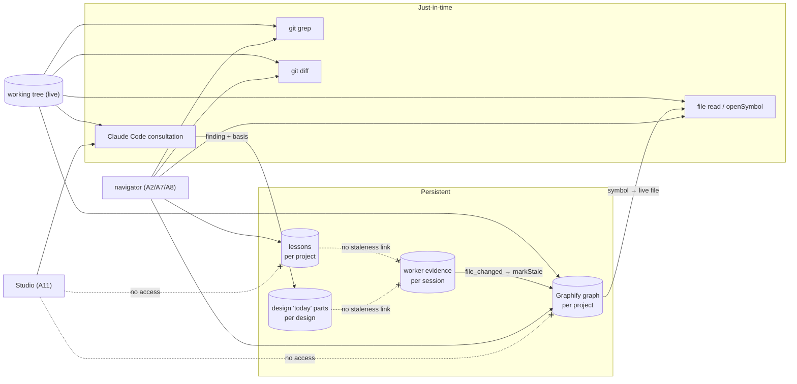

- **[inference]** Vowe holds **two separate codebase intelligences**:
  - the navigator family (graph, lessons, grep, reads, diff), used by
    observation and Ask;
  - the consultant family (a coding harness), used by Studio.

  They were built to different theories. The first is "Vowe searches". The
  second is "a harness is the expert; Vowe asks" (`consultation.ts:6-10`).
  Neither's results reach the other.

---

## 10. How does Vowe think today?

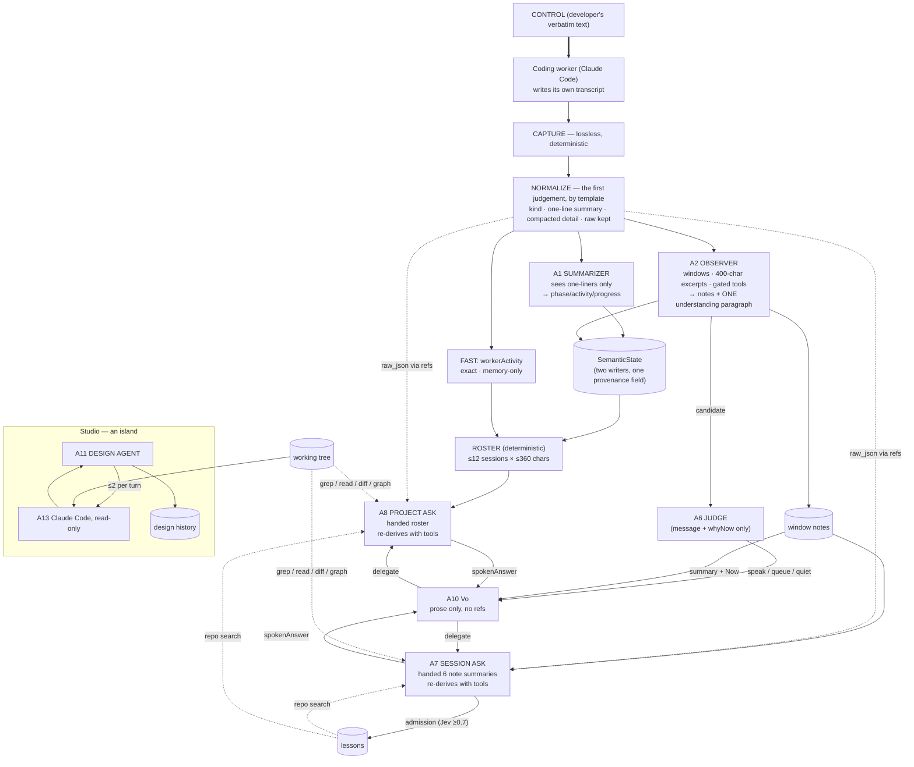

### 10.1 The machine, in prose

Vowe's intelligence is **a lossless evidence store under three independent
readers, with question-time re-derivation on top**:

- the store is lossless and content-addressed;
- a deterministic normalizer makes the most consequential semantic decisions
  (what an event *is* and how it reads in one line) and keeps the raw record
  attached;
- above that, three readers work separately:
  - a stateless summarizer (A1), which restates one-liners;
  - a stateful observer (A2), which keeps a single rolling paragraph and a
    trail of per-window notes;
  - a fast deterministic labeler (`workerActivity`), which is the most exact
    of the three and the least durable.

These readers do not consult each other. They meet only in `SemanticState`,
where two writers share one provenance field (§5.1). They do not share an
understanding.

**Question-time intelligence (Ask) does not trust the observation layer to be
complete, and that is by design.** It is handed a small slice of what was
understood:

- *session:* six note summaries;
- *project:* a roster of observer paragraphs.

It is then expected to go and look, with lexical search and drill-down to the
raw record. That makes answers grounded in the sense that matters most: an
answer can cite the event it rests on. It also means the observer's work is
used mainly as **orientation and as a search index**, not as an accumulated
model of the work that later reasoning builds on. Every answer is a fresh
investigation. What it concludes is persisted as a conversation entry. It
becomes reusable knowledge only if a Jev score clears 0.7, and never if the
question was a project question.

**Vo is deliberately the least-informed actor with the most direct contact with
the human.** It is told that background updates "are what you know". Those
updates are prose without refs, capped at about 500 tokens each. A session call
starts with no understanding at all. Vo compensates by delegating, which routes
to the same investigator, so voice and typed Ask converge on one mechanism.
What Vo *says* afterwards, though, cannot be traced back to a note or an event.

**Studio is a second, independent intelligence with a different epistemology.**
Observation and Ask ground themselves in *what workers did*, reached through
Vowe's own search. Studio grounds itself in *what the repository is now*, as
reported by a coding harness that Vowe runs read-only and forgets afterwards.
Studio's grounding discipline is the strictest in the product:

- refs must be files it checked;
- "today" carries a checkout basis;
- reply and revision commit atomically.

Yet its "today" gate is per design, not per claim, and none of its findings
reach any other actor.

**Across time, Vowe remembers a great deal but reasons over little of it.**
Raw captures, semantic history and run traces (every model input and tool
result) are all persisted, and no model reads any of them. What carries forward
into later reasoning comes down to:

- the notes;
- the current understanding, at most 360 characters of it at project level;
- 12 conversation turns;
- a sparse, gated set of lessons.

Nothing Vowe understands crosses into a worker. Control is the developer's
verbatim text, on a separate path that no model is part of.

### 10.2 Repeated reasoning and repeated summarization

1. **Three readings of the same events.** A1 (every ~15 s, 60 events), A2 per
   window, and A3 every 20 s, all over overlapping evidence. A1's result is
   read by no model (§2, A1).
2. **Two "current activity" fields.** The fast lane writes one and A1 writes
   another. The observer also writes `currentActivity` into each note, and
   `deliverQuiet` sends that one to Vo (`live-bridge.ts:380`). Different
   surfaces show different writers.
3. **Checkpoint versus canonical note.** A3 re-reads a tail that A2 then reads
   again when the window closes. The durable update is de-duplicated by id
   (`session-registry.ts:680-684`), but the reasoning runs twice.
4. **Every Ask is a fresh investigation.** Answers are not reused except
   through admitted lessons. The same question asked twice is investigated
   twice.
5. **The project roster is recomputed on every project question and every brief
   refresh.** It reads all events for all sessions each time
   (`delegated-question-runner.ts:528`, `project-brief.ts:139`).
6. **Communication judgement repeats in series.** Jev, then an LLM, then a
   heuristic, then the speak floor, all for one candidate. They see only the
   candidate's own text.

### 10.3 Where rich evidence becomes thin summaries

| Boundary | What is rich before it | What is left after it |
|---|---|---|
| C1 | tool I/O | `summary`: "Ran: …" or "Edited X" (`normalize.ts:161-180`) |
| C2 | full events | kind + one-liner, for A1 |
| C5/C6 | a window | one ~60-word paragraph that replaces the previous one |
| C7 | that paragraph | 360 characters for the project |
| C9/C10 | an answer or note | one sentence and prose without refs for Vo |

### 10.4 Duplicated forms of understanding

| Duplication | The two (or more) forms |
|---|---|
| Session "what is happening" | `workerActivity` label · A1 `currentActivity` · the note's `currentActivity` · `currentUnderstanding` |
| Session "what has happened" | A1 `recentProgress` · the note `summary` list · `meaningfulUpdates` (notables + checkpoints) · `workerMilestones` (fallback) |
| Repository knowledge | Graphify + lessons + grep (navigator) versus consultant findings (Studio) |
| Q&A prompts | `ANSWER_SYSTEM` / `renderQuestionPrompt` (dead except as a classifier) versus `INVESTIGATE_SYSTEM`; `WRITE_ANSWER_TURN` (dead) |

### 10.5 Load-bearing model boundaries

1. **The normalizer's `summary`**, although it is not a model, because A1 and
   A2 read mostly that.
2. **A2's `understanding` field.** One paragraph is the session's only
   continuous memory, the project's only per-session understanding, and it
   carries no provenance of its own.
3. **A4, the exploration gate.** It decides whether the observer ever sees raw
   evidence or other sessions.
4. **A9, memory admission.** It is the only path from a conversation to
   durable project knowledge, and its structural gate is weaker than it claims.
5. **`record_answer.spokenAnswer`.** It is the only thing Vo hears of an
   investigation.
6. **A11's `today` flag**, gated per design.

### 10.6 Knowledge one actor has that another cannot reach

| Knowledge | Held by | Not reachable by |
|---|---|---|
| `currentUnderstanding` | A2 → registry | A7 (not handed; searchable only by term), session Vo, Studio |
| Interpreter state | A1 | every model |
| Consultant findings | the design receipt | A2, A7, A8, lessons |
| Observer notes, lessons, Graphify | the navigator | Studio (unless attached by hand) |
| Project Q&A | the project conversation | memory; session actors |
| Session Q&A | the session conversation | other sessions (except via lessons) |
| Run traces: what a model actually read | the store | every model |
| Evidence provenance: capture and source agreement | the ledger | every actor (the API is unused) |
| The harness's own reasoning during a consultation | nowhere | discarded |

### 10.7 Where persistence breaks continuity

1. **Evidence invalidation nulls the whole `SemanticState`**, observer fields
   included (`session-registry.ts:557`). Understanding restarts from nothing,
   while notes survive as "historical".
2. **Failed windows** advance the cursor with no note (`observer-runner.ts:327-348`).
   That span of the session is never interpreted.
3. **Checkpoint updates** exist only in a 5-slot list. Once they roll off, they
   are gone.
4. **Fast activity** is memory-only. After a restart, the label is empty until
   the next event.
5. **The observer's continuity is one paragraph.** The previous version is kept
   in the history, and nothing reads it.
6. **Session boundaries.** A new worker session starts an observer with no
   memory of any other session.
7. **Project answers never reach memory.** Session answers reach it only
   through a gate that is closed without Jev. `recordCorrection` has no caller.
8. **A lesson grounded in code never goes stale when that code changes**
   (`support.ts:26`). This is the reverse failure: continuity that should have
   been broken is not.

---

## 11. Verification notes

**How this was verified.** Every claim above was traced statically in the
source at `8029620`, file by file, by reading call sites. Nothing was run, and
**no live model, provider or Graphify probe was made**.

**Newly established in this pass:**

- the per-actor inputs, taken from the prompt renderers themselves;
- the refs-as-touched construction
  (`observer-runner.ts`, `delegated-question-runner.ts:347`,
  `investigation-recorder.ts:60-70`);
- the understanding-provenance defect (§5.1);
- the design-level `today` gate (`studio-service.ts:334-338`);
- `openContext` without a scope check (`context-navigator.ts:503-545`);
- no `onAnswer` on the project path;
- session Vo priming without understanding (`live-bridge.ts:564-580`);
- the stale `raw` depth comment (`context-navigator.ts:50-55, 843-853`);
- `hasCurrentSupport` returning `true` for code refs (`support.ts:26`);
- `getSemanticHistory`, `ledger.provenance` and run traces having no
  model-facing reader.

**Correction to Pass 1:** temperament does not reach the observer model (see
"How to read").

**Unverified. These need runtime evidence:**

- whether `resume` without `forkSession` appends to the same transcript or
  forks it (§7.3);
- how often the exploration gate opens on real traffic, which decides how much
  raw evidence the observer ever sees;
- actual token sizes of observer and investigator prompts on long sessions;
- whether `getEvents(..., { omitRaw })` for whole projects is a practical cost
  at current data sizes;
- Graphify's actual node and edge vocabulary for this repository.

**Not examined in depth:**

- adapters other than Claude Code (for example the Cursor collector), beyond
  confirming that they share the same core pipeline;
- renderer presentation of these states;
- the `workbench` module.
