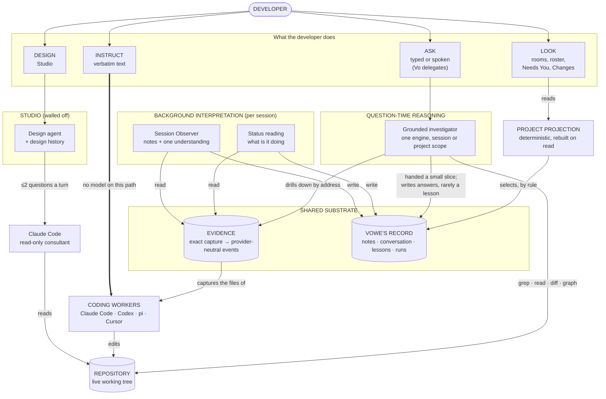
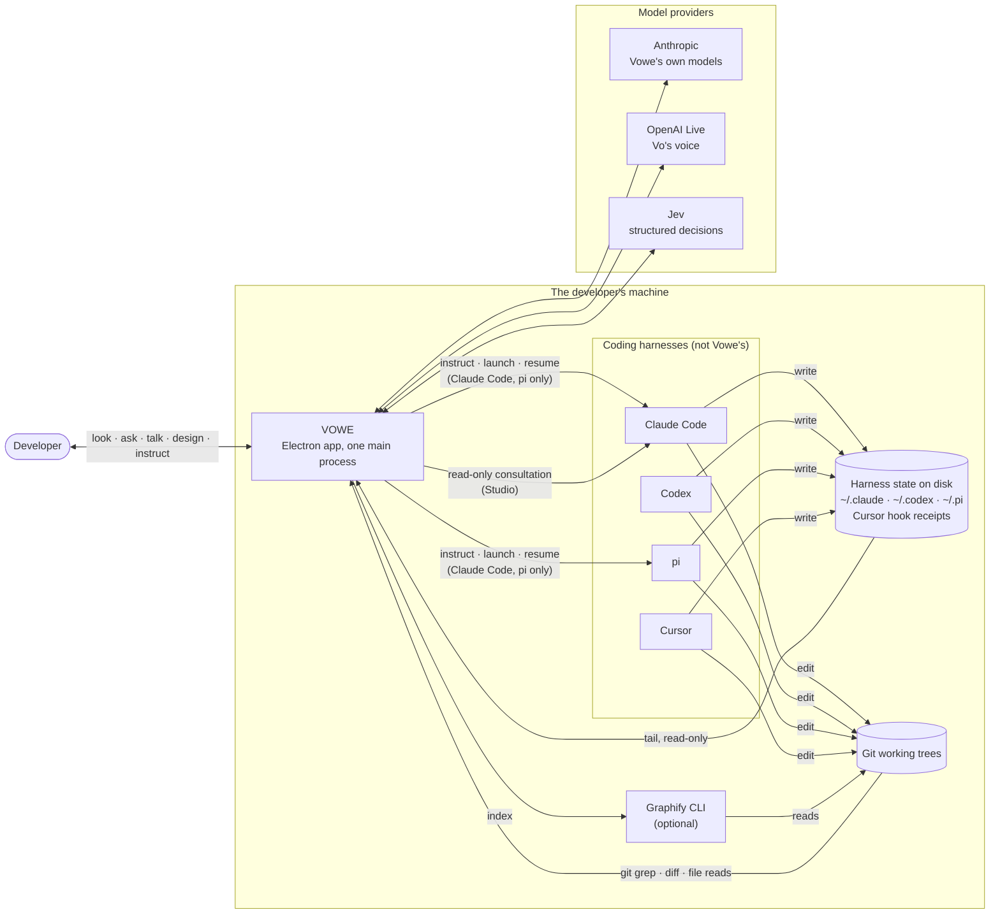
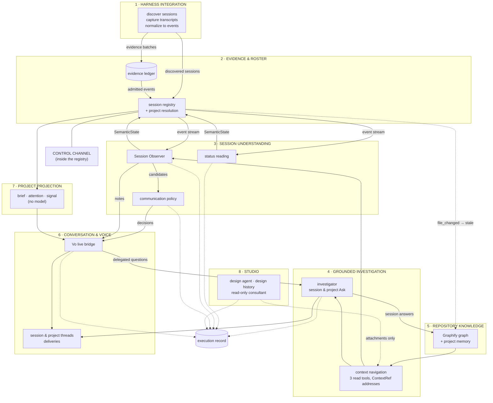
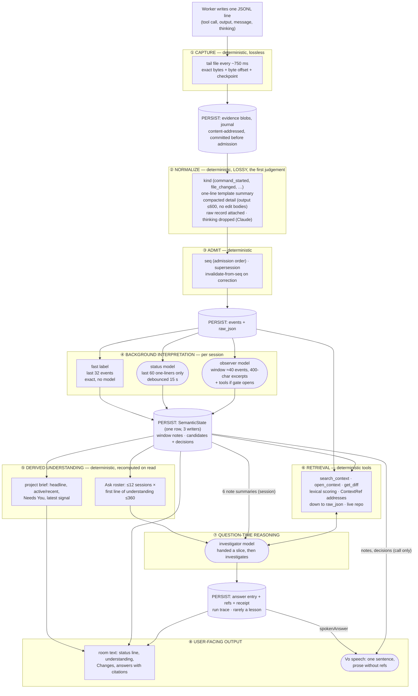
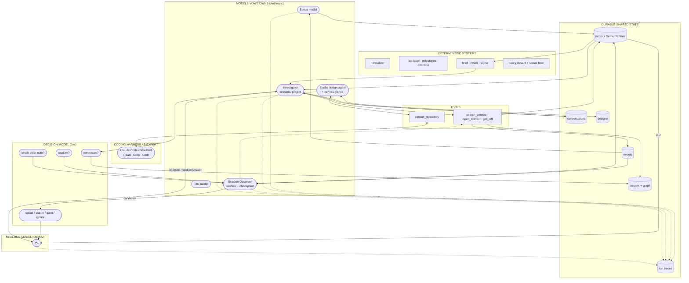
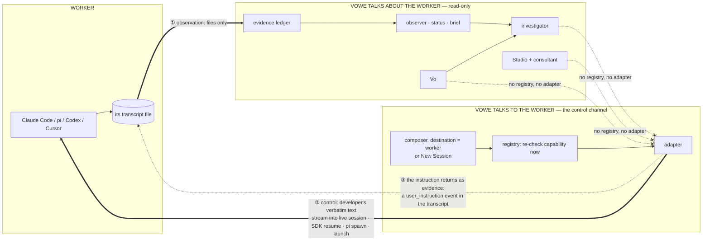
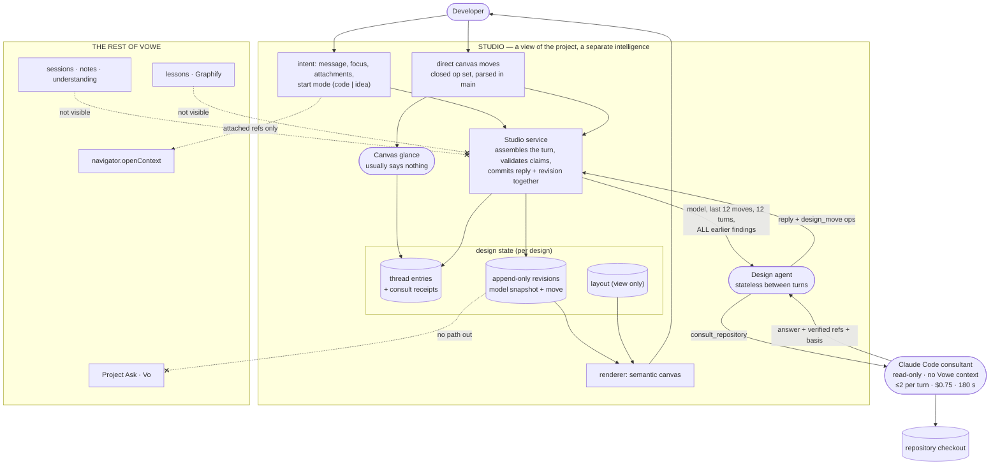
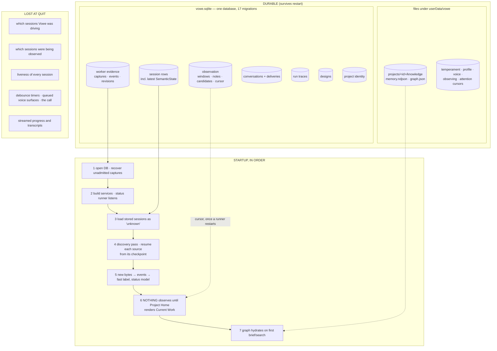

# Vowe as built — Pass 3: System Synthesis

> **The question this pass answers:** *How does Vowe work as one system, and what
> would you draw on a whiteboard to explain it?*
>
> This is the third as-built pass over the repository at commit `8029620`
> (2026-09-27). It reads [`00-system-map.md`](00-system-map.md) (Pass 1) and
> [`01-intelligence-and-agents.md`](01-intelligence-and-agents.md) (Pass 2), checks
> their load-bearing claims against the code again, and reduces them to one
> model. It describes the machine as it exists. It does not propose one.

---

## How to read this document

The document is written to be presented. Sections 1–8 build the picture one
diagram at a time, each followed by the prose you would say while drawing it.
Section 9 describes the system as loops, section 10 answers fifteen direct
questions, and section 11 names the seams. Section 12 is the single page to
print.

The tags from the earlier passes still apply, sparingly:

| Tag | Meaning |
|---|---|
| **[current]** | Executable behavior, traced through a call site that runs in the desktop app. |
| **[partial]** | Runs only under a condition (a key, an installed tool, a UI action, a model's choice). |
| **[inference]** | My reading of the architecture, not something the code states. |
| **[defect]** | Code that contradicts its own stated contract. Found by reading. |

Code references come **after** the explanation they support, as
`path:line`. Paths are repository-relative. Short prefixes: `core/` is
`packages/core/src/`, `llm/` is `packages/llm/src/`, `main/index.ts` is
`apps/desktop/src/main/index.ts`, `renderer/` is `apps/desktop/src/renderer/`.

### What this pass changed in Passes 1 and 2

Deeper inspection revised seven earlier claims. The body of this document uses
the corrected versions.

| # | Earlier claim | What the code does | Evidence |
|---|---|---|---|
| 1 | The fast activity label is **memory-only** (Pass 1 §5.3, §5.5; Pass 2 R5a, §8.1, §10.7). | It is not written to the semantic *history*, but the registry's 5-second reconcile upserts every discovered session with its in-memory `semanticState`, so the label reaches `sessions.semantic_state_json` within one reconcile pass and survives a restart as one overwritten row. The code comment says exactly this. | `core/registry/session-registry.ts:357-397` (`absorb` → `upsertSession(merged)`), comment at `:615-624` |
| 2 | Communication decisions reach the developer **only** through a session voice call; with no call they are "never shown" (Pass 1 §5.7). | The project brief's `latestSignal` reads stored surface candidates, skipping only those the policy marked `ignore`, and falls back to the newest `notableChange`. That signal appears in Project Home's *Changes* list and in the project voice context. So a candidate that was never spoken can still be *shown*, as the newest thing on the project, whatever its decision. | `core/product/project-signal.ts:56-103`, `renderer/state/project-home.ts:17-66`, `core/live/live-bridge.ts:696-706` |
| 3 | The status interpreter's output is **read by no model** (Pass 2 §2 A1, §3.1). | Its `task`, `phase` and `recentProgress` are read by no model. But `currentActivity` is one field shared with the fast lane; whichever wrote last is what `sessionActivity()` returns, and that string goes into the Project Ask roster and the project voice context. | `core/product/session-display.ts:141-153`, `core/delegation/delegated-question-runner.ts:533-541`, `core/live/live-bridge.ts:702` |
| 4 | The roster carries `currentUnderstanding` **truncated to 360 characters** (Pass 2 A8, C7). | It carries the **first non-empty line** of the understanding, cut back to a word boundary within 360 characters, with no mark. A two-line understanding loses its second line. The project voice context, by contrast, gets the whole understanding. | `core/product/session-display.ts:74-92` (`plainText`), `delegated-question-runner.ts:541`, `live-bridge.ts:702` |
| 5 | The brief reads **all** events of every session (Pass 2 §10.2 item 5). | The brief reads at most 2 000 events per session, without raw. The Project Ask roster is the one that reads **all** events of every session. | `core/product/project-brief.ts:114`, `delegated-question-runner.ts:528` |
| 6 | Studio is **a separate room** (Pass 1 §5.17). | Studio is a view of the project route (`{kind:'project', view:'studio'}`), entered from Project Home, which also lists the project's designs. It is a separate *intelligence*, but not a separate place. | `renderer/state/navigation.ts:14`, `renderer/project/ProjectSpace.tsx:43, 191` |
| 7 | Without a model, the observer writes **no notes** (Pass 2 A2 card). | Without a model it writes one note per window with a fixed "recorded but not interpreted" summary, and no understanding. Pass 1 had this right. | `main/index.ts:679-688` (`nullObserver`) |

Two findings are new in this pass and are used below:

- **[current]** The first time a session is followed, its observer interprets
  the **whole stored history from sequence 0**, one model loop per window of
  about 40 events, with no cap. Following a week-old session is a backlog job,
  not a glance (`core/observation/observation-service.ts:105-158`,
  `core/observation/observer-runner.ts:245-295`).
- **[current]** Project Home does not show only the brief. Its *Changes* list
  merges three sources, newest first, and keeps three: each session's latest
  development, the project's latest signal, and **project memory lessons**
  (`renderer/state/project-home.ts:17-66`).

Studio's isolation test was **run** in this pass and passes
(`packages/core/test/studio-service.test.ts:128`, "has no import path to worker
control, project memory or voice").

---

## 0. Vowe in one paragraph

Vowe is a **local companion that sits beside coding agents it does not own and
turns what they write down into something a developer can look at, ask about,
and design against.** It reads each harness's own transcript files, keeps an
exact copy, and converts them into one provider-neutral event history. Two
background readers interpret that history per session: a cheap status reading,
and a stateful observer that keeps notes and one running paragraph of
understanding. At question time, a single grounded investigator, reached by
typing or by voice, is handed a small slice of that understanding and then goes
back to the evidence and the live repository to answer. A project is not a
thing Vowe understands; it is a git identity, and "the project" on screen is a
deterministic projection over its sessions, recomputed on every read. Studio is
a second, separate intelligence for designing a change. It grounds itself not
in what workers did but in the repository as a read-only Claude Code run
reports it. The only path from Vowe into a worker is the developer's own typed
instruction, which no model touches.

---

## 1. The canonical system diagram

The suggested sketch put a single "Vowe intelligence" in the middle, fed by
project understanding, evidence and repository reality. The implementation
tells a different story in three ways, and the canonical diagram is drawn to
show them:

1. **There is no single intelligence in the middle.** There are two families
   of reasoning that share nothing but a store: *background interpretation*
   (which runs whether or not anyone asks) and *question-time investigation*
   (which runs only when someone asks). Studio is a third, walled off from both.
2. **"Project understanding" is not a source.** It is derived: a read-time
   projection of per-session understanding. It sits *above* evidence, not
   beside it.
3. **Control does not pass through intelligence.** The developer's instruction
   goes around every model, straight to the worker.



Arrows point from a component to what it reads, writes or acts on, so the
drawing reads top to bottom. Data itself flows upward: workers write files,
evidence captures them, background readers interpret them, and the developer
sees the result. One flow is left out of the drawing because it runs against
the grain: during a session voice call, the observer can make Vo speak without
being asked.

**The three sentences to say while drawing it.** Workers write files; Vowe
turns those files into evidence, and background readers turn evidence into a
per-session record of understanding. When the developer looks, a deterministic
projection reads that record; when the developer asks, one investigator starts
from a slice of it and goes back to the evidence and the repository. Studio
designs against the repository through a separate expert, and instructions to
a worker bypass all of it.

---

## 2. Diagram 1 — Context



The most important fact about Vowe's context is that **it is a reader of other
programs' files, not a wrapper around them.** A developer runs `claude` or
`codex` in a terminal as they always have. Vowe finds the transcript those
harnesses already write, tails it, and keeps an exact copy. The worker does not
know Vowe exists. This is why Vowe can observe four very different harnesses,
and it is also why it can observe *only* what those harnesses choose to write:
a harness's compacted context, a subagent transcript kept elsewhere, or a
thought the harness never serializes is invisible. Vowe records this honestly
by never claiming more than `partial` coverage for a transcript.

The relationship runs the other way only in narrow cases. Vowe can launch or
resume a Claude Code or pi session and push the developer's text into it; for
those sessions it becomes a parent process. It can also spawn Claude Code for a
completely different reason: as a read-only consultant that Studio asks about
the code. Those are two roles for one harness, configured so they never meet.
Codex and Cursor are observe-only.

The repository is read directly, never written. Vowe runs `git grep`, `git diff`
and file reads itself, and optionally asks Graphify to build a structural graph
into Vowe's own data directory. There is no filesystem watcher. The repository
is considered changed when an *observed worker* reports an edit.

Three model services sit outside. Anthropic hosts every model Vowe owns: the
interpreters, the investigator, the Studio agent, and titles. OpenAI Live hosts
Vo, the voice, which is a separate model with its own session. Jev answers
narrow structured questions (explore or not, which note, whether to speak,
whether to remember). Every one of them is optional, and each degrades
independently to a deterministic floor.

*Evidence:* `main/index.ts:232-610` (`createServices`), `main/index.ts:280-283`
(four adapters registered unconditionally), `main/index.ts:586-591` (no watcher;
`file_changed` marks knowledge stale), `packages/adapter-claude-code/src/consultant.ts:196-203`
(`persistSession: false`), Pass 1 §5.1 (capability matrix).

---

## 3. Diagram 2 — Internal subsystems

Pass 1 listed seventeen subsystems. On a whiteboard, eight are enough.



**Why these boundaries exist.** The subsystems are cut along **authority**
rather than along technology. The code's organizing idea is that what a
component can do is decided by what `createServices` hands it, and the eight
boxes above are eight different answers to "what may this touch?".

*Harness integration* is the only code that knows a file layout or a CLI. It
exists as a boundary so that everything above it can be written once for four
providers. What crosses it is an evidence batch: the exact bytes, their byte
positions, *proposed* events, a coverage claim and a checkpoint. It also
reports discovered sessions with per-session capabilities, which is how the
rest of the system learns that Codex cannot be instructed without ever
mentioning Codex.

*Evidence and roster* is where Vowe decides what it believes happened. The
ledger owns the event history; the registry owns the list of sessions, their
project assignment, and — the one exception to the authority rule — the
adapters themselves, which is why the control channel lives inside it. Nothing
that interprets holds the registry.

*Session understanding* runs without being asked. It exists as its own
subsystem because its cost model is different: it spends money continuously in
proportion to worker activity, and so it is debounced, windowed, gated and
pausable. It writes the only durable interpretation other components read.

*Grounded investigation* runs only when asked. It is split into a navigator
(three read tools and an address scheme) and an investigator (a model loop)
so that the observer can use the same tools without being able to answer
questions, and so that no reader can ever reach the control channel.

*Repository knowledge* is kept separate from session understanding because it
describes a different thing — the code, not the work — and it has a different
lifetime: per project, across sessions.

*Conversation and voice* holds what was said and what was heard. Voice is a
separate model with its own lifecycle, so it is kept behind a bridge that can
only delegate to the investigator and receive text.

*Project projection* is deliberately not intelligent. The codebase's comments
say so in as many words: it is "not a project agent; nothing below calls a
model."

*Studio* is walled off by construction and by test: it receives a design
store, an attachment opener, the design agent and the consultant, and nothing
else.

*Evidence:* `main/index.ts:337-340` (brief is "not a project agent"),
`main/index.ts:491-513` (Studio's constructor arguments), `main/index.ts:459-487`
(one investigator), Pass 1 §3 and §8.

---

## 4. Diagram 3 — Execution → understanding

This is the diagram that carries the talk. It follows one worker action from
the harness's file to the words the developer reads or hears. Solid borders are
deterministic code; rounded nodes are model calls. The horizontal dashed lines
are persistence boundaries: everything below one has been committed to disk.



### 4.1 Capture: the only lossless step

The system's first and strongest decision is to **keep its own exact copy of
everything the harness wrote**, content-addressed and with byte positions,
committed before anything interprets it. A crash between capture and admission
is recovered at the next start. A rewritten file is detected by its head hash
and boundary anchor and re-read as a whole snapshot rather than appended to.
This step introduces no semantics at all, and it is the reason every later
claim can, in principle, be traced to bytes.

The price is that capture is only as complete as the harness. Vowe's coverage
field says `partial` for every transcript, which is the system being honest
about a limit it cannot remove.

*Evidence:* `packages/adapter-kit/src/evidence-source.ts:59-188`,
`core/evidence/ledger.ts`, recovery in `core/store/sqlite-event-store.ts:112-135`.

### 4.2 Normalization: where semantics enter, and the largest loss

The normalized event stream is **the first provider-neutral representation of
worker activity.** Everything above this line reasons about Claude Code, Codex,
pi and Cursor sessions without knowing their transcript formats: the observer,
the investigator, the brief, the attention rules. That is the architectural
payoff.

The price is paid here, and it is paid by string templates, not by a model.
Normalization decides what an event *is* (a `tool_use` of `Edit` becomes
`file_changed`; a Bash call matching a test pattern becomes `test_started`) and
how it reads in one line ("Ran: pnpm test", "Edited x.ts"). It truncates tool
output to 600 characters, keeps only the command or file path from a tool's
input, leaves edit bodies out of the detail, and ignores a list of record
types. For Claude Code it drops thinking entirely; Codex, pi and Cursor instead
emit `agent_reasoning` events, so the neutral stream is neutral in *shape* but
not in *content*.

Two properties make this loss survivable. Each event carries its whole original
record as `raw`, so the investigator can open any single event and read
everything the harness wrote for it. And the one-line `summary` is documented
as deterministic, so a status line does not flicker. The consequence is that
the cheapest readers — the status model and, by default, the observer — reason
mostly over the templates. The normalizer is not intelligent, but it is the
most consequential interpreter in the system.

*Evidence:* `packages/adapter-claude-code/src/normalize.ts:28` (ignored types),
`:134` (thinking), `:264` (600-character output), `:367` (`compactInput`),
`:304` (`rawRef`); `agent_reasoning` in `packages/adapter-{codex,pi,cursor}/src/normalize.ts`.

### 4.3 Admission: ordering and correction

The ledger assigns each admitted event a per-session `seq`, which is admission
order, not chronology. When a source is rewritten or two sources disagree, the
ledger supersedes rather than deletes, and emits an *invalidate-from-seq*
signal. That signal is the system's correction mechanism and it propagates
forward deterministically: windows go stale, the observer cursor rewinds, the
session's `SemanticState` is nulled, and lessons that cited invalidated trace
stop being retrieved. No model is involved in deciding what is true about the
past.

*Evidence:* `core/evidence/ledger.ts:1143, 1259, 1298, 1370`;
`core/registry/session-registry.ts:549-560`; `core/evidence/support.ts:5-26`.

### 4.4 Background interpretation: three readers that do not talk

Above the events, three readers run for each session, and **none reads the
others' output.**

The **fast label** is deterministic and runs on every event. It names a real
command, file or test target from the last 32 events and carries the exact
event ids it rests on. It is the most faithful statement Vowe has of "what is
it doing now".

The **status model** is a debounced model call over the last 60 events. It is
shown only each event's kind and one-line summary, and restates them as phase,
a short activity and up to six progress bullets. Its output is persisted, and
it shares the `currentActivity` field with the fast label; whichever wrote last
is what everyone else sees.

The **Session Observer** is stateful. It cuts the trace into windows, reads
each once with its running understanding and a few recent notes in view, and
writes a durable **note** per window plus a replacement **understanding**
paragraph of about 60 words. A Jev decision chooses whether a window gets read
tools. Every 20 seconds a cheaper checkpoint pass refreshes the understanding
from the still-open tail. The observer may also raise a **candidate** — "this
is worth telling the developer" — which a separate policy decides on.

These three meet in exactly one place: the session's `SemanticState`, merged
by the registry according to a field-ownership convention. That object has one
`provenance` field and three writers, and the observer never sets it. This is
why a search hit on the observer's understanding cites events the observer did
not read (Pass 2 §5.1, **[defect]**).

*Evidence:* `core/product/worker-activity.ts:90`,
`core/interpretation/interpretation-runner.ts:59-164`,
`core/llm/llm-client.ts:76` (`toObservedEvent`),
`core/observation/observer-runner.ts:364-445`,
`core/registry/session-registry.ts:590-696`.

### 4.5 Derived understanding: projection, not synthesis

Nothing called "project understanding" is stored. When the Project Home
renders, the project voice call refreshes, or a project question is asked, a
deterministic function walks the project's sessions and assembles, per
session, the current activity, the observer's understanding, the latest
development and whether a human is needed. The brief adds a headline chosen by
rule ("One thing needs you.", "Everything is moving.") and picks the single
newest signal across the project. The comment explains why: a model rewording
the headline on every poll "would make a calm project look like a changing
one".

This is the point where per-session model output is **selected but not
combined**. Two sessions working on the same subsystem appear as two lines; no
component ever reads both and says what they add up to.

*Evidence:* `core/product/project-brief.ts:136-200` (`get`), `:208`
(`projectHeadline`), `core/product/observer-state.ts:46-90`
(`liveObserverState`), `core/product/project-signal.ts:56`.

### 4.6 Retrieval and question-time reasoning: re-derivation

At question time, the investigator is handed a deliberately small opening
context and then **re-derives** what it needs. For a session question that
context is the last six note summaries and twelve conversation turns; notably,
it is not the observer's understanding paragraph. For a project question it is
the roster. The model then uses three read tools: lexical search over notes,
trace, transcript, observations and repository; opening any `ContextRef` down to
the raw record; and the live diff. Every hit it sees becomes part of the
answer's refs.

This is the architecture's clearest bet: **background understanding is
orientation, and the answer must go back to evidence.** It makes answers
citable. It also means the observer's accumulated understanding is used mostly
as an index, and the same question asked twice is investigated twice.

*Evidence:* `core/delegation/delegated-question-runner.ts:266-398` (session),
`:414-545` (project), `llm/observer-prompts.ts:57-100`,
`core/context/context-navigator.ts:169-545`.

### 4.7 Output: where fidelity drops last

Typed answers keep their full text and their refs. Voice gets less. Vo hears a
single `spokenAnswer` sentence from an investigation, observer notes as prose,
and candidates as commentary. Each is capped at about 500 tokens and none
carries refs. What Vo *says* can therefore not be traced back to what it was
told.

*Evidence:* `core/live/live-bridge.ts:373-414, 538`, `core/live/vo-prompt.ts`.

### 4.8 The compression ladder

Read top to bottom, this is what survives each boundary:

| Level | Representation | Who reads it | What was lost to get here |
|---|---|---|---|
| L0 | Captured bytes | nothing at runtime | only what the harness never wrote |
| L1 | Raw record per event (`raw_json`) | investigator, exploring observer — by opening one event | ignored record types; Claude thinking |
| L2 | Normalized detail | observer (≤400-char excerpt) | output past 600; edit bodies; most tool input |
| L3 | One-line summary | status model, observer, UI | everything but the template |
| L4 | Window note (~60-word understanding) | investigator (6), Vo, search | whatever the model judged "not a change" |
| L5 | `SemanticState` understanding + 5 updates | roster, brief, UI | earlier paragraphs (kept in history, unread) |
| L6 | Roster line | project investigator | everything after the first line or 360 chars |
| L7 | Spoken sentence | the developer's ears | refs, detail |

---

## 5. Diagram 4 — Agent topology

Pass 2 catalogued fourteen actors. Grouped by *kind*, the topology is:



### 5.1 What each kind of actor is for

**Models Vowe owns** are all Anthropic, and four of the five share one client
instance (`claude-sonnet-5`, low effort by default): the status model, the
observer, the investigator, and the policy's fallback. Studio has its own
client at medium effort; titles use Haiku. These models are Vowe's own
reasoning. Each has a narrow charter set by a runner that decides when it runs
and exactly what it is handed.

**The decision model** (Jev) never writes prose. It answers four structured
questions at four call sites, and each one is a gate on another actor's reach:
whether the observer may use tools, which older note it remembers, whether the
developer is interrupted, and whether an answer becomes permanent. Without Jev,
three of these fall back to heuristics and the fourth — memory — fails closed.

**The realtime model** (Vo) is the actor closest to the human and the least
informed. It is told that background updates "are what you know", it hears
prose without references, and it has one capability: delegate a question to
the investigator. It cannot instruct a worker, both because its prompt forbids
it and because nothing in its object graph could.

**The coding harness as expert** (the consultant) is a different species. It is
not a model Vowe prompts turn by turn; it is Claude Code running its own
bounded tool loop, read-only, forgetting everything afterwards, handed one
question and returning an answer with verified file references. Vowe uses it
only from Studio.

**Deterministic systems** carry more semantic weight than their name suggests.
The normalizer decides what events mean; the fast label, milestones and
attention rules decide what is happening, what mattered, and whether a person
is needed; the brief decides what the project looks like. Three model actors
take their output as ground truth.

**Durable shared state** is how almost all of these actors communicate.

### 5.2 One agent, several cooperating agents, or intelligence over shared artifacts?

**The implementation answers: intelligence emerges from independent models
operating over shared artifacts, with exactly two conversations.**

There is no orchestrator and no single agent with a persistent identity. There
are also no cooperating agents in the usual sense, because the actors do not
exchange messages. Direct model-to-model contact happens in only two places:
Vo delegates a question to the investigator and receives one sentence back, and
the Studio agent asks the consultant a question and receives a finding. Every
other relationship goes through the store. The investigator learns what the
observer understood by reading notes the observer wrote. Project Ask learns
what each session is about from a roster that deterministic code assembled
from observer output. The observer learns what it thought before from its own
notes. Nobody learns anything from the status model except through a shared
field.

That design has real strengths: every hand-off is durable and inspectable,
actors can fail independently, and the store's commit order gives the UI a
consistent view. Its costs appear at the hand-offs. Each reader decides alone
what to read, so the best-distilled artifact — the observer's understanding —
is handed to project questions but not to session questions or session voice.
The shared artifacts are *summaries and addresses*, not shared beliefs; there is
no structure in which one actor's conclusion is marked as depending on
another's. And the only "memory" that crosses sessions is the gated lesson
store.

[inference] In short: Vowe is a **blackboard system without a moderator.**
Specialists write to the board on their own schedules; readers consult it on
theirs; the only consistency rules are deterministic ones (supersession,
invalidation, field ownership).

*Evidence:* Pass 2 §3.1 and §3.3; `main/index.ts:248` (one `llm` shared);
`llm/anthropic-system-design-agent.ts:61-77`; `packages/decision-jev/src/jev-decision-router.ts`;
four call sites at `core/observation/observer-runner.ts:700, 754`,
`core/communication/communication-policy.ts:124`,
`core/knowledge/memory-admission.ts:75`.

---

## 6. Diagram 5 — Observation versus control



**Vowe's authority over a worker is structural, not a promise.** Observation
reaches Vowe only through files. Control reaches the worker only through one
method on the registry, which is the only object holding adapters, and which
is reachable for control from exactly two IPC handlers: send-instruction and
launch. The investigator, the observer, the voice bridge and Studio are each
constructed without the registry, so there is nothing in their reach that
could affect a worker. The comments at the construction site state this, and
the constructor arguments enforce it.

What crosses the control boundary is the developer's own text, verbatim. No
Vowe model composes, rewrites or augments it. That is the defining property of
the channel, and it has a consequence the rest of this document keeps meeting:
**nothing Vowe has understood ever reaches a worker** except by the developer
reading it and typing it.

Control is re-checked at the moment of use, because attach mode can change
between discovery passes. Three delivery routes exist for Claude Code: push the
text into a session Vowe is already driving; refuse if the session is live in
someone else's terminal; otherwise resume it headlessly through the Agent SDK
with `permissionMode: 'auto'`. That last route is not a message to a running
agent; it starts a new worker run on the developer's behalf.

The two directions meet only in persistence and in the evidence stream. Vowe
records the instruction and its result in the session's conversation table,
beside questions and answers. The investigator and Vo filter those rows out, so
they never see an instruction *as conversation*; they see it later as worker
evidence, when the harness writes the new user turn and the normalizer emits a
`user_instruction` event. That event also closes the observer's current window.
In other words, **the control loop is closed through the evidence pipeline, not
through Vowe's own record of what it sent.**

*Evidence:* `core/registry/session-registry.ts:264-304` (`sendInstruction`),
`packages/adapter-claude-code/src/adapter.ts:193-221`,
`packages/adapter-claude-code/src/control.ts:119-207`,
`main/index.ts:1069, 1075` (the two IPC handlers),
`main/index.ts:491-498` (Studio constructed without the registry),
`core/live/vo-prompt.ts:23`, `core/product/conversation-context.ts:57`
(`conversationTurns` filters instruction rows).

**Two soft spots.** First, `interrupt` exists in the registry and in two
adapters but no IPC handler exposes it, so the developer cannot stop a worker
from Vowe (Pass 1 §5.4). Second, whether a headless resume appends to the
original transcript or forks a new one is not established statically (Pass 2
§7.3); the answer decides whether an instruction's effect is observed in the
same session.

---

## 7. Diagram 6 — Studio



Studio is **Vowe's representation of the change the developer intends**, and
it is built on a different theory of knowledge from the rest of the product.
Observation and Ask ground themselves in *what workers did*, read through
Vowe's own evidence and search. Studio grounds itself in *what the repository
is now*, as reported by a coding harness that Vowe runs read-only and forgets
afterwards. The two theories share nothing at runtime.

A Studio turn is assembled deterministically from one design's own history:
the current model, the last twelve moves and turns, and every repository
finding this design has ever received. The design agent is stateless between
turns on purpose; its continuity is the design itself. It has one tool, which
asks the consultant a bounded question. The consultant sees only the question
and the repository, and returns an answer with references that the service
verifies exist. The service then does the most careful grounding in the
product: it drops any citation the design never checked, stamps each "exists
today" claim with the checkout it was checked against, and commits the reply
and the new revision in one transaction.

Its grounding has one weak point. Whether a `today` claim is kept is decided
per design, not per part: once anything in the design has been grounded, a
later move may mark an unchecked part as existing today and it survives (Pass 2
§5.3).

**How Studio connects to the rest of Vowe.** It lives inside the project route
and the project's home lists its designs, so it is adjacent in the UI. It can
open refs the developer attaches by hand, through the same navigator, which
means an attached `window:` or `trace:` ref *is* readable to it. That is the
entire connection. Studio cannot see the sessions working on the code it is
designing, their notes, the project's lessons or its code graph; and nothing
it learns — not a finding, not a design — reaches Project Ask, project memory,
voice or any worker. The isolation is asserted by a test that forbids Studio
sources from importing the registry, knowledge, live, companion, interpretation
and observation modules; it passes.

*Evidence:* `core/studio/studio-service.ts:160-161, 230-372, 334-338, 461, 588-599, 669-694`;
`core/studio/types.ts:11-14, 106-141`; `core/studio/model.ts:329-424`;
`packages/adapter-claude-code/src/consultant.ts:22-27, 103-105, 196-203`;
`renderer/state/navigation.ts:14`; `packages/core/test/studio-service.test.ts:128`.

---

## 8. Diagram 7 — Persistence and restart



Nearly everything Vowe has concluded is durable. What does not survive a
restart is **agency and attention**: which sessions Vowe was driving, which it
was following, and which were alive.

**What happens after restart, step by step.** The store opens and replays any
capture that was committed but not yet admitted, so no evidence is lost to a
crash between the two commits. The services are constructed; the status runner
subscribes to the event stream. The registry loads every stored session and
marks each `unknown`, on the principle that "nothing is live until an adapter
says so". The first discovery pass then asks each adapter what exists, and each
evidence source resumes from its stored checkpoint: an unchanged transcript
yields nothing, an appended one yields the new lines, a rewritten one is re-read
as a snapshot and may invalidate earlier events. Only *new* events drive the
fast label and the status model; there is no re-interpretation of old
evidence. Sessions that Vowe had launched or was streaming into come back as
external and at best resumable, because the control state lived in memory.

The observer does not restart by itself. A runner is created only when
Project Home renders its *Current work* list, whose lines call `startObserving`
for each session that is working, starting, or waiting on a person. When that
happens, the runner reloads its cursor, reuses any window that was written but
not yet interpreted before the crash, and continues. A session that was being
observed yesterday but is idle today, or that sits in a project whose home is
not opened, is not observed again. And a session followed for the *first* time
is interpreted from its first event.

The rest is rebuilt on demand. The project brief and the roster are computed
fresh on every read. The code graph loads on the first brief or search for its
project. Studio has nothing to rebuild; every turn re-reads its design. Voice
must be rejoined. Among interpretive state, only the fast activity label is at
risk, and only for sessions whose label changed less than one reconcile pass
(about five seconds) before quit.

*Evidence:* `core/store/sqlite-event-store.ts:112-135`;
`core/registry/session-registry.ts:126-143` (`start`), `:219-253`
(`reconcile`), `:357-397` (`absorb` persists the session row),
`:441-490` (`subscribe`, `resumeAfter`);
`core/interpretation/interpretation-runner.ts:68-78`;
`core/observation/observation-service.ts:105-158`;
`core/observation/observer-runner.ts:195-205, 245-295`;
`renderer/project/ProjectRoom.tsx:164-168`;
`core/knowledge/project-knowledge-service.ts:192-197`.

---

## 9. The system as loops

Boxes say what exists; loops say what the system *does*. Eight loops run in
Vowe today. They differ mainly in **where they close**: through the store,
through the human, or not at all.

```mermaid
flowchart LR
  subgraph L1["L1 · Follow"]
    direction TB
    a1["worker"] --> a2["evidence"] --> a3["observer"] --> a4["note +<br/>understanding"] --> a3
  end
  subgraph L2["L2 · Notice"]
    direction TB
    b1["observer candidate"] --> b2["policy"] --> b3["Vo speaks<br/>(session call only)"] --> b4["developer"]
  end
  subgraph L3["L3 · Ask"]
    direction TB
    c1["developer"] --> c2["investigator"] --> c3["evidence · repo"] --> c2 --> c4["answer"] --> c1
  end
  subgraph L4["L4 · Learn"]
    direction TB
    d1["session answer"] --> d2["Jev ≥ 0.7"] --> d3["lesson"] --> d4["later search"] --> d1
  end
  subgraph L5["L5 · Steer"]
    direction TB
    e1["developer"] --> e2["instruction"] --> e3["worker"] --> e4["transcript"] --> e5["evidence"] --> e6["room / Vo"] --> e1
  end
  subgraph L6["L6 · Correct"]
    direction TB
    f1["source rewritten"] --> f2["invalidate from seq"] --> f3["stale windows · cursor rewind ·<br/>state cleared · lessons filtered"] --> f4["re-observe"]
  end
  subgraph L7["L7 · Index"]
    direction TB
    g1["worker file_changed"] --> g2["graph stale"] --> g3["debounced rebuild"] --> g4["next search"]
  end
  subgraph L8["L8 · Design"]
    direction TB
    h1["developer"] --> h2["design agent"] --> h3["consultant"] --> h4["finding"] --> h5["revision"] --> h1
  end
```



**L1, Follow — closed through the store, per session.** The observer's own
notes and understanding are the input to its next window. This is the only
loop in which a model builds on its own previous conclusions over time. It is
bounded to one session, and its memory at any moment is one paragraph plus
four recent notes and at most one older note.

**L2, Notice — closed only during a session voice call.** A candidate is
decided, and a `speak_now` or `queue` is delivered only if a voice call is
attached to that exact session. Otherwise the loop ends in the store, where the
newest non-ignored candidate may surface in Project Home's *Changes*. The
"Needs You" list, which the developer sees everywhere, is a separate,
deterministic rule over permission and waiting events. So the product has two
answers to "should the developer look now?", and they are not connected.

**L3, Ask — closed through the human, and it does not accumulate.** Each
question is a fresh investigation. The conversation is kept and the next
question sees the last twelve turns, but the investigation itself is not
reused.

**L4, Learn — partially closed.** It is the only path by which one
conversation changes what a later, unrelated question finds. It needs a Jev
key, it takes only session answers, and its structural gate is weaker than
advertised because any repository search counts as grounding. A project answer
never enters it. A lesson citing code never goes stale when that code changes.

**L5, Steer — closed, but only through the human and the evidence.** Vowe does
not steer. The developer reads, decides and types; the effect returns as
worker evidence.

**L6, Correct — closed deterministically.** This is the most complete loop in
the system. A rewritten source propagates forward to every derived artifact
without any model deciding.

**L7, Index — closed for observed edits only.** The graph goes stale when a
watched worker edits a file. Edits by the developer in an editor, or by an
unobserved tool, are noticed only when HEAD moves.

**L8, Design — closed within a design.** Findings accumulate turn over turn,
because every earlier finding is handed back to the agent. The loop never
leaves the design.

**Loops that terminate.** Four arrows start and go nowhere:

| Starts at | Would lead to | Where it stops |
|---|---|---|
| A design | the sessions that build it | nothing connects a design to a session (Studio is walled off) |
| Vowe's understanding | the worker doing the work | no model output crosses into a worker |
| A project answer | project memory | `answerProject` has no `onAnswer` |
| The status model's phase and progress; the semantic history; run traces; `ledger.provenance` | any later reasoning | no model reads them |

*Evidence:* L1 `core/observation/observer-runner.ts:184-185, 393-394`;
L2 `core/live/live-bridge.ts:386-414`, `core/product/attention.ts:67`,
`core/product/project-signal.ts:56`; L4 `core/knowledge/memory-admission.ts:53-111`,
`core/evidence/support.ts:26`, `core/delegation/delegated-question-runner.ts:394`;
L6 `core/registry/session-registry.ts:549-560`, `core/observation/observation-service.ts:268`;
L7 `main/index.ts:586-591`, `core/knowledge/project-knowledge-service.ts:276`;
L8 `core/studio/studio-service.ts:588-599`.

---

## 10. Direct answers

### What is the most authoritative representation of coding-agent activity?

**The ledger's admitted events, each carrying its raw record** (`events` with
`raw_json`), backed by the content-addressed capture. This is the one
representation that is provider-neutral, versioned, correctable and traceable
to bytes. Its authority is bounded by what the harness wrote, and its
`summary` field is a template, not a reading. The capture below it is more
complete (it keeps ignored record types and Claude thinking) but no runtime
component reads it.

### What is the most authoritative representation of what a session is doing?

**It depends on the time horizon, and no single field is authoritative.**
For *right now*, the fast label is the most exact: it names a real command or
file and carries the event ids behind it. For *what the work is about*, the
observer's `currentUnderstanding` is the best-distilled, but it is one
paragraph with provenance inherited from another writer. For *has it finished
or does it need a person*, the deterministic status and attention rules are
authoritative. All three live on one `SemanticState` object merged by
convention in the registry, and the UI, roster and Vo each read different
fields of it.

### What is the most authoritative representation of project state?

**There is none that is stored.** A project row holds only identity. "Project
state" exists as a deterministic brief recomputed on every read from the
project's sessions, and the pieces that are durable at project level are
separate: the project conversation, the lessons file, the code graph, and the
designs. None of them is a description of the project.

### What does Project Home actually project from?

Four sources, assembled in the renderer:

1. **The brief** (deterministic): each session's status, current activity, the
   first line of its understanding, its latest development (observer durable
   updates, or deterministic milestones), attention items; a rule-chosen
   headline; the newest non-ignored observer candidate or notable change
   across the project; the graph's index status.
2. **The project conversation** (Ask history, typed and spoken).
3. **Project memory lessons**, merged with latest developments and the signal
   into a three-row *Changes* list.
4. **The design list** (the latest design is offered as the way into Studio).

It also *causes* something: rendering *Current work* starts Session Observers.

*Evidence:* `core/product/project-brief.ts:136-200`,
`renderer/project/ProjectSpace.tsx:43-81, 191`,
`renderer/state/project-home.ts:17-66`, `renderer/project/ProjectRoom.tsx:164-168`.

### What does Project Ask actually reason over?

A **roster** of up to twelve sessions (every current one, plus the three most
recent others): status, current activity, the first line of each session's
understanding cut at 360 characters, attention, the latest development cut at
220, and up to three refs. Plus the last twelve project conversation entries,
any attached refs, and temperament guidance. Its prompt tells it to answer
broad questions from the roster without searching. When it does search, it can
reach the graph, lessons, `git grep` and other sessions' observer notes, and
through `open_context` it can follow any ref into any session's raw events,
because opening a ref has no scope check.

### What does Studio actually reason over?

**One design's own history and the live repository as the consultant reports
it.** Its turn holds the design model, its last twelve moves and turns, every
earlier finding for that design, the developer's attachments and temperament.
Its only view of the code is at most two consultations per turn. It sees no
sessions, notes, lessons, graph or diffs.

### What repository understanding is shared between those surfaces?

**Only the live working tree itself.** Project Ask and session Ask share the
navigator family: the Graphify graph, lessons, `git grep`, file reads and diffs.
The observer shares it too when its gate opens. Studio shares none of these; it
reaches the same files through a separate harness. No derived repository
understanding is shared across the Studio wall.

### What is not shared?

- Between Studio and everything else: findings, designs, `today` claims, the
  graph, lessons, observations.
- Between the session investigator and the observer: the observer's
  `currentUnderstanding` is not handed to session Ask or to session Vo.
- Between the three session readers: no reader consumes another's output.
- Between sessions: observers start with no memory of other sessions.
- Between conversations and memory: project answers, observer notes and design
  findings never become lessons.
- Between Vowe and workers: everything.

### What knowledge survives from one coding session to another?

Nothing reaches the next worker. On Vowe's side, three things carry over: the
earlier session's roster line, for as long as it stays current or among the
three most recent; its window notes, if a later model chooses to search
observations; and lessons admitted from session Ask answers, if Jev is
configured. The project conversation survives too, and is read by later project
questions. (Pass 2 §8.3 walks this in detail.)

### Where does Vowe currently lose information?

In order of consequence:

1. **Normalization** (templates, 600-character output, dropped Claude thinking,
   ignored record types). Recoverable per event through `raw_json`.
2. **The status model's input** (one-liners only).
3. **Observer windows** (400-character excerpts; everything judged "not a
   change").
4. **Understanding replacement** (each paragraph overwrites the last; history
   is kept but unread; checkpoint updates roll off a five-slot list).
5. **Evidence invalidation** (the whole `SemanticState` is nulled, observer
   fields included).
6. **Roster** (first line, 360 characters, twelve sessions).
7. **Voice** (one sentence; no refs).
8. **Consultations** (the harness's own exploration is discarded by design).

### Where does Vowe currently redo expensive reasoning?

- **Three model readings of the same events** per session: the status model,
  the observer window, and the observer checkpoint over the same tail.
- **Every question is a fresh investigation**; nothing but lessons is reused.
- **First-time observation re-reads a session's entire history**, one model
  loop per window.
- **The Project Ask roster reads every event of every session** in the project
  on each question; the brief reads up to 2 000 per session on each refresh.
- **Studio re-consults** the repository per design, with no cache shared across
  designs or with the navigator.

### Which outputs are evidence-backed and which are model interpretation?

| Output | Kind | Backing |
|---|---|---|
| Fast activity label, attention ("Needs you"), milestones, headline | deterministic over evidence | exact event ids |
| Status line (phase, activity, progress) | model | the 60-event window as a whole |
| Window note, understanding, latest development | model | note refs = the window plus everything touched; understanding cites another writer's events (**[defect]**) |
| Communication decision | Jev / model / rule | the candidate's refs |
| Ask answer | model | refs = everything touched; resolvable to `raw_json` or live files |
| Lesson | model, admitted by Jev | the answer's refs; code refs never invalidate |
| Studio `today` part | model, validated | refs limited to checked files; checkout basis; flag gated per design |
| Vo speech | realtime model | none |

### Which Vowe agent/model has the broadest view of the project?

**The project investigator.** It is the only actor handed every current session
at once, and its tools reach every session's notes, the graph, lessons, `git
grep`, diffs, and — through unchecked ref opening — any session's raw events.
Project Vo starts with a comparable breadth but no depth; it must delegate to
the project investigator to look. Studio's agent has the deepest view of the
*code* on a given turn, through the consultant, and the narrowest view of the
*work*.

### Is there currently any single persistent project representation?

**No.** A project is a git identity plus sessions pointing at it. Its durable
parts are a conversation, a lessons file, a graph and designs, stored in two
places (SQLite and per-project files) with no shared identity scheme and no
object that says "this is the project".

### What exactly happens after application restart?

See §8. In one line: evidence resumes from checkpoints and nothing is lost;
every session is `unknown` until discovery says otherwise; the latest
interpreted state is shown as it was; no session is driven; **no session is
observed until Project Home renders its Current Work**; no old evidence is
re-interpreted by the status model; briefs and rosters are recomputed on
demand.

---

## 11. The natural seams

A seam is a place where the running system already has two sides and a
contract between them. These are the seams the code exposes. Each is described
as it is, not as it should be.

### 11.1 Worker | Vowe

*Worker side:* the harness, its transcript files, its process. *Vowe side:*
everything else. *The contract:* read-only file observation in, and the
developer's verbatim text out through one registry method, re-checked against
per-session capabilities. This is the most strongly enforced seam in the
system, because it is enforced by the object graph.

`core/types/adapter.ts`, `core/registry/session-registry.ts:264-304`.

### 11.2 Provider-specific | provider-neutral

*Left:* four adapters that know file layouts and CLIs. *Right:* one event
vocabulary. *The contract:* `EvidenceBatch` — raw records with locations,
*proposed* events, scoped coverage, a checkpoint and a continuity type. The
adapters also assert small interpretation claims (for example, that a finished
command was actually executed). Neutral in shape, not in content: Claude Code
drops thinking where the others emit reasoning events.

`core/evidence/types.ts`, `packages/adapter-*/src/normalize.ts`.

### 11.3 Evidence | interpretation

*Left:* the ledger's events, immutable and correctable. *Right:* notes,
understanding, status. *The contract:* the event store read by `seq`, plus
`ContextRef` addresses and the invalidate-from-seq signal. Interpretation
cites evidence by address, and evidence can revoke interpretation. The
contract has no notion of *which* event supports *which* claim; refs record
what was touched.

`core/context/refs.ts`, `core/evidence/support.ts`, `core/observation/observer-runner.ts:364-445`.

### 11.4 Status reading | observer reading

*Two sides:* a stateless summarizer and a stateful observer over the same
events, plus the deterministic label. *The contract:* field ownership on one
`SemanticState`, enforced by merge code in the registry and not by types. This
is the weakest-typed seam in the understanding layer, and the one with a known
defect (shared provenance).

`core/registry/session-registry.ts:590-696`.

### 11.5 Background interpretation | question-time reasoning

*Left:* what runs without being asked. *Right:* what runs when asked. *The
contract:* the investigator's opening context — six note summaries (session)
or the roster (project) — plus shared read tools. The handover is thin by
design, and it omits the observer's own summary of its understanding at
session scope.

`core/delegation/delegated-question-runner.ts:266-291, 525-545`, `llm/observer-prompts.ts:93-97`.

### 11.6 Session | project

*Left:* sessions, which are first-class runtime objects with their own
pipelines. *Right:* projects, which are git identities with a conversation, a
memory and a graph. *The contract:* `projectId` on the session row, a
deterministic projection (brief and roster) that selects per-session output,
an `observations` search source, and unscoped ref opening. Nothing flows from
project to session: a session's observer knows nothing about its project
unless it searches.

`core/projects/project-service.ts`, `core/product/project-brief.ts`,
`core/context/context-navigator.ts:124, 197-247, 503`.

### 11.7 Vowe's backend | the voice

*Left:* the investigator, the observer, the brief. *Right:* a realtime model
Vowe does not host. *The contract:* text appended as quiet context or
commentary (capped at about 500 tokens, no refs), one delegation hook, and one
spoken sentence returned. The conversation that results is recorded in the
same threads as typed turns, with delivery kept separately.

`core/live/live-bridge.ts`, `core/live/live-transport.ts`, `core/live/live-conversation-recorder.ts`.

### 11.8 Transient reasoning | persistent knowledge

*Left:* model loops, tool results, streamed progress. *Right:* notes,
conversation entries, lessons, run traces. *The contract:* for session
understanding, a note per window; for answers, a conversation entry with a
receipt; for knowledge, a two-gate admission. Run traces record everything a
model read, but they are an audit lane, not an input to later reasoning.

`core/knowledge/memory-admission.ts`, `core/execution/run-recorder.ts`.

### 11.9 Vowe's understanding | repository truth

*Left:* notes, answers, lessons, the graph. *Right:* the live working tree.
*The contract:* `repo:`, `symbol:` and `diff:` refs that re-read the tree on
every open. Freshness is maintained only by observed worker edits (for the
graph) and by evidence invalidation (for lessons, and only for their trace
citations). A citation can therefore point at text that no longer says what the
answer claimed, and a code-grounded lesson never expires.

`core/context/context-navigator.ts` (`openRepo`, `openSymbol`), `core/evidence/support.ts:26`,
`main/index.ts:586-591`.

### 11.10 Design intent | repository reality

*Left:* a design model of parts, links and duties. *Right:* the checkout.
*The contract:* each part's `today` stamp with a `RepositoryBasis` (worktree,
HEAD, dirty) and references limited to files the design checked, obtained
through a harness consultation. There is no reconciliation: nothing notices
when a `today` part stops being true, and the code says reconciliation is not
built.

`core/studio/model.ts:22-25, 329-424`, `core/studio/studio-service.ts:334-338, 669-694`.

### 11.11 Studio | the rest of Vowe

*Two sides:* a design intelligence and an observation intelligence. *The
contract:* the project route and `repoRoot`; attachments opened through the
navigator. That is all, and a test keeps it that way.

`core/studio/types.ts:106-141`, `packages/core/test/studio-service.test.ts:128`.

### 11.12 Main process | renderer

*Left:* services, credentials, the navigator. *Right:* React rooms. *The
contract:* a typed IPC API and display projections. The seam is clean for
data and credentials, but the renderer decides policy: it starts observation
by rendering, and triggers naming by opening a room.

`apps/desktop/src/shared/ipc.ts`, `apps/desktop/src/preload/index.ts`,
`renderer/project/ProjectRoom.tsx:164-168`, `main/index.ts:1111`.

---

## 12. Vowe on a whiteboard

### The picture

```text
                               DEVELOPER
          ┌──────────────┬────────┴────────┬─────────────────┐
         LOOK           ASK             DESIGN           INSTRUCT
     (rooms, brief)  (typed / Vo)      (Studio)       (verbatim text)
          │              │                 │                 │
          │              ▼                 ▼                 │
          │     ┌──────────────────┐  ┌──────────────┐       │
          │     │   INVESTIGATOR   │  │ DESIGN AGENT │       │
          │     │  one engine,     │  │ + design     │       │
          │     │  re-derives      │  │   history    │       │
          │     └───┬─────▲────┬───┘  └──────┬───────┘       │
          ▼         │     │    │             │ ≤2/turn       │
  ┌───────────────┐ │     │    │      ┌──────▼───────┐       │
  │   PROJECT     │ │ slice    │      │ CLAUDE CODE  │       │
  │  PROJECTION   │─┘     │    │      │  read-only   │       │
  │ (no model,    │       │    │      │  consultant  │       │
  │  rebuilt)     │       │    │      └──────┬───────┘       │
  └───────▲───────┘       │    │ grep/read/  │               │
          │               │    │ diff/graph  │               │
  ┌───────┴───────────────┴──┐ │             │               │
  │      VOWE'S RECORD       │ │             │               │
  │ notes · understanding ·  │ │             │               │
  │ conversation · lessons   │ │             │               │
  └───────▲──────────────────┘ │             │               │
          │                    │             │               │
  ┌───────┴──────────────────┐ │             │               │
  │ BACKGROUND INTERPRETATION│ │             │               │
  │ fast label · status model│ │             │               │
  │ · Session Observer       │ │             │               │
  └───────▲──────────────────┘ │             │               │
          │                    ▼             ▼               │
  ┌───────┴──────────────────┐  ┌──────────────────────┐     │
  │         EVIDENCE         │  │      REPOSITORY      │     │
  │ exact capture → neutral  │  │   live working tree  │     │
  │ events (raw attached)    │  │                      │     │
  └───────▲──────────────────┘  └──────────▲───────────┘     │
          │ transcript files               │ edits           │
          └──────────────┬─────────────────┘                 │
                  CODING WORKERS  ◀══════════════════════════┘
            Claude Code · Codex · pi · Cursor     (no model on this path)
```

### The subsystems

| Subsystem | One line |
|---|---|
| **Harness integration** | Finds sessions on the machine and turns each harness's files into exact captures plus proposed neutral events. The only code that knows a provider. |
| **Evidence & roster** | Admits events with identity, order and correction; keeps the list of sessions and their projects; holds the only control channel. |
| **Background interpretation** | Per session, three independent readings: an exact deterministic label, a cheap status model, and a stateful observer that writes notes and one understanding paragraph and proposes interruptions. |
| **Grounded investigation** | One investigator for typed and spoken questions, session or project scope, handed a small slice of understanding and three read tools that reach down to raw records and the live repository. |
| **Repository knowledge** | A structural code graph and a small, gated set of lessons, per project, searched through the same tools. |
| **Conversation & voice** | Session and project threads that record what was said, separate records of what was heard, and Vo — a realtime voice model that can only delegate. |
| **Project projection** | A deterministic brief and roster rebuilt on every read; not a project model. |
| **Studio** | Per-project designs edited by a design agent that grounds claims through a read-only Claude Code consultant; walled off from everything above. |

### The information flows

1. **Worker → evidence.** Transcript bytes, captured exactly, normalized to
   neutral events with the raw record attached.
2. **Evidence → background interpretation → record.** Labels, status, notes,
   one understanding per session, candidates and decisions.
3. **Record → projection → developer.** What Project Home and project voice
   show, selected by rule.
4. **Developer → investigator → evidence and repository → answer.** Fresh
   investigation per question; refs to everything touched; occasionally a
   lesson.
5. **Developer → Studio → consultant → repository → design.** Grounded design
   revisions, kept inside the design.
6. **Developer → worker.** Verbatim instruction; returns only as evidence.
7. **Evidence correction → everything derived.** Forward invalidation, no model.

### The intelligent actors

| Actor | Kind | Sees | Writes |
|---|---|---|---|
| Status model | owned model, stateless | 60 one-liners | status line |
| Session Observer | owned model, stateful, gated tools | windows + own notes | notes, understanding, candidates |
| Investigator | owned model, tool loop | a slice + evidence + repo | answers |
| Studio design agent | owned model, one tool | one design + findings | replies, revisions |
| Jev | decision model | narrow structured inputs | explore / recall / speak / remember |
| Vo | realtime model | prose updates | speech; delegations |
| Consultant | coding harness as expert | one question + repo | finding with verified refs |
| Normalizer, label, attention, brief | deterministic | events | the facts the models start from |

### The durable stores

| Store | Holds | Read back by reasoning? |
|---|---|---|
| Evidence (SQLite) | captures, events with raw | events yes; captures no |
| Sessions (SQLite) | roster, latest `SemanticState`, titles | yes (roster, UI) |
| Observation (SQLite) | windows, notes, candidates, cursor | yes |
| Conversations (SQLite) | session and project threads, deliveries, receipts | yes (last 12) |
| Runs (SQLite) | every model input, tool call, output | UI only |
| Designs (SQLite) | threads, revisions, layout | Studio only |
| Knowledge (files) | `memory.ndjson`, Graphify graph | yes, through search |
| Preferences (files) | temperament, voice, profile, pauses | temperament reaches the policy, investigator, Vo and Studio |

### The boundaries that matter

1. **Worker | Vowe** — files in, verbatim text out; enforced by who holds the
   registry.
2. **Provider | neutral** — the evidence batch; above it, no provider is named.
3. **Evidence | interpretation** — addresses and forward invalidation; refs say
   what was touched, not what supports a claim.
4. **Background | question time** — a thin handover; the answer goes back to
   evidence.
5. **Session | project** — a project is a projection, not a model.
6. **Understanding | repository truth** — live addresses; freshness only from
   observed edits.
7. **Studio | everything else** — a separate intelligence with its own
   epistemology, joined only by the project route and hand-attached refs.

---

## 13. Verification notes

**Re-verified in this pass by reading call sites:**

- startup order: store recovery, service construction, registry `start`,
  checkpoint resume, and the absence of any observer restart
  (`sqlite-event-store.ts:112-135`, `session-registry.ts:126-143, 357-490`,
  `interpretation-runner.ts:68-78`, `observation-service.ts:105-158`);
- the renderer's only `startObserving` call site, and that
  `refreshInterpretation` has no renderer caller;
- the fast label's persistence through `absorb`;
- what Project Home reads (brief, conversation, memories, designs) and the
  brief's event limit;
- `selectProjectSignal` and its use in the brief, Project Home and
  `projectVoiceContext`;
- the roster's `plainText` truncation and `sessionActivity`;
- Studio's route placement;
- which adapters emit `agent_reasoning`.

**Run in this pass:** `pnpm exec vitest run packages/core/test/studio-service.test.ts -t "import"`
— 1 test passed (the Studio import-isolation test).

**Carried from Passes 1 and 2 without re-reading line by line:** the normalizer
details, the ledger internals, the observer prompt contents, the Studio
grounding functions, and the Vo priming path. Their citations were spot-checked
where this document relies on them.

**Not verified at runtime.** No app launch and no model call. Everything about
cost (backlog observation, roster reads, three readings per session) is from
code structure, not measurement. Still open from Pass 2: whether a headless
resume appends to or forks the transcript, and how often the exploration gate
opens on real traffic.
